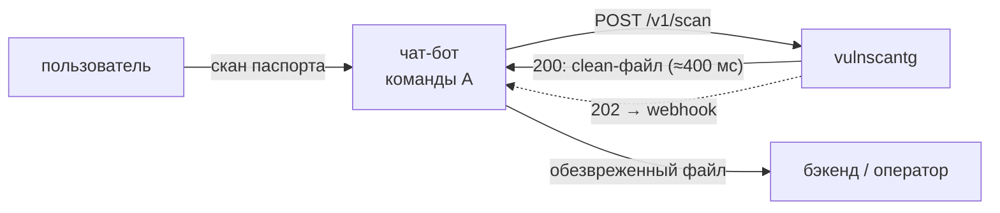

# vulnscantg

Подключаемый по API сервис для сервисов, принимающих документы от пользователей:
получает PDF, документы Word, изображения и архивы с ними, **обезвреживает их (CDR)**
и возвращает вердикт.
Основной результат — безопасный пересобранный файл, а не только «чисто/грязно».



## Быстрый старт

```bash
cp .env.example .env && make up
```

Первый запуск занимает несколько минут: `clamd` скачивает сигнатурные базы.
Готовность — `curl localhost:8080/readyz`.

```bash
make samples && make smoke
```

`make smoke` прогоняет через сервис сгенерированные тестовые файлы: чистый PDF,
PDF с `/OpenAction` + JavaScript, PDF с `/Launch`, EICAR и polyglot JPEG+ZIP.

## Что внутри

## Два сканера

**Fast Scanner** работает на каждом файле и отвечает за то, что клиент увидит в
ближайшую секунду. Стадии идут от дешёвых к дорогим — определение типа, разбор
структуры, антивирус, YARA, — у каждой свой таймаут, и при достижении порога
блокировки остальные не запускаются. Стадия вердикта не выносит: она возвращает
признаки, а решение считается централизованно. Затем файл пересобирается заново,
и результат проверяется на остаточные активные элементы.

**Deep Scanner** — тот же образ в режиме `deep`, отдельная очередь, вне горячего
пути. Идёт до конца без раннего выхода, пересобирает даже заблокированное (чтобы
понять, поддаётся ли документ безопасной пересборке вообще) и не ограничен
стоимостью ответа. Туда уходят подозрительные, непроверяемые и выборка чистых —
последняя не для защиты конкретного файла, а чтобы измерить пропуски: без неё
известно только то, что нашли.

Второй вердикт не подменяет первый — клиент уже действовал по нему. Он приходит
отдельным коллбэком, и только если стало хуже.

Подробнее: [docs/architecture.md](docs/architecture.md), §10.2.

| Компонент | Роль |
|---|---|
| `services/gateway` | FastAPI: приём, sha256 стримом, кэш, очередь, синхронное ожидание |
| `services/worker` | конвейер стадий и CDR; в режиме `deep` — углублённая проверка |
| `services/notifier` | доставка результата клиенту, подпись ключом тенанта |
| `services/writer` | история проверок в PostgreSQL; единственный с доступом к БД |
| `services/cvdmirror` | локальное зеркало баз ClamAV |
| `examples/telegram-bot` | Telegram-бот: вложение → сканер → обезвреженная копия |
| `examples/feedbackbot` | Telegram-бот-форма: ФИО и файл, копия уходит в S3 владельца |
| `examples/feedback-site` | сайт с формой: подключение через SDK и через виджет |
| `services/worker/worker_app/stages` | `filetype_detect`, `pdf_structure` — разбор форматов |
| `packages/vscommon` | модели API, Risk Engine, кэш, логирование, хранилище, очередь, подпись |
| `rules/yara` | собственные YARA-правила |
| `weights.example.json` | веса признаков Risk Engine |
| `policies.example.json` | политики тенантов: пороги, режим отказа, профиль |
| `clamd` | резидентный AV-демон (sidecar) |

Стадии: `filetype` → `structure` → `clamav` → `yara` → скоринг → CDR.
Ранний выход по достижении порога блокировки; дорогие стадии не запускаются впустую.

## Документация

- [ROADMAP.md](ROADMAP.md) — майлстоуны и задачи с критериями приёмки.
- [Справочник признаков](docs/findings.md) — все 65 кодов: что означает и что делать.
- [Политики, веса и профили](docs/policies.md) — режим отказа, профили CDR,
  пороги, веса признаков, настройки тенанта.
- [Сборка и деплой](docs/deploy.md) — образы под amd64, registry, проверка после развёртывания.
- [Архитектура и схемы](docs/architecture.md) — целевая картина: компоненты,
  горячий путь, конвейер, профили CDR, надёжность, изоляция, модель данных.
- [API](docs/api.md) — контракт, вердикты, подпись, рекомендации клиенту.
- [CLAUDE.md](CLAUDE.md) — правила написания кода в этом репозитории.

## Разработка

```bash
make corpus      # скачать корпус реальных PDF
make corpus-check # регрессия на ложные срабатывания
make test        # тесты, без сети
make lint        # ruff
make typecheck   # mypy --strict
```

Тесты запускаются без Docker: Redis и S3 подменяются, стадии тестируются напрямую.

## Ограничения скелета

Реализовано ядро: приём, конвейер, скоринг, CDR трёх профилей, коллбэк, кэш.
Осознанно не сделано — deep-scan в песочнице, prometheus-метрики, мульти-AV,
полноценная изоляция воркера (gVisor/nsjail). Подробности в
[docs/architecture.md §7](docs/architecture.md).

**Перед продом:** заменить `HMAC_SECRET`, включить `REQUIRE_SIGNATURE=true`,
переключить `LOG_FORMAT=json`, обернуть воркер в песочницу и запретить ему
сетевой egress везде, кроме Redis, S3 и адресов коллбэков.
