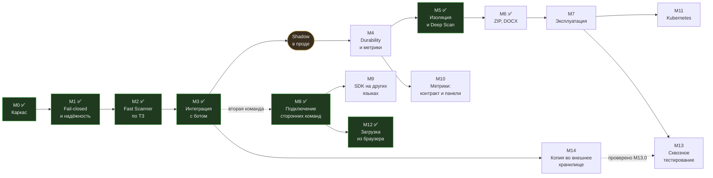

# ROADMAP

Цель: подключить к существующему боту API, которое возвращает обезвреженный файл и
вердикт за приемлемое время. Приоритет форматов — PDF, затем JPEG/PNG.

Целевая картина: [docs/architecture.md](docs/architecture.md).

**Минимально поставляемое в прод — M1 + M2 + M3.** Всё, что после, повышает
надёжность и покрытие, но не блокирует запуск в shadow-режиме.

## Где мы сейчас

**Версия 2.0.0.** Мажорный номер — не из-за ломающих изменений протокола
(их нет: `/v1` и формат ответа прежние), а потому что `v1.0.0`–`v1.3.2` уже
выпущены, и этот выпуск подводит черту под стабилизацией. Что в него вошло
сверх стабилизации: документы Word и ZIP-архивы (M6), YARA по частям
документа, бот-форма обратной связи (M14.13), пример сайта на отдельном
сервере с обоими способами подключения (M12.8), выкат в Kubernetes (M11).
Реализации подключения — оба бота и сайт — перенесены в `examples/`: это
образцы того, как к сервису подключаются, а не его части.
Документация публикуется сайтом на GitHub Pages (`pages.yml`), собранным из
тех же `.md`; битая ссылка роняет сборку — первая же нашлась в `docs/api.md`.

Сервис работает в двух выкатах. **Compose** — боевой стенд: принимает файлы
от Telegram-бота, отдаёт вердикт и пересобранную копию, ведёт историю в
PostgreSQL, отдаёт трассировки и метрики в общий стек. **Kubernetes** (M11) —
развёрнут и поднимается: база, внешний вход через Gateway API, бот в своём
namespace. Сетевые политики вынесены отдельным этапом и пока не применены.

Закрыты целиком: M0–M3, M5, M8, M12. В M4 и M10 остались хвосты. M6 закрыт,
кроме M6.5: документы Word и ZIP-архивы проверяются и пересобираются.

Открыто:

* **M11** — политики на живом кластере (M11.1), обновление баз внутри
  кластера (M11.9: зеркало там не качает, clamd работает на базах из образа),
  решение по `/readyz` (M11.11), скрейп метрик (M11.14), gVisor (M11.4 —
  пока сознательно runc);
* **M14** — копия при ответе из кэша (M14.11: повторный файл в приёмник не
  попадает, подтверждено на боевом), подбор зависших заданий доставки
  (M14.12);
* **M13** — сквозные тесты сверх доставки: основной путь, асинхронный, отказ
  clamd на живом стеке, виджет в браузере, права через настоящий HTTP;
* **M7** — ревью ложных срабатываний, ротация ключей, шифрование карантина,
  runbook;
* **M6.5** (таблицы, презентации, старые форматы Office — по потребности),
  **M9** (SDK на Go);
* долги **D4**, **D7** (закрыт в Kubernetes, открыт в compose) и **D8**
  (логи на английском и один словарь имён полей).

**Доставка копий (M14) проверена сквозным прогоном** — впервые с настоящим
S3, а не с подделанным `boto3` (M13.0). Прогон нашёл восемь дефектов, и ни
один не проявлялся ошибкой: сервис каждый раз выглядел исправным. Три из них
— прямо в пути доставки: выгрузка была привязана к коллбэку, `strict` не
растеризовал, `{filename}` удваивал расширение.

**Выкат в Kubernetes повторил тот же урок в другом месте.** Почти каждая
поломка была гарантией из compose, которая переехала не целиком: корень
только для чтения, которого у сервисов раньше не было; DNS, который Cilium
без замены kube-proxy видит как внешний адрес; прокси, потерянный при
переносе; JSON с незакрытой скобкой, молча уехавший в ConfigMap. Сводка — в
таблице «Что нашлось по дороге».

**M14 — про бизнес-модель, а не про транспорт.** Раньше копию забирали у нас,
и сутки мы держали чужие документы. Складывая её сразу в хранилище клиента,
мы перестаём хранить их вовсе — и берём взамен другой риск: постоянный доступ
на запись в чужую инфраструктуру (M14.4).

Сделано, но не развёрнуто: изоляция воркера под gVisor на compose-стенде
временно снята ради трассировок; точка входа с TLS (M8.10) нужна только при
подключении сторонней команды.

---

## M0 — Каркас ✅

Сделано в текущем репозитории.

- [x] Структура репозитория, `CLAUDE.md`, docker-compose, Makefile
- [x] Gateway: приём multipart и по ссылке, sha256 стримом, кэш, очередь, ожидание `wait_ms`
- [x] Worker: конвейер стадий с ранним выходом, скоринг, доставка результата
- [x] Стадии `filetype`, `structure`, `clamav`, `yara`
- [x] CDR для PDF и изображений, три профиля, обязательная верификация выхода
- [x] Логирование через `logging`, JSON-формат, `contextvars`, запрет ПДн в логах
- [x] Коллбэк с HMAC-подписью и ретраями
- [x] Тесты, линт, генератор сэмплов

---

## M1 — Fail-closed и надёжность очереди ✅

Закрыт полностью. Помимо запланированного, по дороге найдены и исправлены четыре
дефекта, каждый из которых давал `clean` там, где проверки не было:
клиент мог выставить себе `fail-open` (M1.1), отказ CDR перезаписывал вердикт
режимом отказа (M1.6), `PasswordError` терял признак шифрования (M1.6),
недоступный clamd молча пропускал файлы (M1.7).

- [x] **M1.1** Убрать `on_timeout` из тела запроса, перевести режим отказа в
      серверную политику тенанта.
      *Готово: клиентское поле игнорируется, `fail-open` доступен только серверной настройке.*
- [x] **M1.2** Подхват задач, зависших в pending после падения воркера.
      *Готово: heartbeat живого владельца + разбор pending-списка. Упавший воркер
      больше не уносит задачу; лимит доставок не даёт перевыдавать её бесконечно.*
- [x] **M1.3** Различать инфраструктурную ошибку (ретрай) и контентную — краш парсера
      на конкретном файле детерминирован и ретраю не подлежит.
      *Готово: классификация исключений по природе + журнал попыток, переживающий
      жёсткий краш процесса. Файл, обрывающий разбор, закрывается после первой
      попытки; транзиторный сбой S3 или Redis возвращает задачу в очередь.*
- [x] **M1.4** Dead-letter stream + состояние `manual_review`.
      *Готово: поток `scan.dlq` с ограниченной длиной, три причины попадания,
      статус живёт неделю вместо пяти минут, служебная ручка `/v1/ops/dlq`
      с обязательной подписью.*
- [x] **M1.5** Идемпотентность: повторная доставка задачи не создаёт второй артефакт.
      *Готово: заявка на проверку по (sha256, профиль, версия политики) — тот же
      файл получает тот же `scan_id`; канал ожидания переведён на pub/sub, чтобы
      результата могло ждать несколько запросов; повторная доставка завершённой
      задачи не запускает конвейер заново. Заработал документированный, но не
      реализованный `Idempotency-Key`.*
- [x] **M1.6** Состояния `unscannable` (зашифрованный PDF, неподдерживаемый формат)
      отдельно от `clean` и `malicious`.
      *Готово: исправлено распознавание шифрования (`PasswordError` падал в
      `PDF_MALFORMED`, флаг терялся), непроверяемое больше не идёт в CDR,
      добавлен инвариант «сбой не смягчает вердикт». Владельческий пароль
      отделён от пользовательского: такой документ читается и проверяется.*
- [x] **M1.7** Тесты на отказ: краш воркера, таймаут стадии, недоступный S3, недоступный clamd.
      *Готово — и попутно закрыта дыра: при недоступном clamd файл получал `clean`.
      Введено понятие полноты покрытия: вердикт `clean` требует, чтобы обязательные
      стадии действительно отработали. Единственный путь к `clean` при неполном
      покрытии — явно выставленный оператором `fail-open`.*

---

## M2 — Fast Scanner до уровня ТЗ ✅

Сделано 8 из 8. ✅ Risk Engine переехал в общий пакет: вердикт считает и воркер, и
gateway при попадании в кэш — там же, где применяется политика тенанта.

- [x] **M2.1** `libmagic` вместо самописного определения типа; оставить свой polyglot-детект.
      *Готово: детектор двухслойный — таблица из 31 сигнатуры работает всегда,
      libmagic уточняет её вывод. 29 типов под тестами, добавлены признаки
      смещённой сигнатуры и расхождения детекторов.*
- [x] **M2.2** Расширить структурный анализ PDF: аннотации, шрифты, аномалии xref,
      число объектов, глубина вложенности, размеры потоков.
      *Готово: разбор вынесен в `stages/pdf_structure.py`, добавлено 22 новых
      признака, все 16 пунктов §8 покрыты, на каждый — синтетический сэмпл.*
- [x] **M2.3** Вынести веса и пороги Risk Engine в конфигурацию, добавить политику тенанта.
      *Готово: 24 литеральных веса убраны из стадий в таблицу `vscommon/weights.py`,
      файл `WEIGHTS_FILE` переопределяет встроенные значения, у тенанта свои
      `weight_overrides`. Пороги переехали в политику ещё в M1.1.*
- [x] **M2.4** YARA hot-reload без остановки воркера + версия правил в ключе кэша.
      *Готово: фоновая проверка правил и весов, компиляция вне блокировки,
      подмена ссылки под ней. Кривое правило не применяется и не останавливает
      проверку. Новый отпечаток сразу публикуется — иначе gateway читал бы кэш
      по прежним правилам. Заодно перезагружаются веса: без этого обещание M2.3
      «правка без пересборки» работало только с рестартом.*
- [x] **M2.5** Двухуровневый кэш: структурный по `rules_version`, AV по `av_db_version`
      с коротким TTL.
      *Готово: кэшируются признаки, а не вердикт — попутно исправлено, что тенанты
      с разными порогами делили одну запись с чужим вердиктом. При обновлении баз
      структурная часть переиспользуется, воркеру остаётся только clamd.*
- [x] **M2.6** Rate limiting и лимиты размера на gateway, per-tenant.
      *Готово: частота (скользящее окно) отсекается в middleware до чтения тела;
      параллелизм ограничен множеством с метками времени — именно он и защищает
      латентность соседей; предел размера у тенанта не поднимается выше общего.*
- [x] **M2.7** Замер латентности на корпусе документов.
      *Готово: `bench/latency.py`, цифры в architecture §9. Оценки оказались
      пессимистичны для PDF на порядок. Замер нашёл три дефекта: пересборка
      картинки шла через список пикселей (145× медленнее, ~5 ГБ на пределе),
      верификация CDR ложно срабатывала на сжатых данных, профиль `standard`
      раздувал фотографии втрое.*
- [x] **M2.8** Аудит потокобезопасности движков.
      *Готово: у clamd сокет лежал в поле экземпляра — общий клиент отдавал
      вердикт одного файла другому. Переведён на экземпляр-на-поток, YARA — на
      общий объект под блокировкой. Все разделяемые объекты в таблице
      architecture §7.7, на каждый — тест на параллельные вызовы.*

---

## M3 — Интеграция с ботом ✅

Сделано 11 из 11. ✅ Бот работает на боевом стенде: принимает вложения, отдаёт
обезвреженные копии, блокирует опасное. Есть теневой режим для обкатки и
список доверенных для снятия ложных блокировок.

- [x] **M3.1** Клиент сканера: таймаут, размыкатель, заранее заданное поведение
      при отказе. Живёт в `examples/telegram-bot/botapp/scanner.py`.
      *Готово: при недоступном сканере бот отвечает «проверка недоступна» и файл
      не пропускает — fail-closed и на стороне клиента. Отдельным пакетом SDK
      пока не вынесен: второго потребителя нет.*
- [x] **M3.2** Приёмник вебхука на стороне бота: проверка HMAC, идемпотентность.
      *Готово: публичный адрес не нужен — сканер обращается по внутренней сети.
      Право ответить разыгрывается атомарно, поэтому повтор коллбэка и
      параллельный опрос-подстраховка не дают второго сообщения. Опрос остаётся
      как запасной путь: вебхук может не дойти.*
- [x] **M3.3** Shadow-режим: сканируем весь поток, ничего не блокируем, только логируем.
      *Готово: флаг `DEFAULT_SHADOW_MODE` в политике тенанта, отчёт
      `GET /v1/ops/shadow`. Вердикт остаётся честным — меняется только то,
      действует ли по нему клиент. Заблокированное в тени пересобирается, иначе
      режим не покрывал бы возможные ложные блокировки; ранний выход отключён,
      чтобы видеть мнение антивируса. Считаются отказы, а не только вердикт
      `malicious`.*
- [x] **M3.4** Allowlist по sha256 с аудитом — быстрый обход ложного срабатывания.
      *Готово: `POST /v1/ops/allowlist` с обязательными автором и причиной,
      ограниченным сроком и записью каждого применения в лог. Блокировка
      снимается без релиза, но пересборка файла сохраняется: список применяется
      ДО решения о CDR, иначе доверенный документ остался бы без копии.
      Кэш учтён — иначе запись не давала бы ничего до истечения TTL.*
- [x] **M3.5** Сквозной путь: пользователь → бот → сканер → обезвреженный файл → бот.
      *Готово: путь проверен на боевом стенде, реальные документы проходят.
      Систематического прогона по корпусу с замером time-to-verdict нет — он
      вынесен в M4.7, потому что упирается в метрики.*
- [x] **M3.6** Согласовать лимит Telegram Bot API (20 МБ на скачивание) с `max_file_size`.
      *Готово: бот проверяет размер до скачивания и отвечает понятным текстом.
      Локальный Bot API server — когда понадобятся файлы крупнее.*
- [x] **M3.7** Собрать образы под целевую архитектуру и выложить в registry.
      *Готово: buildx под `linux/amd64`, образы `dato1/vulnscantg-*` в Docker Hub,
      оверлей `docker-compose.prod.yml` для разворачивания без сборки.*
- [x] **M3.8** Регрессия на ложные срабатывания по корпусу реальных PDF.
      *Готово: `make corpus` и `make corpus-check`, разметка в репозитории,
      файлы скачиваются по требованию. Падение — по НОВЫМ срабатываниям на
      чистых файлах, а не по проценту: метка `none` означает «не внедряли», а не
      «безобидно». Разобранные случаи — в `corpus/expected.json` с объяснением.
      На корпусе доля срабатываний по чистым снижена с 40% до 3.8%, и все три
      оставшихся разобраны как верные.*
- [x] **M3.9** Понятные сообщения бота.
      *Готово: человек видит, что получает пересобранную копию, а не оригинал,
      и какие категории найдены — обычными словами, без кодов признаков. Для
      заблокированных файлов подробности не раскрываются.*
- [x] **M3.10** Документация для эксплуатации: `docs/policies.md`, `docs/deploy.md`,
      `deploy/README.md` и преднастроечная проверка `preflight.sh`.
- [x] **M3.11** Справочник кодов признаков (`docs/findings.md`).
      *Готово: 65 признаков с объяснением и указанием, что делать. Собирается
      из кода (`make findings-doc`), поэтому не может разойтись с реальными
      весами. Тест не даёт новому признаку остаться без описания и отсекает
      отписки вроде «то же».*

**После M3 — две недели shadow-режима на реальном потоке до включения блокировок.**

---

## M8 — Подключение сторонних команд ✅

Сделано 12 из 12. Мультитенантность обеспечена: тенант выводится из ключа,
загрузка требует подписи, результат достаётся только владельцу, коллбэк
подписывается ключом тенанта и уходит только на разрешённые адреса.

Не развёрнуто. Перед выкаткой обязателен `deploy/config/keys.json` — без него
gateway отвергает **все** запросы. Это осознанное поведение: умолчание в
аутентификации — дыра.

- [x] **M8.1** Подпись обязательна на `POST /v1/scan`.
      *Готово. Загрузка подписывает **канонический запрос без тела**
      (`METHOD\nPATH\nkey_id`), а не тело: подписать multipart можно только
      прочитав его, а читать тело до аутентификации нельзя — тогда нагрузка уже
      принята и проверка частоты теряет смысл. Целостность файла обеспечивает
      TLS (M8.10), подпись доказывает отправителя. Путь входит в подпись, иначе
      она годилась бы для любой другой ручки в пределах окна времени.*
- [x] **M8.2** Ключ на тенанта вместо общего секрета. Идентификатор тенанта
      берётся из ключа, а не из заголовка.
      *Готово: `vscommon/keys.py`. Реестр перечитывается на живом сервисе —
      скомпрометированный ключ нельзя оставлять до окна обслуживания.
      Нечитаемый файл ключей означает «никого не пускаем»: умолчание в
      аутентификации — это дыра. Одна битая запись не отрезает остальных.*
      *Критерий: заголовок `X-Vulnscan-Tenant` не влияет на применяемую политику;
      компрометация одного ключа не затрагивает остальных; ключ отзывается
      без рестарта.*
- [x] **M8.3** Проверка владения результатом.
      *Готово: `vscommon/ownership.py`, владелец фиксируется на приёме. Чужой
      тенант получает `404`, а не `403`: `403` подтвердил бы существование
      скана и превратил ручку в способ проверять чужие идентификаторы.
      Неизвестный владелец — отказ, а не разрешение.*
- [x] **M8.4** Коллбэк подписывается ключом тенанта, а не общим.
      *Готово вместе с M8.11: доставка вынесена в отдельный сервис `notifier`.
      Общий секрет означал, что любой клиент может подделать коллбэк любому
      другому — подпись доказывала лишь принадлежность к сервису.*
      *Ключи в воркер не попали: он разбирает враждебные файлы, и держать в нём
      секреты всех тенантов значит менять одну дыру в парсере на компрометацию
      всех клиентов сразу. В задаче едет только `key_id`, секрет знает notifier.*
- [x] **M8.9** Ограничить адреса коллбэков. `callback_url` приходит из запроса
      клиента и не проверяется: воркер отправляет запрос куда скажут. Вместе с
      отсутствием egress-политики (M5.2) это делает сканер посредником для
      обращений во внутреннюю сеть — метаданные облака, Redis, MinIO, сам
      gateway. **Работает на текущем стенде, не только при удалённом клиенте.**
      *Готово: `vscommon/callbacks.py`, проверка на приёме запроса. Пустой
      список означает «запрещено», а не «разрешено всё». Адреса метаданных
      облака запрещены даже если их вписали в список: легитимного повода слать
      туда результат не существует, а цена ошибки — ключи от инфраструктуры.*
- [x] **M8.10** TLS и точка входа для внешних клиентов.
      *Готово: Caddy в профиле `public`, gateway порт по-прежнему не публикует.
      Служебные и административные ручки наружу не выставляются: `/readyz`
      раскрывает состав движков и размер очереди разбора, `/metrics` — весь
      профиль нагрузки, а заведение тенантов через интернет не нужно вовсе.*
      *`REQUIRE_SIGNATURE=false` теперь пишет `ERROR` на старте: без подписи
      загружать файлы сможет кто угодно, а тенант возьмётся из умолчания.*
- [x] **M8.11** Долговечность доставки коллбэка.
      *Готово: 10 попыток с растущей паузой покрывают 27 минут. Отложенные
      повторы живут в упорядоченном множестве, а не в потоке: поток выдаёт
      сообщение сразу, а нужно «через четыре минуты». Задание удаляется из
      множества до попытки — иначе два экземпляра notifier доставили бы
      результат дважды.*
      *Недоставленное уходит в dead-letter с причиной `callback_failed`:
      молча потерянный результат для клиента неотличим от того, что файл не
      проверяли.*
      *Ретраи вынесены из воркера ещё и поэтому: полчаса повторов внутри
      обработки задачи означали бы, что воркер всё это время не берёт файлы.*
- [x] **M8.12** Согласовать расхождение часов.
      *Готово: `check_signature()` отдаёт причину отказа, и расхождение с
      размером окна видно в логе. Требование к NTP записано в §5 руководства.*
      *В ответ причина не уходит: клиенту незачем знать, ключа нет или подпись
      не сошлась. В лог обязана — иначе разошедшиеся часы выглядят как неверный
      ключ, и на это уходят часы разбирательств.*
- [x] **M8.5** Клиентская библиотека (SDK) отдельным пакетом: сейчас это
      `examples/telegram-bot/botapp/scanner.py`, и второй команде пришлось бы копировать
      исходники.
      *Готово: `packages/vulnscan_client/`. Формат канонического запроса
      закреплён тестом буквально: расхождение с сервисом дало бы `401` на
      каждой загрузке, а выглядело бы как неверный ключ.*
      *Список безопасных вердиктов положительный, а не отрицательный: вердикт,
      добавленный в сервисе позже, считается небезопасным, пока интегратор не
      обновит библиотеку осознанно. `not blocked` и `safe` — разные вещи, и это
      главная ловушка интеграции.*
      *Документации у библиотеки нет, и она одна — на Python. Продолжение в M9.*
- [x] **M8.6** Руководство по подключению.
      *Готово: [docs/integration.md](docs/integration.md). Отдельный раздел про
      то, что `not blocked` не означает «безопасно», — это самая частая ошибка
      интеграции, и стоит она дороже всех остальных.*
- [x] **M8.7** Заведение тенанта без правки файла на сервере.
      *Готово: `/v1/admin/keys` и `/v1/admin/tenants/{t}/policy`, хранилище в
      Redis, подхват без перезапуска. Файл остался начальной загрузкой: потеря
      Redis не должна отрезать доступ всем, включая администратора.*
      *Секрет генерируется сервером и показывается один раз. Ручка, отдающая
      ключи списком, превратила бы одну утечку во все сразу.*
      *Административные ручки требуют отдельного признака у ключа: иначе клиент
      выписывал бы себе ключи и менял себе политику — тот же `fail-open` полем,
      только окольным путём.*
- [x] **M8.8** Раздельный учёт по тенантам.
      *Готово: `python -m writerapp.usage --days 30` по истории в PostgreSQL.
      Метрики для этого не годятся — у них ограниченная ретенция и они агрегаты,
      а счёт и разбор жалобы требуют записей.*
      *Список тенантов для меток метрик берётся из реестра ключей, а не из
      отдельной переменной: два списка неизбежно разъезжаются, и метрики тихо
      схлопывают настоящего тенанта в `other`.*

---

## M4 — Durability и наблюдаемость

Сделано 15 из 18: наблюдаемость работает, но версии библиотек и образов отстали от обновлённого стека мониторинга.

Стек наблюдаемости: **Tempo** для трейсов, **Prometheus** для метрик, **Loki** для
логов, дашборды в Grafana.

Общее ограничение для всех трёх: **у воркера нет сетевого выхода наружу**, и
наблюдаемость не повод его открывать. Всё, во что пишет воркер, живёт в `backend`,
а наружу выносит уже коллектор.

- [x] **M4.1** Result Writer: отдельный сервис-потребитель, владеет PostgreSQL.
      *Готово: `services/writer/`. Воркер публикует `ScanRecord` в поток
      `scan.results` и идёт дальше; базой владеет только writer, у воркера
      сетевого доступа к ней нет — это процесс, разбирающий враждебные файлы.*
      *Ack только после успешной записи: иначе сбой базы означал бы потерю
      истории без следа. Пачками, чтобы запись не стала узким местом.*
      *Отказ публикации не прерывает обработку: вердикт клиенту важнее истории.*
- [x] **M4.2** Схема PostgreSQL по §11 архитектуры + миграции.
      *Готово: `services/writer/migrations/001_init.sql` — `files`, `scans`,
      `findings`, `artifacts`. Индексы по `sha256`, `created_at`, `tenant`
      и `verdict`.*
      *Имя файла не хранится, и это закреплено тестом: поля просто нет в
      `ScanRecord`. Гарантия структурная, чтобы оно не появилось «для удобства
      отладки».*
      *Миграции идемпотентны (`IF NOT EXISTS`) — отдельная таблица версий при
      трёх файлах была бы лишней сущностью.*
- [x] **M4.3** Прометеевские метрики: гистограммы по стадиям и профилям CDR,
      счётчики вердиктов, глубина очереди, размер DLQ.
      *Готово: `vscommon/metrics.py`. Время до вердикта меряется в `ingest`, а не
      в middleware: middleware видит длительность запроса вместе с чтением тела
      и не отличает ответ из кэша от полного прохода.*
      *Дашборд — за пределами репозитория, метрики для него есть.*
- [x] **M4.6** Hit rate по каждому уровню кэша отдельно.
      *Готово: `vs_cache_lookups_total{level,outcome}`, уровни `structural` и `av`
      считаются раздельно.*
      *Критерий: на дашборде видно, что после freshclam падает только AV-уровень.
      Без этой метрики критерий M2.5 на проде нечем подтвердить.*
- [x] **M4.15** Дашборды Grafana.
      *Готово: `deploy/grafana/` — два дашборда, разделённых по вопросу.
      «Обзор» отвечает, работает ли сервис правильно; «конвейер» — куда уходит
      время и что отваливается. Смотреть начинают с первого.*
      *Главная панель обзора — возраст баз антивируса, по той же причине, что и
      главное правило алертов: остальное ловит падения, заметные и без
      дашборда, а это ловит сервис, который продолжает отвечать неправильно.*
      *JSON собран скриптом и проверяется тестами: панель без запроса, панель
      без описания и ссылка на несуществующую метрику ломают прогон. Последнее
      важнее всего — опечатка в имени метрики даёт исправную с виду панель,
      которая молча показывает «нет данных», и обнаруживается это во время
      инцидента.*
      *Третий дашборд — «трассировки и логи»: граф сервисов, время по спанам,
      логи с отбором по уровню. Он опирается на генератор метрик Tempo, который
      надо включить отдельно; без него часть панелей пуста, и в README рядом
      написано, что именно включать.*

- [x] **M4.16** Поднять версии телеметрии вслед за стеком мониторинга.
      *Стек обновлён до Grafana 13.2, Tempo 3.0, Prometheus 3.13, OTel Collector
      0.157, Loki 3.7. Наши библиотеки закреплены на `>=1.29` для OTEL и
      `>=0.21` для prometheus-client — это версии полугодовой давности.*
      *Сделано. Версий было не два места, а семь: `pyproject.toml` и шесть
      Dockerfile, и во всех через `>=` — то есть каждая пересборка могла дать
      другую версию, а какая работает на стенде, выяснялось бы `pip freeze`
      внутри контейнера.*
      *Точные версии, а не границы: OTel 1.44.0 и prometheus-client 0.26.0.
      Метрики отдельно от трассировки: они нужны и там, где OTel ни при чём, —
      зеркалу баз и примеру подключения.*
      *Жили эти пины в `requirements-telemetry.txt` и `requirements-metrics.txt`
      до переезда на `uv.lock` (D6); теперь — в группах `telemetry` и `metrics`
      в `pyproject.toml`. Два файла рядом с локом были бы вторым источником
      правды на одну и ту же вещь.*
      *Проверено сборкой: образы собираются и выкатываются (теги v1.3.2 и
      v1.4.5), а сквозной стенд M13.0 собирает их из дерева.*

- [x] **M4.17** Привести версии образов в compose к стеку.
      *`vs-collector` закреплён на `0.115.1`, в стеке 0.157. Мост, который
      старше стека, — не то место, где стоит экономить: OTLP совместим, но
      конфигурация коллектора между версиями менялась.*
      *`vs-prometheus` на `v3.1.0` против 3.13 в стеке.*
      *Закрыто удалением, а не бампом. Оба сервиса жили под профилем
      `observability` и не поднимались ни разу: изоляция воркера снята,
      телеметрию собирает стек в `deploy/lgtp`. Конфигурация неиспользуемого
      сервиса устаревает молча — на сорок релизов, как и вышло.*
      *Второй повод: два коллектора с похожими именами — готовая ошибка в
      `OTEL_ENDPOINT`, а неверный адрес приёмника не даёт отказа, экспортёр
      просто пишет в никуда.*
      *Вернётся вместе с изоляцией — под текущие версии и заново.
      `deploy/config/prometheus.yml` оставлен как образец для того случая.*

- [x] **M4.18** Метрики из трейсов считает OTel Collector, а не Tempo.
      *Генератор Tempo 3.0 не заработал: модуль стартует, переопределения
      применяются (проверено по `/status/config`), но в его кольце нет
      участников — distributor не находит, кому отдавать спаны. Тот же симптом
      в grafana/tempo#5479, закрыт без решения.*
      *Решение — коннекторы `spanmetrics` и `servicegraph` в коллекторе: он и
      так стоит на пути всех трейсов, а имена метрик совпадают с теми, что даёт
      генератор, так что `serviceMap` в Grafana работает одинаково.*
      *Попутно: `assigned_partitions` в монолитном режиме всегда ноль и
      признаком не является — на это я потратил один неверный вывод.*

- [ ] **M4.19** Вернуться к генератору Tempo, когда issue сдвинется.
      *Считать метрики в коллекторе — обход, а не замена: у генератора Tempo
      есть доступ к полному трейсу, у коннектора — только к потоку спанов, и
      на длинных трейсах результаты могут расходиться. Пока нагрузка невелика,
      разницы не видно.*
      *Дашборд использует `traces_spanmetrics_latency_bucket` и
      `traces_spanmetrics_calls_total` — имена из 2.x. В 3.0 они, вероятно,
      стали `traces_span_metrics_duration_seconds_*`, но проверить это можно
      только после запуска генератора.*
      *Панель с неверным именем выглядит исправной и молча показывает «нет
      данных» — ровно тот случай, ради которого заводился `EXTERNAL_METRICS`
      в `tests/test_dashboards.py`. Править запросы и список вместе.*
      *Критерий: панели «p95 по спанам» и «Спаны с ошибкой» показывают данные.*

- [x] **M4.4** Alerting: рост очереди, рост latency, массовые ошибки сканеров,
      аномальная доля malicious.
      *Готово: `deploy/config/alerts.yml`, 10 правил, плюс конфигурация
      Prometheus и сам сервис в профиле `observability`.*
      *Главное правило — возраст баз: остальные ловят падения, которые заметны
      и без них, а это ловит сервис, который продолжает отвечать неправильно.*
      *Переполнение storage не покрыто: своей метрики на это нет, MinIO отдаёт
      её сам через `/minio/v2/metrics` — подключается отдельно.*
- [x] **M4.7** Замер time-to-verdict на корпусе реальных документов.
      *Готово: `bench/corpus_latency.py` — полный проход по внешнему корпусу,
      а не стадии по отдельности на своих же слишком аккуратных документах.*

      Замер на 175 файлах корпуса, профиль `standard`:

      | | измерено | цель |
      |---|---|---|
      | p50 | 11 мс | — |
      | p95 | 132 мс | ≤ 700 мс |
      | p99 | 693 мс | ≤ 2000 мс |
      | max | 2349 мс | — |
      | уложились в `wait_ms=400` | 98.9% | ≥ 80% |

      Вердикты: `clean` 54.3%, `suspicious` 27.4%, `malicious` 18.3% — корпус
      состоит из PDF с намеренно внедрёнными (безвредными) конструкциями.

      **Замер неполон и завышает оптимизм.** Он снят на машине разработчика, где
      нет ни `yara`, ни clamd, — то есть без антивирусной стадии, которая в
      проде и есть основная стоимость. Настоящие числа берутся с боевого стенда
      из `vs_verdict_duration_seconds`; этот скрипт нужен, чтобы ловить
      регрессии конвейера, а не подтверждать SLA.
- [x] **M4.8** Решить вопрос сохранности очереди. Redis запущен без записи на
      диск: его перезапуск теряет принятые, но не обработанные задачи. Группа
      потребителей теперь восстанавливается сама, задачи — нет, и это расходится
      с требованием «потеря задач 0».
      *Готово: включён `appendonly yes` с `appendfsync everysec` и томом.
      Выбран `everysec`, а не `always`: последний делает fsync на каждую запись
      и упирается в диск на горячем пути.*
      *Требование уточнено осознанно: остаточный риск — до секунды принятых
      задач при жёстком падении хоста. На этот случай работает идемпотентность
      по sha256: повторная присылка файла проверит его заново.*
- [x] **M4.14** Возраст баз и правил виден и деградирует сервис. Сейчас
      остановившееся обновление выглядит ровно как работающее: clamd доволен
      базой из образа, а вердикт `clean` выдаётся по сигнатурам недельной
      давности. С появлением зеркала (`cvdmirror`) риск вырос: clamd больше не
      ходит наружу сам и не жалуется в лог, если зеркало ничего не приносит.
      *Возраст в `/readyz` и метрикой; сутки без обновления — предупреждение,
      неделя — сервис не готов. Это ровно тот же приём, которым чинили молча
      недоступный clamd: не вес признака, а признание проверки несостоявшейся.*
      *Готово: `vscommon/freshness.py` разбирает дату базы из строки версии
      clamd, воркер публикует её, gateway отдаёт в `/readyz` и при возрасте
      больше недели объявляет себя неготовым. Метрика `vs_rules_age_seconds`,
      алерты на сутки и на неделю. 13 тестов.*
      *Неизвестный возраст считается непригодностью, а не свежестью: молчание
      означает, что воркер мог не запуститься вовсе.*

- [x] **M4.5** TTL и lifecycle-политики бакетов: quarantine 24 ч, clean по конфигу,
      отдельная политика для malicious-семплов.
      *Готово: `S3Store.apply_retention()`, воркер выставляет правила на старте.
      Срок живёт правилом бакета, а не уборщиком в коде: процесс, который
      «должен» подчищать, однажды не запустится, а правило переживёт рестарт.*
      *Политика по вредоносным семплам согласована так: дольше карантина их
      НЕ храним (`KEEP_MALICIOUS_SAMPLES=false`). Соблазн собрать коллекцию
      понятен, но вредоносный PDF — это всё ещё чей-то документ с ПДн, и
      удлинять срок нужно осознанно, а не по умолчанию.*
      *Хранилище без поддержки lifecycle не роняет старт, но пишет `ERROR`:
      молча накапливать чужие документы хуже, чем громко отказаться.*

### Имплементация наблюдаемости

Сделано 5 из 5. SDK заведены во всех компонентах: gateway, worker, deepscan, бот.
Не развёрнуто — коллектор поднимается профилем `observability`, выкатывать вместе
с M8.9.

Общий принцип, которого пришлось держаться: **наблюдаемость не имеет права влиять
на вердикт.** Отсутствующий SDK выключает телеметрию, но не проверку; недоступный
коллектор не задерживает стадию; негодный контекст трассировки начинает новый
трейс, а не роняет задачу.

- [x] **M4.9** OpenTelemetry: SDK и разметка спанами. Корневой спан на скан,
      дочерние — на стадии конвейера, пересборку и её проверку. Идентификаторы
      уже живут в `contextvars` (`log_context`), спаны кладутся туда же, а не
      протаскиваются аргументами.
      *Атрибуты спана — это те же логи: имя файла целиком, полный sha256, URL
      коллбэка с параметрами, значения EXIF в них не попадают. Ограничения
      раздела «что запрещено писать в логи» действуют дословно.*
      *Экспортёр обязателен в `_INFRA_MODULES` (`vscommon/errors.py`): иначе его
      транзиторный сбой будет принят за порчу файла и задача закроется без повтора.*
      *Экспорт не блокирует корутину — либо асинхронный экспортёр, либо
      `asyncio.to_thread`. Стадия не должна ждать коллектор.*
      *Критерий: один скан даёт одно связное дерево спанов; отключённый коллектор
      не меняет ни одного вердикта.*

- [x] **M4.10** Протаскивание контекста трассировки через очередь. Gateway и воркер
      разнесены по времени и по хостам, поэтому `traceparent` (W3C) едет **полем
      в `ScanJob`**, а не заголовком. Углублённая проверка со своим `scan_id`
      цепляется к трейсу родителя.
      *`traceparent` из запроса клиента не принимается на веру: чужой контекст
      позволил бы склеить свой скан с чужим трейсом. Либо валидируется, либо
      порождается заново.*
      *Критерий: трейс не рвётся на границе Redis Stream — приём файла, работа
      воркера и коллбэк лежат в одном дереве. Второй вердикт виден как
      продолжение первого.*

- [x] **M4.11** Экспорт OTLP в Tempo через коллектор. Коллектор стоит в `backend`
      и сам выносит наружу; воркер продолжает не иметь egress.
      *Критерий: `deploy/isolation-check.sh` по-прежнему проходит — из воркера
      в интернет не уходит ничего, кроме Redis, S3, коллбэка и коллектора.*

- [x] **M4.12** Настоящий `/metrics` вместо заглушки в
      `services/gateway/gateway_app/routes/health.py`. Отдельная задача — метрики воркера:
      он не HTTP-сервис, а цикл-потребитель, и своей ручки у него нет.
      Нужен либо минимальный HTTP-эндпоинт в воркере на `backend`, либо
      экспозиция через Redis; pushgateway не подходит — метрики не событийные.
      *Метки не содержат sha256, имени файла и `scan_id`: это и утечка ПДн,
      и неограниченная кардинальность. Тенант меткой быть может.*
      *Критерий: каждая реплика воркера скрейпится отдельно; рестарт реплики не
      обнуляет гистограммы на дашборде.*

- [x] **M4.13** Связка логов с трейсами для Loki. В структурную запись добавляются
      `trace_id` и `span_id` — через тот же `log_context`, которым уже
      протаскиваются `scan_id` и `sha256`.
      *Доставка логов (promtail или alloy) — инфраструктура, кода не требует.
      Кода требует именно корреляция.*
      *Правило «не больше одной записи INFO на скан в горячем пути» остаётся в
      силе: трейсы добавляются к логам, а не разрешают логировать больше.*
      *Критерий: из спана в Tempo можно перейти в логи этого же скана в Loki
      и обратно.*

---

## M5 — Изоляция и Deep Scanner ✅

Сделано 6 из 6. ✅ Изоляция воркера, углублённая проверка и реакция бота на
второй вердикт готовы. gVisor установлен на сервере и замерен. Осталось
развернуть — это общая выкатка вместе с M8.9.

- [x] **M5.1** Воркер внутри gVisor.
      *Готово: `runsc` установлен на сервере и доступен как рантайм,
      включается оверлеем `docker-compose.gvisor.yml`. Замер на самом сервере:
      разбор и пересборка PDF замедляются втрое (2.2 → 6.3 мс и 9.2 → 27.8 мс),
      перекодирование картинки не меняется вовсе. Это ожидаемый профиль:
      дорог перехват системных вызовов, а не вычисления. В абсолютных числах
      прибавка — десятки миллисекунд против сотен у антивируса, то есть
      приемлемо.*
      *Включается отдельным файлом `deploy/docker-compose.gvisor.yml`, а не
      переменной `WORKER_RUNTIME`: рантайм и адреса зависимостей обязаны
      меняться вместе, иначе воркеры не стартуют.*
      *Замер делался на одиночном контейнере и пропустил отказ: под compose
      воркеры с `runsc` не стартовали вовсе — не разрешались имена сервисов.
      Причина в `--reproduce-nat`, см. таблицу находок.*
- [x] **M5.2** Сеть воркера без выхода наружу.
      *Готово: две сети — `backend` (`internal: true`) для воркера и хранилищ,
      `egress` для тех, кому связь нужна по назначению: gateway принимает
      запросы, clamd тянет базы, бот ходит в Telegram. Проверка оформлена
      скриптом `deploy/isolation-check.sh`. Выяснилось попутно, что
      `internal: true` ломает публикацию порта — gateway пришлось оставить с
      внешней связностью, он парсеров не запускает.*
      *Не развёрнуто на сервере: там воркер пока ходит в интернет свободно.
      Выкатывать вместе с M8.9, иначе коллбэки к внешнему клиенту сломались бы.*
      *Критерий: исходящий запрос в интернет из воркера не проходит — негативный тест.*
- [x] **M5.3** Ограничение прав воркера.
      *Готово ещё в M0, здесь проверено и зафиксировано: non-root (uid 10001),
      корневая ФС только для чтения, все capabilities сброшены,
      `no-new-privileges`, временные файлы в tmpfs. Проверяется тем же
      `isolation-check.sh`, в том числе на сервере.*
- [x] **M5.4** Deep Scanner: очередь, углублённый разбор, асинхронный второй вердикт.
      *Готово: отдельный сервис `deepscan` — тот же образ в роли `WORKER_MODE=deep`.
      Разбирает без раннего выхода и пересобирает даже заблокированное, чтобы
      выяснить, поддаётся ли документ безопасной пересборке. Свой идентификатор
      скана со ссылкой на родительский: с прежним задача не запускалась бы
      вовсе, а результат быстрой проверки был бы затёрт.*
      *Детонация в песочнице не реализована — под неё оставлено место в
      конвейере. Отзыв первого вердикта на стороне бота вынесен в M5.6.*
- [x] **M5.6** Бот реагирует на второй вердикт.
      *Готово: углублённый результат ищется по родительскому скану — у него
      свой идентификатор, и иначе он выглядел бы ответом на неизвестный скан и
      молча терялся. Человека беспокоим, только если вердикт ухудшился;
      уточнение отправляется один раз, сколько бы коллбэков ни пришло.*
- [x] **M5.5** Выборка чистых файлов в углублённую проверку.
      *Готово: `DEEP_SAMPLE_RATE` — доля чистых, уходящих на разбор. Бросок
      криптостойкий: предсказуемая выборка позволяла бы подгадать, какой файл
      углублённо не проверят. Цифра пропусков появится, когда накопится
      статистика на реальном потоке.*

---

## M9 — SDK для сторонних команд

Python-библиотека есть (M8.5), но её недостаточно: у неё нет собственной
документации, а команда на другом языке всё равно будет писать подпись руками —
и ошибётся ровно там, где мы уже ошибались.

Порядок здесь имеет значение: **сначала документация, потом новые языки**.
Задокументированная библиотека на одном языке полезнее четырёх нечитаемых, а
описание протокола — то, из чего вторая реализация вообще делается.

- [x] **M9.1** Документация SDK: справочник по методам, разбор вердикта,
      проверка коллбэка, поведение при недоступности сервиса.
      *Сейчас всё это живёт в докстрингах и в §6 руководства по подключению —
      то есть находится только тем, кто уже читает исходники.*
      *Отдельно и заметно: `not blocked` не означает «безопасно». Это самая
      частая ошибка интеграции, и она стоит дороже остальных.*
      *`docs/sdk.md`: создание клиента, все методы, разбор вердикта,
      поведение при недоступности, диагностика `401`.*
      *Критерий закреплён тестом, а не намерением: каждое имя из `__all__`
      обязано встречаться в справочнике, а умолчания в тексте — совпадать с
      сигнатурой. Числа в документации устаревают тише всего.*

- [x] **M9.2** Спецификация протокола отдельным документом.
      *Предпосылка для любой второй реализации: две схемы подписи (тело для
      JSON-ручек, канонический запрос для загрузки), формат заголовков, окно
      расхождения часов, порядок повторов, состав вердиктов.*
      *Сейчас единственное описание — исходники Python-клиента, а копия
      формата на второй стороне разошлась бы молча: расхождение выглядит как
      неверный ключ, и на его поиск уходят часы.*
      *`docs/protocol.md`: две схемы подписи и почему их две, окно
      расхождения часов, коды ответа с колонкой «повторять ли», модель ответа,
      коллбэки с повторами, раздел про совместимость — что не сломается в
      `/v1`, а что может добавиться.*

- [x] **M9.3** Набор тестов совместимости, общий для всех реализаций.
      *Фиксированные векторы: секрет, тело, отметка времени → ожидаемая
      подпись. Плюс канонический запрос байт в байт.*
      *Без них каждая новая реализация проверяется вручную и на живом стенде —
      именно так мы ловили расхождения до сих пор.*
      *`tests/vectors/protocol.json` — шесть векторов подписи, байты
      канонического запроса, классификация вердиктов. Проверяются обе стороны:
      сервис и библиотека, у которой своя копия алгоритма.*
      *Векторы сразу нашли пробел: вердикт `suspicious` не попадал ни в одну
      корзину, хотя это отдельная категория — проверен, признаки есть, порог
      не пройден, решение за клиентом.*

- [x] **M9.4** SDK на JavaScript/TypeScript.
      *`packages/vulnscan-client-js`: ESM без зависимостей, Node 18+, типы
      отдельным `index.d.ts`. Сборки нет намеренно — библиотеку, подписывающую
      запросы чужими секретами, полезнее уметь прочитать целиком, чем собрать.*
      *Серверная и говорит об этом первым абзацем README: ключ в бандле — это
      ключ, отданный всем посетителям сайта.*
      *Проверяется общими векторами (M9.3) и кросс-проверками с Python:
      одинаковый разбор всех шести вердиктов и коллбэк, подписанный на Python
      и проверенный на Node. Node в прогоне не обязателен — нет, тесты
      пропускаются.*
      *Ещё две проверки на то, что расходится молча: объявления типов против
      экспорта модуля в обе стороны и отсутствие зависимостей в манифесте.*

- [ ] **M9.5** SDK на Go.
      *Второй по вероятности: сервисы, которые принимают вложения, часто на нём.*

- [ ] **M9.6** Решить про остальные языки — по запросу, а не заранее.
      *Каждая реализация это ещё одна копия протокола, которая начнёт
      расходиться. Заводить их без спроса — плодить то, что придётся
      поддерживать вместе с M9.3 на каждое изменение подписи.*

---

## M10 — Метрики: дашборды, стек, сервисы

Наблюдаемость собрана (M4), но собрана по кускам и в разное время: часть метрик
заводилась под конкретную панель, часть панелей — под уже существующие метрики,
а конфигурация стека правилась по симптомам. Пока это работало, но два случая
подряд показали, чего стоит отсутствие общей картины.

**Случай первый: молчаливо непокрытые цели.** Метрики notifier и writer никто не
скрейпил, и панель «Коллбэки» не могла показать данные в принципе. Не было
ошибки — была пустая панель, а пустая панель неотличима от «ничего не
происходило».

**Случай второй: правка конфигурации, которая убрала лишнее.** Переписывая
`prometheus.yml` под цели vulnscantg, я оставил только их — и цели самого стека
(node-exporter, loki, tempo, alloy, grafana, alertmanager, сам Prometheus)
пропали вместе со старым файлом. Обнаружилось это по отсутствию данных в
Grafana, а не по ошибке: Prometheus стартовал нормально. Заодно выяснилось, что
`alerting` в файле не было вовсе — десять правил загружались и срабатывали в
пустоту, потому что адресата у них не было.

Общее у обоих: **отсутствие метрики выглядит как отсутствие событий.** Это тот
же класс, что «сбой, похожий на здоровую работу», только применённый к самой
системе наблюдения — той, которая должна была этот класс ловить.

Отсюда порядок работ: сначала описать, что мы вообще хотим видеть, потом
привести к этому стек и сервисы, и только потом рисовать панели.

Договорённости и текущий инвентарь — в [docs/metrics.md](docs/metrics.md).
Документ заведён вместе с этим майлстоуном и описывает частично желаемое:
задачи ниже приводят код и стек в соответствие с ним.

### Что должно измеряться

- [x] **M10.1** Список метрик как контракт, а не как побочный результат.
      *Сейчас источник правды — `packages/vscommon/metrics.py` плюс то, что
      удалось вспомнить при написании дашбордов. Нужен документ: что меряем,
      каким типом, с какими метками, на какой вопрос отвечает.*
      *Метки — отдельно: каждая новая умножает число временных рядов, и
      добавляются они легко, а убираются ломающим изменением дашбордов.*
      *`docs/metrics.md` плюс `tests/test_metrics_contract.py`: таблица
      инвентаря сверяется с реестром в обе стороны — метрика без строки не
      проходит, строка без метрики тоже. Совпадать обязаны и тип, и набор
      меток.*
      *Строка-призрак опаснее пропуска: по ней напишут запрос, запрос вернёт
      пустоту, а пустота выглядит как отсутствие событий.*
      *Проверено ломкой в обе стороны.*

- [x] **M10.2** Свести RED/USE к вердикту, а не к процессам.
      *Заведена `vs_degraded{component}` — деградация была состоянием в
      `/readyz`, то есть видимым только тому, кто спросит. Ручку никто не
      опрашивает: у gateway нет даже healthcheck. Теперь это число рядом с
      вердиктами; ноль выставляется всегда, потому что ряд, появляющийся
      только при поломке, не отличить от неработающего экспорта.*
      *Источники зовут `report_degraded` там, где состояние известно:
      политики — gateway при загрузке, libmagic — воркер в периодической
      публикации версий.*
      *Компоненты добраны до полного списка флагов `degraded` в коде:
      `keys` (реестр ключей неполон — отзыв через API не применится, а мы
      будем считать, что применился), `weights` (файл весов не прочитан, балл
      считается по встроенным порогам) и `delivery`. `WeightTable.degraded` до
      этого не читал вообще никто: стадии отрабатывают, признаки находятся,
      вердикт выдаётся — просто по чужой таблице. Список закреплён в
      `test_degradation_is_reported_where_it_is_known`, чтобы следующий флаг не
      остался таким же немым.*
      *Доля непроверенного: панель «Доля непроверенного» на дашборде
      дежурного — `unsupported` и `encrypted` от всех сканов, во времени.
      Выражение собирается из `UNSCANNABLE_VERDICTS`, так что новый
      непроверяемый вердикт окажется на панели сам.*
      *Хвост висел долго по банальной причине: он был помечен «уедет в
      M10.13», а M10.13 закрыли, не взяв его. Пометка «перенесено» осталась,
      переноса не было — тот же класс, что и всё в этом майлстоуне, только в
      самом ROADMAP.*
      ***Алерта нет намеренно.*** *Какая доля нормальна, неизвестно, а порог
      без знания фона либо шумит, либо молчит. Панель стоит в строке
      «Наблюдаем: порог ещё не выбран»; через неделю наблюдения порог берётся
      с неё же, правило уходит в `rules/`, панель — в предупреждения.*

- [x] **M10.3** Метрики на всё, что деградирует молча.
      *Заведено: `vs_config_reloads_total{kind,outcome}` — правила YARA и
      таблица весов при отказе компиляции молча остаются прежними;
      `vs_rules_loaded{kind}` — ноль правил это работающая стадия, которая
      ничего не находит, и по вердиктам она неотличима от стадии, которой
      попадаются чистые файлы; `vs_rules_age_seconds{kind="yara"}` рядом с
      уже существовавшим `av_db`; `vs_history_lag_seconds` — история до
      записи живёт только в памяти процесса.*
      *Глубина очереди коллбэков уже считалась через
      `vs_queue_depth{stream="callbacks:retry"}` — заведённый было дубль
      убран.*
      *`tests/test_silent_degradation.py`: каждая проверка сломана намеренно
      и падает. Первая версия помощника читала отсутствующий ряд как ноль, и
      проверка «правил ноль» проходила при полностью снятой метрике — тот же
      класс подмены, против которого написан весь файл.*

### Стек (`deploy/lgtp`)

- [x] **M10.4** Тест на покрытие целей, а не только на дашборды.
      *`tests/test_dashboards.py` проверяет, что панели ссылаются на
      существующие метрики. Обратного — что каждый сервис, отдающий метрики,
      кем-то скрейпится — он проверяет только для vulnscantg, и то по
      `deploy/docker-compose.yml`. Стек `lgtp` не проверяется ничем, и именно
      там пропали цели.*
      *Критерий выполнен: `tests/test_monitoring_stack.py`, семь проверок.
      Удаление `job_name` роняет тест — проверено намеренной поломкой.
      Покрыты и цели стека, и цели vulnscantg, и адресат алертов, и маска
      `rule_files`, и существование монтируемых конфигураций.*
      *Каталог стека в git не закоммичен, поэтому проверки пропускаются при
      его отсутствии: `make test` обязан проходить без него.*

- [x] **M10.5** Проверять конфигурацию стека до выката, а не после.
      *`make check-stack`: `promtool check config` и `check rules`,
      `otelcol validate`, `amtool check-config`. Конфигурация Prometheus
      монтируется по тому же пути, что в проде, — `rule_files` задан
      абсолютным путём и иначе не разрешится.*
      *Не проверено запуском: Docker Hub с машины разработки недоступен.
      Первый прогон — на сервере.*

- [~] **M10.6** Алерты довести до адресата и проверить доставку.
      *Блок `alerting` добавлен, но ни одно правило ещё не доезжало до
      Alertmanager по-настоящему. Правило, которое ни разу не срабатывало, —
      это правило с неизвестным поведением.*
      *Сделано: недостающие файлы стека в репозитории, `KNOWN_MISSING` пуст.
      Заведён `prometheus/rules/stack.yml` — семь правил о самом стеке:
      `Watchdog` (безусловный, доказывает, что путь доставки жив), `TargetDown`
      для целей вне vulnscantg, отказ вычисления правил, недоставка
      оповещений, пропажа метрик из трейсов.*
      *Найдено при разборе: маршрутизация Alertmanager ссылалась на `Watchdog`
      и `TargetDown`, которых не существовало, — маршрут и правило подавления
      выглядели рабочими и не делали ничего. Проверяется тестом.*
      *Осталось: у получателей `default` и `critical` не настроен ни один
      канал — все каналы закомментированы. Алерт доходит до Alertmanager, там
      и остаётся. Пока канала нет, доставка не проверена ни разу.*

- [x] **M10.7** Развести, что считает коллектор, а что сервисы.
      *Разобрано в `docs/metrics.md`: три пары, которые накладываются, и для
      каждой сказано, в какую сторону ожидается расхождение.*
      *Две расходятся по построению — спан gateway начинается раньше
      middleware, а `vs_verdict_duration_seconds` включает ожидание в очереди.
      Третья, по стадиям, расходиться не должна: если разошлась, врёт одна из
      двух, и разбираться надо до того, как на неё повесят алерт.*
      *Общее для всех: трейсы сэмплируются, метрики считаются по всем
      запросам. При `otel_sample_ratio < 1` сравнимы только формы
      распределений, не абсолютные значения.*
      *Правило выбора зафиксировано: для алертов и вердиктов — `vs_*`, из
      трейсов — граф сервисов и «где именно время».*

### Сервисы

- [x] **M10.8** Единая договорённость об именах и метках.
      *Проверяется, а не соблюдается по памяти: префикс `vs_`, `_total`
      только у счётчиков, никаких миллисекунд в именах, `_seconds` — это
      гистограмма или gauge, метки не из открытого набора (`scan_id`, sha256,
      имя файла, сырой путь).*
      *Отдельная проверка на объявление мимо `vscommon/metrics.py`: такая
      метрика не попадёт в реестр процесса и не отдастся — молча. Исключения
      перечислены явно: экспортёр зеркала и пример подключения, у них свои
      процессы и свои префиксы.*

- [x] **M10.9** Порт метрик — по одному правилу для всех сервисов.
      *Правило: порт задаётся в compose явно каждому сервису. Умолчание из
      кода договорённостью не является — общий `.env` перебивает его молча,
      ровно так выпал из наблюдения бот.*
      *worker и deepscan полагались на умолчание — проставлены явно.
      Проверка `test_metrics_ports_match_scrape_targets` раньше пропускала
      сервис без `METRICS_PORT` (сравнивать было не с чем) — теперь
      отсутствие значения само по себе ошибка.*

- [x] **M10.10** Метрики демо-сайта и cvdmirror.
      *Зеркало: `services/cvdmirror/exporter.py` — отдельный процесс рядом с
      `cvd serve`, смотрит на каталог со стороны. Обёртывать чужую утилиту
      ради метрик дороже, чем измерить результат её работы, а результат —
      файлы и их возраст.*
      *Демо-сайт: три метрики с префиксом `feedback_`, отдаются своим же
      HTTP. Префикс не `vs_` сознательно — измеряется сторона клиента, и это
      заодно образец того, что стоит завести подключающейся команде.*
      *Цель `vulnscantg-cvdmirror` добавлена в обе конфигурации Prometheus;
      порт задан явно тем же `METRICS_PORT`, что у остальных.*

      *Найдено позже, при M11.9: у пустого каталога экспортёр отдавал возраст
      `0` — самую свежую базу из возможных, — а правил на эти метрики не было
      вовсе. Исправлено значением `+Inf` и алертом `ЗеркалоБазНеОбновляется`.*
- [x] **M10.11** Пройти по стадиям и добрать недостающее.
      *`vs_input_bytes{profile}` рядом со временем и в том же месте: порознь
      они перестают отвечать на вопрос «стало медленнее или стало тяжелее».
      Корзины кратны двум — время разбора растёт ступенями, по числу объектов
      и страниц, а не линейно с байтами.*
      *Причины отказа уже были: `vs_stage_failures_total{stage,reason}`
      различает `timeout` и `failed`.*

### Дашборды

- [x] **M10.12** Пересобрать панели под M10.1, а не наоборот.
      *Неотвеченными оказались четыре: перезагрузка конфигурации, число
      правил в работе, размер входа, отставание истории. Все получили панели в
      «конвейере», с описанием, что означает пустота и ступенька.*
      *Заведена обратная проверка `test_every_metric_is_visible_somewhere`:
      метрика без панели и без алерта существует только в `/metrics`, то есть
      о её поломке никто не узнает. Список исключений пуст.*

- [x] **M10.13** Дашборд дежурного: одна страница, отвечающая «всё ли хорошо».
      *`vulnscan-duty`: верхняя строка отвечает без чтения графиков — жив ли
      путь оповещения (Watchdog), сколько алертов горит, сколько компонентов в
      урезанном режиме, сколько целей не отвечает.*
      *Первая панель важнее остальных: если Watchdog погас, молчанию всех
      прочих панелей верить нельзя.*
      *Дополнено при закрытии M10.2: строка «Наблюдаем: порог ещё не выбран»
      с долей непроверенного. И две находки по дороге. Пятая плашка верхней
      строки стояла в `x=24`, за краем сетки: плашек прибавилось, ширина
      осталась `6`, а Grafana такую панель не отвергает — молча переносит.
      Теперь ширина считается от их числа, и тест следит за краем на всех
      дашбордах. Второе: `build_duty.py` не звал ни тест, ни Makefile — ручная
      правка JSON пропадала бы при следующей сборке. Теперь тест сверяет
      лежащий дашборд с тем, что собирает генератор.*

- [x] **M10.14** Панель для каждого алерта.
      *Панели порождаются из файлов правил скриптом `deploy/grafana/build_duty.py`,
      а не пишутся рядом. Два списка, живущие отдельно, расходятся — и
      расхождение обнаруживается ровно тогда, когда сработавший алерт некуда
      открыть.*
      *Панель показывает то же выражение, что и правило: похожий, но другой
      запрос хуже отсутствия панели — он выглядит объяснением и объясняет не
      то. Проверяется тестом.*

- [x] **M10.15** Проверить дашборды на пустых данных.
      *У всех 52 панелей заполнен `noValue`, текст зависит от источника: для
      Prometheus он отсылает к `/targets`, для Tempo напоминает про
      сэмплирование, для Loki — про Alloy.*
      *Проверяется тестом: панель без подписи пустого состояния не проходит.*

- [x] **M10.16** Считать весь поток, а не самый короткий путь.
      *Новый класс: метрика снимается исправно, но не на всех путях. Ошибка не
      выглядит ошибкой — график рисуется, алерт настроен, и только числа
      описывают часть потока. Найдено обходом кода, а не по пустой панели:
      панель была непустая.*
      *`vs_scans_total`, `vs_verdict_duration_seconds` и `vs_input_bytes`
      снимались в gateway после ожидания результата. Мимо шли оба края: полный
      кэш-хит выходил раньше, а всё, что не успело в `wait_ms`, уходило в `202`
      и вердикта в gateway не получало вовсе. Воркер счётчик не трогал.*
      *Последствия: алерт `ДоляВредоносныхАномальна` делил одно смещённое число
      на другое — тяжёлые файлы уходят в `202` чаще лёгких, а вердикт у них
      чаще не `clean`. Цель «p95 ≤ 0.7 с» выполнялась по построению:
      наблюдение длиннее `wait_ms` в гистограмму попасть не могло, при том что
      корзины заведены до 10 с.*
      *Разведено так, что каждый скан попадает ровно в один счётчик: всё, что
      прошло через воркер, считает воркер (`Worker._deliver`, до ветки
      углублённой проверки — второй вердикт не удваивает поток); gateway
      считает только полный кэш-хит, которого воркер не видел. Время воркер
      меряет от `enqueued_at`, то есть вместе с ожиданием в очереди.*
      *Метка `cached` получила третье значение и наконец означает то, что
      написано: `full` — вердикт собран из кэша целиком, `structural` — разбор
      переиспользован, антивирус прогнан заново, `none` — полный проход. Прежние
      `true`/`false` описывали два разных вида непопадания в кэш.*
      *`vs_input_bytes` переехал на приём: рядом с вердиктом он описывал только
      успевшие ответить синхронно файлы, то есть заведомо лёгкие, — при том что
      заведён объяснять уехавший p95.*
      *Проверяется вызовом `Worker._deliver`, а не чтением его исходника.
      Разница существенная: проверка, зовущая `_observe_verdict` напрямую,
      проходит и при полностью отключённой проводке — метрика считает
      исправно, просто не на том пути. Ломкой проверены оба направления: снятый
      вызов и вызов до ветки `deep`.*
      *Заодно: `vs_history_writes_total{outcome}` вместо
      `vs_stage_failures_total{stage="writer"}`. Writer стадией не является, а
      на отказы стадий стоит алерт с разбивкой по `stage` — недоступная база
      поднимала «Стадия writer падает» с описанием про вердикты и уводила
      дежурного в конвейер.*

- [x] **M10.17** Вынести наружу то, что видно только в логах.
      *Класс тот же, что в M10.3, но с другой стороны: там метрики не было у
      молчаливой поломки, здесь — у события, которое пишется одной строкой.
      Разница практическая: строку замечает только тот, кто в этот момент
      читает логи, а ступеньку на графике видно и через неделю.*
      *`vs_jobs_reclaimed_total{outcome}` — подхват задач мёртвого воркера.
      Всплеск подхватов это самый ранний признак цикла «падаем на файле —
      задача уходит следующему»; `vs_dlq_size` показывал то же самое позже и
      только после исчерпания лимита доставок.*
      *`vs_deep_scans_total{reason}` и `vs_deep_verdict_changes_total{change}`.
      Второе — то, ради чего вообще берётся выборка чистых: она заведена
      «измеряем пропуски», но измерение никуда не выходило, файл проверялся
      дважды, а сравнение двух вердиктов не оседало нигде. `stricter` — пропуск
      быстрой проверки, `looser` — её ложное срабатывание. `unknown` отдельным
      значением, а не «совпало»: статус быстрой живёт по TTL, и посчитать
      несравнимое совпадением значит занизить ровно то число, ради которого всё
      считается.*
      *`vs_rejections_total{reason}` — в `vs_http_requests_total` все отказы
      один и тот же `429`, а действия у них разные: поднять предел частоты,
      добавить воркеров или объяснить клиенту суточную квоту.*
      *`vs_storage_duration_seconds{op,ok}` плюс спан `storage.*` — обращения к
      S3 были единственным сетевым вызовом в горячем пути, не видным ни в
      метриках, ни в трейсах: медленное хранилище проявлялось размазанным
      ростом времени до вердикта без указания на причину. Обёртка синхронная,
      потому что зовут её и из потоков; контекст трассировки `to_thread`
      переносит сам, копируя `contextvars`. В метку не идут ни бакет, ни ключ —
      ключ содержит sha256, то есть ряд на каждый файл.*
      *`vs_shadow_records_total{tenant,would_block}` — доля «заблокировали бы»
      жила только в Redis и была видна тому, кто спросит через админский API.
      По ней принимают решение включать блокировки, и смотреть на неё надо
      неделю.*
      *`vs_retention_runs_total{outcome}` — неработающая чистка не проявляется
      ничем: сервис отвечает, история пишется, а срок хранения тихо перестаёт
      соблюдаться. Обнаруживается по месту на диске либо по вопросу о
      персональных данных, которые полагалось удалить.*
      *Семь панелей, каждая с текстом пустого состояния: у пяти из семи пустота
      — норма (никого не отвергали, теневой режим никому не включён,
      углублённая проверка выключена), и без подписи она неотличима от
      неработающего скрейпа.*
      *Проверки поведенческие везде, где это осмысленно: циклы подхвата и
      чистки прогоняются на один оборот с нулевым интервалом, сравнение
      вердиктов — таблицей из пяти случаев. Структурными остались только точки
      отказа на входе: они разбросаны по middleware, приёму и маршрутам, и
      поднимать ради каждой приложение дороже пользы. Ломкой проверено всё.*

- [x] **M10.18** Трейс без разрывов: серверный спан и конец пути.
      *Спанов у gateway было два, и открывались они уже после чтения тела,
      потокового sha256 и заливки в S3 — то есть самая долгая часть приёма
      шестнадцатимегабайтного файла в трейс не попадала вовсе. `/v1/ops/*`,
      `/v1/admin/*` и виджет не попадали никак: заведение тенанта и отзыв ключа
      — как раз те редкие операции, о которых потом спрашивают «когда это
      произошло».*
      *`tracing_middleware` даёт серверный спан на каждый запрос, включая
      отвергнутые. Имя — шаблон маршрута (`POST /v1/scan/{scan_id}`), и
      проставляется оно после `call_next`: до него маршрут ещё не выбран, а
      сырой путь в имени — то же самое, что сырой путь в метке, только в
      Tempo.*
      *Главное следствие — **чужой контекст теперь принимается ровно в четырёх
      местах**, по одному на границу процессов: HTTP у gateway, очередь задач у
      воркера, очереди коллбэков и выгрузки у notifier, поток истории у writer.
      Внутри процесса — обычные вложенные спаны. `continue_trace` ставит
      родителя явно, из заголовка, и в середине обработки даёт не потомка, а
      брата: приём висел бы в дереве отдельно от запроса, внутри которого
      выполняется. Инвариант закреплён тестом на множество вызывающих файлов —
      поведенческий тест на «нигде больше» пришлось бы писать по одному на
      каждый будущий вызов.*
      *Writer был тупиком: трассировка настраивалась, спанов ноль, `ScanRecord`
      контекста не нёс. Теперь `history.write` — по спану на запись, в трейсе
      её собственного скана. Спана вокруг сброса пачки для этого мало: пачка
      общая, трейсы у записей разные, и он ответил бы «пачка доехала», тогда
      как спрашивают всегда про конкретный файл — тот самый, у которого
      `vs_history_lag_seconds` показал отставание.*
      *Заодно убрана ручная передача `traceparent` через параметры `ingest_*` и
      `_dispatch`: заголовок читает middleware, и три сигнатуры перестали
      таскать сквозь себя контекст.*
      *Проверки на настоящем экспортёре спанов: продолжение трейса клиента,
      имя по шаблону маршрута, вложенность приёма в серверный спан, запись
      истории в трейсе скана и запись без контекста. Ломкой проверено, что
      подмена `span` на `continue_trace` в `_dispatch` роняет инвариант — сам
      по себе тест на вложенность её не ловил, потому что проверял механизм, а
      не проводку.*

---

## M11 — Выкат в Kubernetes

Кластер: Cilium, Gateway API, `local-path`. Манифесты в `deploy/k8s`, четыре
компонента, и разделены они по жизненному циклу, а не по красоте:

| Каталог | Что | Почему отдельно |
|---|---|---|
| `gateway/` | внешний вход, `Gateway` | один на кластер, адрес и сертификат переживают приложение |
| `base/` | сам сервис | то, что разворачивает любой, кому нужна проверка файлов |
| `bot/` | Telegram-бот, свой namespace | клиент, а не часть сервиса; единственный, кому нужен прокси |
| `policies/` | сетевые политики | отдельный этап — см. M11.1 |
| `monitoring/` | `PodMonitor` | CRD prometheus-operator: без него база обязана ставиться |

Секреты и политики тенантов в кластер кладут скрипты, а не манифесты:
`secrets.sh` собирает Secret'ы из тех же файлов, что читает compose,
`config.sh` заливает `policies.json` только после проверки настоящим
загрузчиком сервиса. `audit.sh` включает режим аудита Cilium на выбранных
подах.

**Состояние.** Сервис в кластере поднят. Манифесты покрыты тестами
(`tests/test_k8s_manifests.py`, в `make test`), каждая ловушка ниже — отдельным
сторожем, проверенным ломанием. **D7 в Kubernetes закрыт:** воркеру
монтируется политика, но не ключи тенантов.

Но «манифест есть» и «защита есть» — разные утверждения, и у части пунктов
критерий приёмки ещё не проверен на живом кластере:

* **M11.1** — политики написаны, но **не применены**: во время выката их
  пришлось снять целиком (см. пункт);
* **M11.2** — тома в памяти стоят в манифестах, но «файл не появляется на
  узле» никто не смотрел;
* **M11.7** — ротация ключа без перезапуска проверена рассуждением, не делом;
* **M11.8** — `kubectl delete pod` без потери данных для Redis не проверялся;
* **M11.14** — мониторы написаны, но метка, которую требует ваш Prometheus,
  и namespace, откуда он скрейпит, не сверены с кластером: цели
  `up{job=~"vulnscantg.*"}` ещё никто не видел.

**Осталось сделать:** M11.4 (gVisor — сознательно отложен, пока runc), M11.9
(поток обновления баз), M11.11 (`/readyz`).

Задача выглядит как перевод `docker-compose.yml` на другой язык, но это не так.
Compose у нас держит не только запуск: в нём живут **гарантии безопасности** —
сеть без выхода наружу, временные файлы в памяти, песочница ядра, права
процесса. Каждая из них переводится в Kubernetes своим механизмом, и почти
каждая умеет молча не сработать.

Это главный риск майлстоуна. Неверный `image:` роняет под — это видно. Не
применившаяся `NetworkPolicy` не роняет ничего: воркер работает, файлы
проверяются, и только выход в интернет у него остался. Тот же класс, что и
весь M10, но цена ошибки выше.

Поэтому здесь у каждого пункта критерий приёмки — **проверка, что защита
действительно есть**, а не что манифест применился.

### Что переносится нетривиально

- [~] **M11.1** Изоляция сети: `internal: true` → политики Cilium.
      ***Статус: политики написаны и вынесены в `deploy/k8s/policies`, в
      кластере НЕ применены.*** *На выкате их пришлось снять: они ломали
      запуск, и разбирать это одновременно с подъёмом самого сервиса значило
      держать в голове две неизвестных. Цена названа прямо — пока политик нет,
      выход наружу есть у всех, включая воркер.*
      ***Что выяснилось про этот кластер.** Cilium здесь не подменяет
      kube-proxy: обращение к ClusterIP не транслируется в адрес пода до
      применения политики, и Hubble показывает `10.43.0.10 (world)` — kube-dns
      как внешний адрес. Из этого два следствия:*
      *— правило DNS по меткам пода CoreDNS не срабатывает; работает только
      разрешение по диапазону Service (`toCIDRSet`);*
      *— `toFQDNs` недоступен вовсе: ему нужен L7-прокси DNS, а L7-правила в
      Cilium ставятся только рядом с `toEndpoints`. **Сочетание `rules: dns` с
      `toCIDRSet` отвергает политику целиком** — так на выкате отвалился DNS
      у всего namespace. Ограничение зеркала по имени хоста заменено честным
      «наружу по 443/80 с одного пода»; вернуть его — вместе с заменой
      kube-proxy, по отдельности не работает.*
      *Порядок возврата: применить `policies/`, включить аудит на подах,
      которые сломаются (`audit.sh on`), собрать недостающее из
      `hubble observe --verdict AUDIT`, дописать, выключить аудит. Если время
      кончилось — оставить хотя бы политику `worker`: она и есть периметр.*
      *CNI выбран — Cilium. Это снимает главный риск пункта: политики будут
      кем-то применяться, а не создаваться в пустоту.*
      *Начинать с `default deny` на весь namespace, потом открывать по одному.
      Обратный порядок («запретим лишнее») оставляет дыры, которых не видно.*
      ***DNS разрешать явно.** Забытый доступ к kube-dns ломает не всё сразу, а
      выборочно — то, что резолвится по имени, при живых соединениях по IP.
      Разбирать такое тяжело.*
      *Воркеру: Redis, объектное хранилище, коллектор. Больше ничего.*
      ***`toFQDNs` для зеркала баз** — то, ради чего Cilium здесь полезен
      сверх обычных политик. Зеркало единственное ходит в интернет, и вместо
      «наружу можно» политика ограничивает его именем хоста CDN ClamAV.*
      *Критерий: из пода воркера не открывается соединение к внешнему адресу.
      Проверяется запуском, а не чтением манифеста, — по образцу
      `deploy/isolation-check.sh`. Отброшенные потоки смотреть в Hubble: он же
      показывает, что политика реально сработала, а не что трафика не было.*

- [x] **M11.2** Временные файлы: `tmpfs` → `emptyDir` с `medium: Memory`.
      *Правило «ничего не оседает на диске после обработки» держится на том,
      что `WORK_DIR` — это память. `emptyDir` по умолчанию **диск**, и разница
      не видна ни по логам, ни по вердиктам: сервис работает одинаково.*
      *Память тома считается в лимит пода — `sizeLimit` обязателен, иначе
      бомба распаковки выселит под вместо того, чтобы упереться в лимит.*
      *Критерий: файл, созданный стадией, не появляется на узле.*

- [x] **M11.3** Права процесса: `read_only`, `cap_drop`, `no-new-privileges` →
      `securityContext`.
      *Переносится один в один, но по частям и в двух местах (под и
      контейнер). Пропущенный `readOnlyRootFilesystem` — то же самое
      ослабление, что и в compose, только менее заметное.*
      *Критерий: под не стартует с записью в корневую ФС; проверяется тестом
      на манифесты, а не глазами.*

- [ ] **M11.4** gVisor: `runtime: runsc` → `RuntimeClass`.
      *Отдельным пунктом, потому что на нём мы уже спотыкались: под gVisor
      встроенный DNS Docker оказался недоступен, и лечилось это статическими
      адресами. В Kubernetes DNS другой (CoreDNS, обычный сетевой путь), так
      что проблема, скорее всего, не повторится — но проверять надо, а не
      предполагать.*
      *`RuntimeClass` должен быть только у воркера и deepscan: gateway под
      песочницей ничего не выигрывает, а латентность теряет.*

### Тип контроллера и учётная запись на каждый сервис

- [x] **M11.5** Определить контроллер для каждого сервиса.

      | Сервис | Контроллер | Реплик | Почему так |
      |---|---|---|---|
      | gateway | Deployment | N | без состояния, за Service |
      | worker | Deployment | N | состояние в Redis, не в поде |
      | deepscan | Deployment | N | тот же образ, другая роль |
      | notifier | Deployment | N | потребитель потока |
      | writer | Deployment | N | пачка в памяти, но восстановима из потока |
      | postgres | StatefulSet | 1 | или `Cluster` оператора CloudNativePG |
      | redis | StatefulSet | 1 | AOF на PVC; очередь важнее всего остального |
      | minio | StatefulSet | 1+ | данные на PVC |
      | clamd | StatefulSet | N | базы на PVC: без них старт занимает минуты |
      | cvdmirror | StatefulSet | **строго 1** | две реплики качают одно и то же и ловят бан CDN |

      *В таблице только сам сервис. **Бота и демо-сайта здесь нет намеренно:**
      это клиенты нашего API, а не его части. Telegram-бот — такой же
      интегратор, как форма обратной связи: подписывает запросы своим ключом и
      ходит в gateway снаружи. У пользователя его может не быть вовсе, зато
      может быть свой клиент, о котором мы ничего не знаем.*
      *Практическое следствие для манифестов: клиенты не входят в базовый
      набор. Им место в отдельном оверлее (M11.13) — тому, кто разворачивает
      сервис для своей интеграции, бот не нужен и не должен приезжать «за
      компанию».*
      *Если бота всё же разворачивают, у него **строго одна реплика** и
      `strategy: Recreate`: опрос идёт с накоплением `offset`, вторая реплика
      получит те же обновления и ответит второй раз, а при `RollingUpdate` две
      реплики существуют одновременно даже при `replicas: 1`.*

      *Два места, где число реплик — не настройка, а требование.*
      ***Зеркало баз.** Ограничение внешнее: CDN ClamAV банит за частые
      скачивания, ради чего зеркало и заводилось.*
      ***clamd.** Не из-за идентичности, а из-за цены холодного старта: без
      сохранённых баз каждый перезапуск это минуты и поход в зеркало.*

      *Потребители Redis Streams (worker, notifier, writer) — Deployment, а не
      StatefulSet, сознательно. Стабильные имена подов дали бы каждому свой
      набор необработанных сообщений, но у нас уже есть `reclaim`, который
      забирает зависшие у мёртвого потребителя, и он покрыт тестами. Заводить
      второй механизм ради того же — лишнее.*

- [x] **M11.6** Своя `ServiceAccount` каждому сервису и
      `automountServiceAccountToken: false` везде.
      *Токен монтируется по умолчанию. Для сервиса, который разбирает
      враждебные файлы, это значит, что дыра в парсере даёт не «упал
      контейнер», а учётные данные к API кластера. Ровно та же логика, по
      которой воркер лишён выхода в сеть.*
      *К API кластера не ходит ни один наш сервис, поэтому исключений нет:
      токен выключается всем, включая gateway.*
      *Отдельные учётные записи нужны не ради прав — прав нет ни у кого, — а
      ради адресуемости: политики Cilium и правила аудита ссылаются на
      identity, и общий `default` лишает возможности их различать.*
      *Критерий: тест на манифесты падает, если у пода нет своей
      `serviceAccountName` или токен монтируется.*

### Состояние и конфигурация

- [x] **M11.7** Ключи тенантов → `Secret`, политики и веса → `ConfigMap`.
      *Тут ловушка: горячая перезагрузка у нас смотрит на mtime файла
      (`KeyRegistry`, `WeightTable`). Kubernetes обновляет смонтированный
      Secret подменой символической ссылки на каталог, и обновление приходит
      не мгновенно (до минуты). Надо убедиться, что наша проверка изменений
      это видит, — иначе ротация ключа «пройдёт», а сервис останется на
      старом.*
      *Критерий: правка Secret приводит к перезагрузке реестра без
      перезапуска пода. Проверяется на живом кластере — заглушка тут соврёт.*
      *Сделано: у gateway ключи смонтированы каталогом, обновление доезжает
      само. У notifier — нет: два разных Secret (`keys.json` и
      `delivery.json`) в один каталог кладутся только через `subPath`, а
      **такие монтирования обновлений Secret не получают вовсе**. Закрыто
      аннотацией Stakater Reloader на всех рабочих объектах — с исключением
      для ConfigMap политик: они перечитываются на живую по mtime, и
      автоперезапуск отменил бы горячую перезагрузку.*

- [x] **M11.8** Состояние — в кластере. По компоненту на шаг.
      *Решено: в кластер едет всё, включая Redis, PostgreSQL и объектное
      хранилище. Половина системы снаружи означала бы две операционные модели
      навсегда — это дороже, чем разобраться с StatefulSet.*
      *Порядок переезда всё равно по одному: состояние переносится один раз и
      с риском потери. Сначала PostgreSQL — в нём только история, его потеря не
      останавливает проверку, writer буферизует и повторяет. Потом объектное
      хранилище. Redis последним: в нём очередь, идемпотентность, владение
      сканами, оба уровня кэша и отложенные повторы коллбэков, и его потеря —
      это принятые, но не обработанные файлы.*
      *Каждому — свой PVC и явный `storageClass`. Дефолтный класс молча
      подставляется разный в разных кластерах, а для Redis с AOF разница между
      локальным и сетевым диском — это разница в том, переживёт ли очередь
      переезд пода на другой узел.*
      *Критерий на каждый компонент: пережить `kubectl delete pod` без потери
      данных. Для Redis отдельно — без потери принятых задач.*

- [ ] **M11.9** Обновление баз внутри кластера.
      *Тип контроллера и число реплик — в M11.5, здесь про сам поток
      обновления. Сейчас зеркало обновляется по расписанию внутри `cvd serve`,
      и это работает, потому что процесс один и живёт долго.*
      *В кластере появляется вопрос, которого не было: пережить перезапуск
      зеркала так, чтобы clamd не остался без источника. Пока зеркало
      недоступно, clamd работает на том, что скачал, — то есть деградирует
      молча, и ловится это только метрикой возраста баз (M10.10).*
      *Критерий: перезапуск зеркала не приводит к росту `vs_rules_age_seconds`
      сверх порога устаревания.*
      ***На выкате: зеркало в кластере не качает.*** *Версии баз оно узнаёт
      (TXT-запрос к своему резолверу проходит), а `GET` к
      `database.clamav.net` проваливается мгновенно — при выключенных
      политиках, то есть не из-за Cilium. Причина не найдена. Заметка на
      разбор: в compose зеркало читает `proxy.env`, а в кластере прокси
      оставлен только боту.*
      ***Срок.** clamd в кластере работает на базах из образа, собранных
      20 сентября. Порог «непригодны» — 7 суток, после него `/readyz`
      отдаёт `503`, а проба готовности gateway смотрит именно туда. То есть
      около 27 сентября из ротации выпадут ВСЕ поды gateway разом, и сервис
      перестанет принимать файлы (см. M11.11). Мониторинг до этого молчал бы:
      см. ниже.*
      ***Сделано в этом пункте — то, что не зависит от причины:***
      *— пустое зеркало больше не выглядит свежим. Экспортёр отдавал возраст
      `0` при пустом каталоге, и тест это закреплял («ряд обязан быть»). Цель
      верная, значение — нет: ноль у возраста значит «обновлено только что».
      Теперь `+Inf`;*
      *— алерт `ЗеркалоБазНеОбновляется` (возраст > суток, час подряд). У
      метрик зеркала с M10.10 не было ни одного правила. Он срабатывает
      раньше, чем правило на стороне clamd, и называет место: сломано
      получение баз, а не путь до clamd;*
      *— зеркало называет причину неудачи. При проваленном `cvd update`
      запускается `probe.py` и пишет одной строкой, что случилось: 403
      (CDN закрыт для этой сети), таймаут (нет выхода), DNS, лимит частоты.
      Адрес прокси в лог не попадает — только факт, что он задан.*
      ***Причина пока не найдена, но улики есть.*** *В compose `proxy.env`
      читает и cvdmirror (`deploy/docker-compose.yml`, с комментарием
      «прокси там, где до CDN не дойти напрямую»), `proxy.env.example`
      называет обновление баз одной из двух причин его существования, а в
      боевых логах при протухшей прокси ошибки шли и от зеркала. Мгновенный
      отказ всех трёх файлов похож на ответ 403, которым CDN ClamAV закрывает
      целые сети. Если `probe.py` это подтвердит, зеркалу нужен прокси — ему
      одному в namespace сервиса, опциональным Secret'ом.*
      *Чтобы это не блокировало запуск: **clamd стартует на базах из образа**.
      Официальный образ несёт их в себе (~107 МБ, недельной свежести), а
      пустой PVC на `/var/lib/clamav` их закрывал — и clamd «долго стартовал»,
      на деле ожидая, пока freshclam скачает то, что уже лежало в образе.
      Теперь их кладёт на том initContainer, один раз. Устаревание при этом не
      прячется: возраст баз в `/readyz` и в метрике.*

### Масштабирование и живучесть

- [x] **M11.10** Имя потребителя в группе Redis Stream — из имени пода.
      *Сейчас оно из переменной окружения. Две реплики с одинаковым именем
      делят один список необработанных сообщений, и `reclaim` начинает
      отбирать задачи сам у себя.*
      *Критерий: масштабирование до пяти реплик не приводит к повторной
      обработке.*

- [ ] **M11.11** Проба готовности и осознанное решение по `av_db`.
      *`/readyz` намеренно отдаёт `503`, когда базы антивируса непригодны, —
      это fail-closed и это правильно. Но в Kubernetes непригодные базы
      выведут из ротации **все** поды разом, и сервис перестанет отвечать
      вообще, вместо того чтобы отвечать отказом на проверку.*
      *Решение принимать до выката, а не по факту: либо это осознанный
      останов, либо `readyz` для k8s должен отличать «не могу проверять» от
      «не могу принимать».*
      *Рядом тот же вопрос с обратным знаком: **негодная конфигурация даёт
      `"config": "degraded"`, но код ответа остаётся `200`**. Под не выходит
      из ротации, `kubectl get pods` зелёный, а тенанты работают по
      умолчаниям — то есть по чужим порогам и без приёмника. Так битый
      `policies.json` пролежал в кластере, пока причину искали в notifier.
      Для баз антивируса выбрано обратное (`503`); решать обе вещи вместе.*

- [x] **M11.12** Лимиты ресурсов на каждый контейнер.
      *Защита от бомб у нас двухслойная: rlimits внутри `run_sandboxed` и
      лимит контейнера снаружи. Без второго слоя разбор специально собранного
      файла выселит соседей по узлу.*

### Сборка манифестов и наблюдаемость

- [x] **M11.13** `kustomize`, а не Helm — на первом шаге. База и оверлеи.
      *Helm нужен, когда манифесты раздают наружу. Пока выкатываем сами,
      шаблонизатор добавляет слой, в котором ошибка видна только после
      рендера. Появится второй потребитель — вернёмся к вопросу.*
      *Деление такое:*
      ***База** — сам сервис: gateway, воркеры, notifier, writer, хранилища,
      clamd, зеркало. Это то, что разворачивает любой, кому нужна проверка
      файлов.*
      ***Клиенты — отдельным компонентом, а не оверлеем.*** *Сначала бот был
      оверлеем `examples` в namespace сервиса; на выкате переехал в
      `deploy/k8s/bot` со своим namespace. Причина — прокси: он нужен только
      для Telegram, и в общем namespace адрес с логином и паролем оказался бы
      рядом с воркером. Цена переезда — `callback_hosts` ключа сверяется с
      хостом коллбэка ТОЧНЫМ совпадением, и старое `["bot"]` превращается в
      отказ на приёме, причём сообщение намеренно не называет ожидаемый хост.*
      ***Тег образов — в одном месте** (`images` в `base/kustomization.yaml`),
      а `imagePullPolicy` не задан вовсе. Явный `IfNotPresent` с `latest`
      означал, что узел навсегда оставался с первой скачанной версией:
      `rollout restart` отрабатывал успешно, версия не менялась.*
      ***Оверлей окружения** — размеры, реплики, классы дисков, домены.*
      *Проверка тем же способом, что и остальное: `kustomize build` каждого
      оверлея прогоняется в тестах (M11.15), иначе сломанная база обнаружится
      на выкате.*

- [x] **M11.14** Скрейп метрик: `ServiceMonitor`/`PodMonitor`.
      *Правило M10.9 никуда не девается: порт задаётся в коде, в манифесте и
      в объекте скрейпа, и расходятся они молча. Тест на покрытие целей нужно
      расширить на манифесты.*
      *Готово: `deploy/k8s/monitoring`, три `PodMonitor` — общий, gateway и
      бот. `PodMonitor`, а не `ServiceMonitor`: у воркера, notifier и writer
      Service нет, и заводить его ради скрейпа значило плодить объекты,
      похожие на точки входа.*
      ***Главная ловушка — имя job.** Панели и алерты ищут сервисы по
      `job=~"vulnscantg.*"`, а PodMonitor по умолчанию называет job
      `<namespace>/<монитор>`. Цели зелёные, метрики собираются, панели пусты
      — запрос к несуществующей метке отвечает пустотой, а не ошибкой. Job
      переписывается в те же имена, что в compose, вплоть до того, что
      deepscan делит job с воркером; тест прогоняет `relabelings` и сверяет
      результат с `prometheus.yml` стека.*
      *Gateway — отдельным монитором: порт `http` есть и у зеркала баз, и
      общий монитор по имени порта держал бы в Prometheus вечно красную цель
      `cvdmirror:8000/metrics`.*
      *Мониторы вне базы: это CRD, и в кластере без prometheus-operator база
      не развернулась бы из-за мониторинга.*
      *Тесты теперь сверяют все три места: порт в контейнере, endpoint в
      мониторе и правило политики, пускающее скрейп на этот порт, — плюс
      namespace Prometheus один во всех политиках. Каждый сторож проверен
      ломанием. На кластере не проверено — см. «Состояние» выше.*

- [x] **M11.15** Тесты на манифесты в общем прогоне.
      *`make test` обязан ловить: у каждого контейнера есть лимиты и
      `securityContext`, у воркера — политика без выхода наружу, временные
      тома в памяти, порты метрик совпадают с договорённостью.*
      *Сделано, и по ходу выката список вырос: ни один компонент не
      раскатывает Secret; каждый манифест перечислен в сборке; том не
      объявлен одновременно как emptyDir и PVC; адрес прокси есть только у
      бота; адрес коллбэка совпадает с namespace бота; listener Gateway
      пускает namespace приложения; `freshclam.conf` в кластере совпадает с
      рабочим из compose; clamd стартует без root; `imagePullPolicy` не
      задан; у всех объектов есть Reloader, у ConfigMap политик — нет.*
      *`RuntimeClass` не проверяется: пока выбран runc (M11.4).*
      *Плюс: у каждого пода своя `serviceAccountName` и выключено монтирование
      токена; база собирается без оверлея `examples` — клиент не должен быть
      обязательной частью поставки.*
      *Это ровно то, что нельзя проверить чтением: манифестов будет два
      десятка, и пропущенное поле в одном не отличается от намеренного.*

### Что решить, когда дойдут руки

- Один кластер на всё или отдельный namespace на тенанта. Второе делает квоты
  и сетевые политики естественными, но умножает конфигурацию.
- Куда девается `deploy/lgtp`: остаётся снаружи как есть или переезжает в
  кластер. Снаружи проще и честнее — наблюдение не должно падать вместе с
  наблюдаемым.
- Что считается источником правды после переезда: compose остаётся для
  разработки, или его выбрасываем. Два описания одного стенда разъедутся —
  вопрос только в том, когда это заметят.
- Где живут клиенты в compose. Сейчас бот — такой же сервис, как gateway, хотя
  по смыслу он пример подключения. В Kubernetes он уже в своём namespace;
  стоит ли разводить и в compose — отдельный вопрос, но расхождение между
  двумя описаниями начнётся именно здесь.
- Секреты через Secrets Store CSI Driver. Сейчас штатные `Secret`, то есть
  значения в etcd. Переход — замена `volumes[].secret` на `volumes[].csi`,
  код не меняется; но драйверу нужен провайдер (Vault и подобные), и
  заводить его стоит вместе с решением, где живут секреты.

---

## M12 — Загрузка из браузера: талон, ключ сайта, виджет ✅

Замысел целиком — из `docs/ideas.md`, разделы 3 и 4 (оттуда удалены). Коротко:
сайт вставляет несколько строк разметки и получает форму с проверкой вложений.
Файл идёт от посетителя прямо к нам, минуя и страницу сайта, и его сервер.

Это единственная форма, в которой наше обещание «вашему серверу не придётся
трогать враждебный файл» выполняется буквально. Держится оно на **iframe**:
поле выбора файла живёт в нашем документе и на нашем origin. Без фрейма, просто
скриптом в чужой странице, выгода испаряется — файл проходит через контекст их
страницы, а мы получаем право выполнять код на чужом сайте, то есть ровно ту
поверхность атаки, от которой клиента защищаем.

**Главное, что нельзя потерять по дороге.** Браузер посетителя целиком под его
контролем. Он отправит форму с любым `scan_id` и любым «чисто». Поэтому вердикт
становится доказательством только после проверки на бэкенде сайта его секретным
ключом — как у капчи и по той же причине. Виджет без этого шага — украшение, и
говорить об этом надо первой строкой документации, а не в разделе «продвинутое
использование».

Порядок работ задан зависимостями: талон → ключ сайта → фрейм. Первые два —
это API, полезное и само по себе; фрейм надстраивается последним.

### Талон

- [x] **M12.1** Одноразовый талон на загрузку.
      *Бэкенд сайта просит талон подписанным запросом, отдаёт его в браузер,
      браузер грузит файл прямо нам. Сервер сайта байтов не видит.*
      *Свойства талона: одноразовый, короткий срок жизни, лимит размера,
      привязка к тенанту. Всё это — серверная сторона; клиент не может ни
      продлить, ни расширить.*
      *`vscommon/tickets.py` плюс ручка `POST /v1/tickets`. Гашение через
      `GETDEL`: пара «прочитать, потом удалить» пропускает оба параллельных
      запроса, и это не теория — на наивной версии тест даёт восемь погашений
      из восьми.*
      *Предел размера из талона **сужает** предел политики, а не заменяет:
      иначе талон, выписанный до ужесточения, пережил бы его.*
      *Попутно: первый тест на гонку проходил и с наивной реализацией —
      `fakeredis` не даёт коду переключиться между операциями. Заменён на
      двойник, который уступает управление явно.*

- [x] **M12.2** Загрузка по талону вместо подписи.
      *Отдельный путь аутентификации на том же эндпоинте. Талон заменяет
      подпись и ничего сверх загрузки не разрешает: ни чтения результатов, ни
      скачивания копий.*
      *`require_key_or_ticket` подключена только к загрузке; на остальных
      ручках заголовок с талоном не смотрят вовсе. Проверяется структурно:
      появление второго потребителя роняет тест.*
      *Подпись проверяется раньше талона — клиент с валидным ключом,
      приславший заодно протухший талон, должен загрузить файл, а не получить
      отказ.*
      *Отзыв ключа гасит выданные им талоны сразу: `KeyRegistry.get` не
      возвращает отключённые. Второй проверки в `auth` нет намеренно — два
      места, решающих одно, расходятся.*

### Ключ сайта

- [x] **M12.3** Публичный ключ сайта с привязкой к origin.
      *Второй тип ключа: лежит открыто в HTML, умеет ровно одно — получить
      талон. Проверяется по списку разрешённых origin, привязанному к ключу.*
      *`public: true` и `origins` на том же `AccessKey` — признак, а не
      отдельный реестр, по той же причине, что и `admin`: второй способ
      аутентификации отстал бы от первого.*
      ***Публичным ключом нельзя подписать — физически.** `check()` отвергает
      его до сравнения подписи: его секрет знает каждый, кто открыл исходный
      код страницы. Ключ «публичный и административный» не загружается вовсе.*
      *Сравнение origin точное, масок нет: `*.example.com` превратил бы захват
      любого заброшенного поддомена в кражу ключа. `Origin: null` отвергается
      явно — его шлют песочницы и файлы с диска.*
      *`Origin` подделывается вне браузера, и это не делает проверку
      бесполезной: она защищает от использования ключа на чужом сайте, а не от
      скрипта в консоли. От второго защищают квоты (M12.5).*
      *Найдено на первом запуске: запрос на талон приходит ИЗ ФРЕЙМА, то есть
      с нашего собственного origin, а не с origin сайта — обращение
      same-origin. Проверка была написана только под прямой кросс-доменный
      вызов и отвечала «ключ сайта недействителен» на исправный ключ.
      Принимаются оба случая; доверие к первому опирается на `frame-ancestors`,
      который исполняет браузер.*

- [x] **M12.4** CORS для загрузки из браузера.
      *`gateway_app/cors.py`, своя реализация вместо `CORSMiddleware`: готовая
      берёт список источников один раз при создании приложения, а у нас он
      живёт в реестре ключей и перезагружается на живом сервисе. Отзыв ключа
      обязан убирать его origin сразу.*
      ***Про preflight есть тонкость.** `OPTIONS` приходит без наших
      заголовков — ни ключа, ни талона, — поэтому привязку «ключ↔origin» на
      нём проверить нельзя. Проверяется более слабое: origin известен хоть
      одному действующему публичному ключу. Полная проверка на самом запросе;
      ослаблением это не является, потому что разрешённый preflight не отдаёт
      данных.*
      *Разрешены ровно две ручки, сравнение путей точное. Первая версия
      сравнивала по префиксу, и `/v1/scan` открывал заодно `/v1/scan/{id}` и
      `/v1/scan/{id}/clean` — чтение результатов и выдачу файла. Нашёл тест.*
      *`Access-Control-Allow-Origin` — конкретный адрес, никогда `*`: в ответе
      на `/v1/tickets` лежит талон. `Vary: Origin` обязателен, иначе кэш отдаст
      одному сайту разрешение, выданное другому.*

- [x] **M12.5** Квоты на анонимную загрузку.
      *Два ограничения, и одним не обойтись. `public_rate_limit_per_min` —
      частота по ИДЕНТИФИКАТОРУ КЛЮЧА, а не по тенанту: общее ведро означало
      бы, что наплыв через виджет вытесняет собственные вызовы сайта, то есть
      наша защита ломает клиента.*
      *`public_daily_tickets` — про стоимость, а не про нагрузку. Шестьдесят
      запросов в минуту это восемьдесят шесть тысяч файлов в сутки, и
      ограничение частоты такой поток считает штатным.*
      *`vscommon/quota.py`: календарные сутки UTC, отказанная попытка тоже
      расходует счёт (откат означал бы гонку), недоступный Redis не отказывает
      в проверке — вспомогательный механизм не должен становиться единственной
      точкой отказа.*
      *Размер уже ограничен талоном (M12.1).*

### Доказуемость

- [x] **M12.6** Проверка результата на бэкенде сайта — обязательный шаг.
      *Виджет возвращает в форму `scan_id`. Бэкенд обязан спросить у нас
      вердикт своим секретным ключом, иначе принимает то, что написал браузер.*
      *Работает поверх существующей модели владения: скан принадлежит тенанту
      ключа сайта, и его же секретный ключ имеет к нему доступ.*
      *В `docs/protocol.md` заведён раздел «Загрузка из браузера», а сам шаг
      добавлен в список «что должен уметь клиент» — то есть в начало, а не в
      конец.*
      *Гарантия закреплена тестами: скан по талону виден секретному ключу
      своего тенанта, не виден чужому, а публичным ключом результат не
      прочитать — подписать им нельзя.*
      *Три следствия, которые интегратор узнал бы иначе на своей шкуре: файл
      забирать по тому же `scan_id`, по которому проверен вердикт (тогда
      подмена идентификатора безвредна — получите то, что проверили);
      `scan_id` не идентифицирует отправку формы, потому что идемпотентен по
      sha256; `Origin` защищает от вставки ключа на чужой сайт, но не от
      запросов мимо браузера.*

### Фрейм

- [x] **M12.7** Скрипт-загрузчик и фрейм.
      *`widget/loader.js` — вся обвязка на чужой странице: создать фрейм,
      слушать сообщения, положить `scan_id` в скрытое поле. Ни чтения файла,
      ни `FormData`, ни `fetch` — проверяется тестом, потому что появление
      любого из них означает возврат к «наш скрипт в чужой странице».*
      *`widget/frame.html` — наш документ на нашем origin. Наружу уходит
      только идентификатор проверки: ни талон, ни ключ, ни вердикт. Талон
      отдать на страницу — значит отдать возможность грузить файлы от имени
      сайта.*
      *У сообщения проверяются ОБА признака: origin (прислать может любой
      фрейм, включая рекламный) и источник (origin совпадёт и у второго нашего
      фрейма, если на странице две формы). Ответы уходят конкретному origin,
      не `*`.*
      ***Главная защита — `frame-ancestors` из ключа**, а не проверка
      параметров запроса: параметры ставит тот, кто нас встраивает, а заголовок
      исполняет браузер. Фрейм не отдаётся по секретному, отключённому и
      бесхозному ключу.*
      *Вердикт наружу не отдаётся намеренно: всё, что скажет страница, написал
      браузер посетителя, а настоящий вердикт бэкенд запрашивает сам (M12.6).*

- [x] **M12.8** Версионирование раздаваемого скрипта.
      *Версия в пути, а не в параметре: адрес — единственное, что сайт у себя
      записал, и менять поведение за одним адресом значит менять то, чего он не
      менял.*
      *`widget/contract.py` перечисляет то, что нельзя тронуть без смены
      версии: типы сообщений, при каких из них заполняется скрытое поле, имя
      поля, атрибут разметки, параметры фрейма. Список продублирован в тесте
      намеренно — правка контракта должна требовать остановки и ответа на
      вопрос «это точно совместимо?».*
      *Главная проверка — про расхождение двух файлов, которые обязаны
      говорить на одном языке. Фрейм сообщил «проверено», загрузчик тип не
      узнал, поле осталось пустым — форма уходит без вложения, хотя посетитель
      его приложил. Ошибки нигде нет, жалоба приходит от людей.*
      *Версия продублирована ещё и строкой в JavaScript; тест ловит и это —
      загрузчик новой версии, просящий фрейм старой, ломается сразу у всех.*

- [x] **M12.9** Поведение при недоступности задаёт политика тенанта.
      *`widget_on_unavailable` в политике тенанта: `block` или `mark`. Режим
      подставляется в документ фрейма сервером — выбор сделан на стороне,
      которую посетитель не правит.*
      *Умолчание `block`. Непроверенный файл не должен выглядеть как
      проверенный, и умолчание в таком выборе всегда строгое.*
      *Добавлено второе скрытое поле `vulnscan_state`: пустой `scan_id`
      означает «вложения нет», но не объясняет, не приложили ли файл,
      заблокирован ли он или проверка не состоялась. Для бэкенда сайта это три
      разных случая.*
      *Настоящее решение всё равно за бэкендом (M12.6) — настройка определяет,
      что виджет сообщает и делает с полем, а не что физически возможно.*

- [x] **M12.10** CSP: документированный набор директив.
      *Две директивы, и обе обязательны: `script-src` для загрузчика,
      `frame-src` для фрейма. Отдельной таблицей — чего мы НЕ просим и почему:
      `connect-src` (запросы идут из фрейма, с нашего origin), `unsafe-inline`,
      `form-action`. Просьба ослабить политику ради интеграции — повод
      насторожиться, и к нашей она не относится.*
      *Проверяется тестом по коду загрузчика: нет `fetch`, нет
      `XMLHttpRequest`, нет `eval` — значит и просить под них нечего.*
      *Политику самого фрейма ставим мы: `default-src 'none'`, `connect-src
      'self'`, `form-action 'none'`, `frame-ancestors` из ключа.*

### Пример подключения на отдельном сервере

- [x] **M12.8** Демо-сайт доведён до выката отдельно от сканера: свой compose
      на своём сервере, к сканеру в Kubernetes — по HTTPS через Gateway API,
      внутренних сетей сканера он не видит. Оба способа подключения на одном
      сайте — через `vulnscan_client` и через наш виджет — и одно решение по
      вердикту на оба (`_decide`).
      *Что было не так в прежнем примере, и каждое копировалось бы в чужие
      интеграции: новый клиент библиотеки на каждый запрос вместо одного на
      процесс; копия любого формата отдавалась как `application/pdf` с
      расширением `.pdf` — копия GIF, DOCX или ZIP не открылась бы; витрина
      копий росла без предела; `/metrics` был открыт на порту сайта, то есть
      в интернет; предел размера проверялся уже после того, как форма
      разобрана и файл лежит на диске; виджет не принимал `suspicious`, хотя
      форма через библиотеку принимала — два способа давали разный ответ на
      один файл.*
      *Для типа копии в SDK добавлен `download_clean_copy`: тип и имя — из
      ответа сервиса. `download_clean` остался как был.*
      *Ограничение, которое не лечится кодом: виджет загружает браузер
      посетителя, и сертификат сканера должен быть доверенным у посетителей.
      Свой центр сертификации (лабораторный `*.abdullin.lab`) годится для
      способа через библиотеку, но не для виджета.*
      *Найдено на живом кластере: виджет отвечал «ключ сайта недействителен»
      на отправке файла, хотя ключ был верный. TLS снимает Gateway, до gateway
      доходит HTTP, а uvicorn верит `X-Forwarded-Proto` только с 127.0.0.1 —
      сервис считал себя `http://…`, рамка присылала Origin `https://…`, и
      проверка «запрос из нашей же рамки» не проходила. В compose этого не
      было видно: там ходили напрямую по HTTP. Лечится `FORWARDED_ALLOW_IPS`
      в `vulnscan-env`, тест на манифест есть.*
      *Проверено: 22 теста на сайт целиком через HTTP с подменённым
      сканером, каждый сторож — поломкой; образ собран, контейнер поднят с
      корнем только для чтения, проверка здоровья проходит. Против живого
      сканера в кластере не запускался.*

### Что решить по дороге

- Виджет отдаёт сайту вердикт или сразу обезвреженную копию. Второе снимает с
  сайта шаг, но заставляет нас хранить файл дольше и отвечать за его выдачу.
- Кто говорит с посетителем при отказе — наш фрейм или страница сайта. Наш
  текст единообразен, но не переводится и не вписывается в чужой дизайн.
- Нужен ли режим «только проверка, без своей формы»: сайт оставляет своё поле,
  мы даём проверку. Ближе к капче и, возможно, продаётся легче.
- **Обработка персональных данных меняется:** файл едет к нам напрямую от
  посетителя, а не от клиента. Это другой договор и другая ответственность —
  вопрос не технический, но решать его придётся раньше кода.

---

## M6 — Расширение форматов

Закрыто всё, кроме M6.5 — его ведёт потребность, а не план. Новых
зависимостей нет: ZIP читает `zipfile`, XML — `expat` из стандартной
библиотеки. Каждый сторож проверен поломкой кода.

- [x] **M6.1** ZIP: защита от бомб, общий бюджет распаковки на всё дерево вложенности,
      path traversal, симлинки, исполняемые файлы внутри.
      *Критерий: 10 МБ → 10 ГБ блокируется; бюджет общий, а не на каждый архив.*
      *Готово: `worker_app/archive.py` — один `UnpackBudget` на загруженный
      файл, его получают все вложения. Опись списывает заявленные размеры до
      распаковки, поэтому бомба видна, не распаковав ни байта:
      `ARCHIVE_BOMB` (вес 100), если заявлено больше 256 МБ при сжатии от
      x100. Просто большой архив со сжатием как у документов — не бомба, а
      `ARCHIVE_INCOMPLETE` и вердикт `unsupported`. Распаковка считает
      настоящие байты, а не заявленные. Пределы — в `vscommon/limits.py`:
      объём, 500 записей, глубина 4, 120 секунд на все вложения.*
      *Число записей читается из концевой записи архива до того, как его
      открыл `zipfile`: тот держит объект на каждую запись, и загрузка в 64 МБ
      вмещает больше миллиона пустых — полгигабайта памяти до первой
      проверки.*
      *Служебные файлы macOS (`__MACOSX/._*`, `.DS_Store`) не проверяются как
      документы — иначе почти любой архив с Mac был бы `unsupported`. Исключение
      узкое: до мегабайта и только по точному имени.*
      *Тесты: `tests/test_archives.py` — оба критерия буквально (10 МБ с
      заявленными 10 ГБ; три архива по 400 КБ при бюджете в мегабайт, каждый
      по отдельности проходит), глубина, ложный заявленный размер, пароль,
      пути, ссылки.*
- [x] **M6.2** Распространение признаков вложенного файла на контейнер.
      *Критерий: ZIP с вредоносным PDF внутри не получает `clean`.*
      *Готово: каждая запись проходит все стадии заново (`Pipeline._expand`),
      признаки переносятся на архив (`ScanContext.adopt`) с номером записи
      вместо имени — имя это ПДн. Непроверенное вложение делает непроверенным
      весь архив. Антивирус и YARA по сжатому архиву видят сжатые байты: тест
      кладёт EICAR внутрь и проверяет, что по архиву его не видно, а по
      вложению — видно.*
      *Заявленные клиентом тип и расширение на вложения не переносятся: иначе
      каждый PDF в архиве получал бы «расширение не совпадает».*
      *Ограничение: при попадании в структурный кэш антивирус перепроверяет
      только архив целиком. Это держится на том, что clamd распаковывает
      архивы сам (`ScanArchive` по умолчанию включён).*
- [x] **M6.3** DOCX: VBA, OLE, DDE, внешние шаблоны и связи, подозрительные relationships.
      *Готово: `stages/docx_structure.py`, пятнадцать кодов `DOCX_*` в
      справочнике. Тип уточняется по содержимому ZIP (`refine_zip`): DOCX,
      DOCM, а заодно JAR и APK — они теперь `TYPE_EXECUTABLE`, а не безобидный
      архив.*
      *DDE ищется по склеенной инструкции поля, а не по тексту части: тест
      проверяет, что `DDEAUTO`, разрезанного на три прогона, в байтах части
      нет, а признак есть. Так же ловится инструкция в удалённом режиме правок
      и имя поля, вычисляемое вложенным `QUOTE`.*
      *Веса: макрос — 70, ниже порога блокировки намеренно. Пересборка его
      удаляет, и пользователь получает документ; на блокировке не получил бы
      ничего. DDE и загрузка шаблона или объекта по сети — блокировка.
      Шаблон на диске автора (`file:///C:/…`) признаком не считается.*
      *XML разбирается через expat с запретом DTD и сущностей: billion laughs
      и внешние сущности отвергаются до раскрытия.*
      *YARA по документу Word сначала была слепой: стадия отдавала правилам
      сырые байты, а части DOCX сжаты. Теперь части отдаются распакованными,
      по одной, с именем в переменной `part` (`worker_app/yara_views.py`), и
      канарейка смотрит на то же самое. Шлюз `make rules-check` использует тот
      же обход — иначе проверял бы правила не в тех условиях, в каких они
      работают.*
      *Правил для Word два (`rules/yara/office.yar`), и только о том, чего не
      видит разбор структуры: объект редактора формул Equation 3.0 и длинный
      base64 в переменной документа — там макрос держит нагрузку. DDE, макросы
      и внешние связи правилами не дублируются: у признаков YARA нет семейств,
      и одно поле, найденное дважды, весило бы вдвое.*
      *По дороге: у YARA есть тихий предел длины повтора в регулярке — `{1023}`
      компилируется без ошибки и не находит никогда. Правило с длинным
      повтором обязано иметь образец в шлюзе; проверено поломкой.*
      *И дыра, найденная при выборе правил: внешние гиперссылки разбор
      пропускал, а пересборка оставляла — с любой схемой. `ms-msdt:`,
      `search-ms:`, `file:` и сетевой путь запускают что-то по щелчку и доживали
      до «обезвреженной» копии. Теперь это `DOCX_EXTERNAL_LINK`, и пересборка
      оставляет только `http`, `https`, `mailto` и относительные ссылки.*
      *Не измерено: ложные срабатывания правил для Word. Корпус — только PDF
      (80 чистых), чистых документов Word в нём нет.*
- [x] **M6.4** CDR для DOCX.
      *Критерий: макрос есть на входе, отсутствует на выходе.*
      *Готово: `cdr/docx.py`. `light` и `standard` собирают пакет по списку
      разрешённых частей, а не по списку запрещённых: неизвестная часть в выход
      не попадает. `strict` собирает документ с нуля из текста, таблиц и
      пикселей картинок — растеризовать Word без Word нельзя, а гарантия та
      же: ни одного элемента исходника. Архивы пересобираются по вложениям
      (`cdr/archive.py`).*
      *Каждый активный образец × каждый профиль: признак есть у входа, нет у
      выхода — тем же разбором, что в конвейере (`tests/test_cdr_office.py`).*
      *Одно решение, которое легко сломать: свой сериализатор XML.
      ElementTree при записи переименовывает префиксы в `ns0`, а Word читает
      `mc:Ignorable="w14"` по имени префикса и такой документ объявляет
      повреждённым.*
      *Не проверено: открывается ли выход в настоящем Word. Структура
      валидна по спецификации, но Word строже спецификации. Нужен прогон по
      реальным документам — как корпус для PDF (M7.1).*
- [ ] **M6.5** WEBP, TIFF, устаревшие DOC/XLS/PPT — по фактической потребности.
      *Таблицы (XLSX) и презентации (PPTX) теперь опознаются и честно
      получают `unsupported`. Сколько их в потоке — видно на панели «Доля
      непроверенного» (M10.2): она и покажет, какой формат просят.*

---

## M7 — Эксплуатация

- [x] **M7.1** CI для YARA-правил: компиляция и прогон по корпусу до выкатки.
      *Готово: два уровня. Контракт правил (`tests/test_yara_contract.py`) —
      теги, описания, имена, двойники; работает без `yara-python` и потому
      идёт в каждом `make test`. Шлюз выкатки (`rules/check.py`,
      `make rules-check`) — компиляция, прогон по синтетике и по чистым файлам
      корпуса; конвейер `.github/workflows/rules.yml`.*
      *Первое, что обнаружилось: `make corpus-check` не работал с момента
      переименования пакетов воркера в D1 — `corpus/check.py` импортировал
      `app.scoring`. Регрессия на ложные срабатывания, ради которой корпус и
      заводился, не выполнялась ни разу. Никто не заметил ровно потому, что
      никто её и не звал; теперь импорт скрипта проверяется тестом.*
      *Второе: первый же прогон нашёл настоящее ложное срабатывание.
      `pdf_js_with_autoexec` искал `/JS` и `/AA` с `nocase`, и в
      двенадцатимегабайтном договоре они находились в сжатом потоке как `/js`
      и `/aA` — легитимный документ получал признак весом 60. Имена объектов
      PDF регистрозависимы: `nocase` не ловил ничего, чего не поймал бы без
      него, зато утраивал число случайных совпадений. Убран, короткие имена
      привязаны к разделителю PDF. Проверено по корпусу: срабатывания на
      чистых файлах 3 → 1 (оставшееся разобрано и верно), `object_action_
      injection` как ловился 8 из 8, так и ловится. Потерянные попутно
      срабатывания на файлах с инъекциями оказались тем же мусором — `/Js`,
      `/aa`, `/jS`: ни одного настоящего имени PDF среди них.*
      *Третье, из мелкого, но показательного: `import yara` в скрипте рядом с
      каталогом `rules/yara/` импортирует КАТАЛОГ ПРАВИЛ — неявный
      namespace-пакет. Импорт проходит, и падает всё только на
      `yara.compile`, то есть выглядит как несовместимая версия библиотеки,
      которой на машине нет вовсе.*
      *Отдельно: отсутствие `yara-python` шлюз считает провалом, а не
      пропуском. Пропущенный шаг в зелёном конвейере читается как
      «проверено» — ровно то состояние, в котором проект и жил.*
- [x] **M7.2** Канареечная выкатка правил и мгновенный откат.
      *Готово: два механизма, оба ради одного свойства — правило не должно
      уметь навредить.*
      ***Кандидат вхолостую.** `YARA_CANDIDATE_DIR` задаёт набор, который
      прогоняется рядом с действующим и не влияет ни на вердикт, ни на
      `engines`, ни на кэш, ни на отпечаток правил. Это не осторожность, а
      определение: набор, способный изменить вердикт, — не канарейка, а
      выкатка на долю трафика, и тогда сырое правило блокирует настоящие
      документы. Расхождения копятся в `CanaryLedger` и считаются метрикой
      `vs_rules_canary_total`; решение принимается по `candidate_only` —
      будущим ложным срабатываниям. Отчёт: `GET /v1/ops/rules/canary`.*
      ***Откат без выката.** `POST /v1/ops/rules/disabled` выключает одно
      правило по имени; файлы не трогаются, их приводят в порядок отдельно.
      Автор и причина обязательны. Окно — `RELOAD_INTERVAL_S` (30 с), и это
      тот параметр, который уменьшают, а не «мгновенно» в кавычках.*
      *Три решения, каждое против тихого отказа. Выключение входит в
      отпечаток правил, иначе кэш продолжал бы отдавать признак от правила,
      которого нет в работе. Список применяется ДО первой задачи, а не только
      в цикле перезагрузки: цикл спит перед первым тиком, и рестарт воркера
      отменял бы откат на полминуты. Недоступный Redis оставляет прежний
      список, а не сбрасывает его в пустой — сброс означал бы, что сетевой
      сбой сам собой включает правило, выключенное из-за аварии.*
      *Срока жизни у выключения нет намеренно. У записи в списке доверенных он
      есть: она разрешает один файл, и мир вокруг меняется. Выключенное
      правило — наоборот: автоматически включить его значит вернуть ровно ту
      аварию, из-за которой выключали. Ловится оно не таймером, а тем, что на
      виду: `vs_rules_disabled` и панель на дашборде дежурного.*
      *Тенанту выключать правила нельзя: он выключил бы детект себе, а платит
      за это поток соседей. Обе ручки административные.*
- [ ] **M7.3** Очередь ревью ложных срабатываний, накопление размеченного корпуса.
- [ ] **M7.4** Мультитенантность: квоты, свои пороги, свой ретеншн, ротация ключей.
- [x] **M7.7** Аудит на общие данные между тенантами.
      *Готово: инвентарь в [docs/policies.md](docs/policies.md) — три раздела
      (тенант в ключе, адресация неугадываемым идентификатором, осознанно
      общее с обоснованием), сторож в `tests/test_tenant_isolation.py`.*
      *Проверяется не по литералам в исходниках, а по ключам, которые
      компоненты **создают** в настоящем Redis: разделяемый ключ, собранный из
      константы и f-строки, обзор литералов пропустил бы — и пропустил бы
      ровно те два модуля, из-за которых задача и появилась. Слабость такого
      аудита — забытый компонент ключей не создаёт и проверку проходит,
      поэтому рядом сверка: модуль, импортирующий Redis, обязан в аудите
      участвовать.*
      *Найдено и исправлено три штуки, все — из класса «отказ выглядит как
      исправная работа»:*
      *1. `/v1/ops` требовал лишь **подписи**, а не административного ключа.
      Любой тенант читал разбор карантина (ключи объектов соседей), список
      доверенных целиком (авторы и причины) и глобальный отчёт теневого
      режима. Хуже: `POST /v1/ops/allowlist` принимал `tenant: "*"` — то есть
      клиент снимал блокировку с файла сразу для всех.*
      *2. `allowlist:<sha256>` — один ключ на файл, разграничение только на
      чтении. Запись второго тенанта **затирала** первую, и пропажа
      разрешения выглядела как новое ложное срабатывание.*
      *3. `shadow:*` — полностью общий учёт. Он не просто раскрывал соседей:
      теневой режим включают по одному тенанту, значит общая доля
      «заблокировали бы» описывала поток тех, у кого он включён, а выдавалась
      за долю спрашивающего. Общий `reset` уничтожал чужое наблюдение.*
- [x] **M7.8** Инструмент настройки `keys.json`, `weights.json`, `policies.json`.
      *Готово: `deploy/configure.py`, `make config` и `make config-check`.
      Диалог спрашивает параметры по одному — с объяснением, что каждый
      меняет, — и принимает только допустимые значения. Новая команда — это
      функция с декоратором `@command`, новый параметр — `Param(...)` в списке
      рядом с остальными: описание, допустимые значения и разбор лежат вместе,
      а не растекаются по коду вопроса.*
      *Главное в нём не диалог, а то, что проверяют **загрузчики сервиса**:
      `KeyRegistry.load` и `TenantPolicy.model_validate`. Своих правил у
      инструмента нет намеренно — разъехавшись с загрузчиком, они начали бы
      одобрять то, что сервис отвергает, и разбираться пришлось бы по симптому
      «ключ есть в файле, но не работает». Проверка идёт по уже записанному
      файлу, а не по значению в памяти: сервис прочтёт файл. Не сошлось — файл
      возвращается в прежнее состояние.*
      *Все три файла деградируют молча, и это тот же класс, что и не
      компилирующееся YARA-правило из M7.1. Ключ с коротким секретом не
      загружается — сервис стартует и просто не пускает владельца. Опечатка в
      коде признака даёт не ошибку, а запасной вес. Битый `policies.json`
      уводит на умолчания **всех** тенантов. Поэтому `config-check` показывает
      и то, чего в логах нет вовсе: политику на тенанта без ключей (обычно
      опечатка в имени), публичный ключ без `origins` (не работает нигде), код
      признака мимо встроенной таблицы, `keys.json` с правами шире `0600`.*
      *Отдельный сторож — `test_policy_questions_cover_the_model`: поле,
      добавленное в `TenantPolicy`, обязано появиться в вопросах. Иначе
      настроить его инструментом нельзя, и узнать об этом неоткуда — ни
      ошибки, ни предупреждения, просто в файле никогда не появится ключ.*
- [x] **M7.9** Конвейер проверок безопасности переведён на общий пайплайн.
      *Готово: `.github/workflows/security.yml` — тонкий вызов
      `dato-dev/DevSecOpsCommonPipeline@v1`. Он закрывает КОД: SAST (bandit,
      semgrep), зависимости (osv-scanner, trivy fs), секреты (gitleaks по всей
      истории), IaC (checkov), Dockerfile (hadolint), SBOM. Триггеры —
      pull_request, push в main, ночное расписание.*
      *Причина перехода не в том, что свой не работал. Набор правил детекта —
      то, что стареет само: gitleaks и semgrep обновляют сигнатуры чаще, чем мы
      правим конвейер, и «мы это проверяем» незаметно превращается в «мы это
      проверяли». Общий пайплайн обновляется в одном месте на все репозитории —
      ровно то же рассуждение, по которому правила YARA переехали в M7.1 из
      рук в CI.*
      *ОБРАЗЫ остались в своём конвейере — `.github/workflows/images.yml`.
      Это не остаток и не дубль: общий пайплайн смотрит на код, который мы
      написали, а здесь проверяется опубликованный образ по тегу, то есть
      базовый образ и системные пакеты. Они и ломаются в разные моменты:
      уязвимость в базовом образе появляется без единого коммита, поэтому
      расписание, а не триггер на изменение.*
      *Разделение держится тестами (`tests/test_build_context.py`): образы не
      уезжают на push, исходники не проверяются дважды (иначе `reimport` одного
      прогона закрывал бы находки другого в том же engagement), вызов общего
      пайплайна пинится версией, а не веткой, и у push-триггера нет фильтра по
      путям — иначе gitleaks перестал бы видеть часть репозитория, а прогон
      оставался бы зелёным, потому что не запускался.*
      *Что нужно на стороне репозитория: переменная `SEC_RUNS_ON=self-hosted`
      (DefectDojo во внутренней сети, с раннеров GitHub в него не заливается)
      и секрет `DD_CA_CERT`, если его сертификат самоподписанный.*

- [ ] **M7.5** Шифрование quarantine at rest, аудит доступа.
- [ ] **M7.6** Runbook: что делать при росте очереди, при массовых FP, при недоступном clamd.

---

## M13 — Сквозное тестирование

Модульные тесты отвечают на вопрос «работает ли эта функция», и отвечают
хорошо: их больше тысячи, они герметичны и быстры. Но почти каждый дефект,
найденный в M7, был другого рода — **все части работали, а целое нет**, либо
целое никто не запускал.

`corpus/check.py` был сломан с момента переименования пакетов и не запускался
ни разу. `/v1/ops` пускал любого подписанта. Канарейку можно было настроить и
не смонтировать каталог. Виджет вечно писал «Вложение ещё проверяется». В M14
код доставки существовал без `DeadLetterReason.DELIVERY_FAILED` и без настроек
потока — при полностью зелёном прогоне. Ни одно из этого не ловится заглушкой,
потому что заглушка описывает то, как мы думаем, что устроен стык.

Что уже есть и чего это не заменяет:

* `tests/integration/` — настоящие Redis и PostgreSQL, но только цепочка
  истории. Ни gateway, ни воркера, ни CDR там нет;
* `make smoke` — цикл `curl` по сэмплам. **Утверждений в нём нет**: он печатает
  JSON и завершается успехом всегда, в том числе когда gateway не отвечает
  вовсе. То есть это не проверка, а способ посмотреть глазами;
* `make rules-check` и `make corpus-check` — про правила, не про сервис.

**Первой шла доставка копий (M14), и это себя оправдало.** До M13.0 весь её
путь ни разу не выполнялся против настоящего S3: `boto3` в тестах был
подменён. Проверено было устройство и границы — что приёмник берётся из
политики, что манифест уезжает вторым, что учётка нужна только на запись, —
но не сама выгрузка. Первый же живой прогон нашёл три дефекта прямо в этом
пути.

Она же и самый показательный случай для M13: единственный путь, где отказ
виден **не нам**. Клиент смотрит в свой ящик, а пустой ящик означает
одновременно «файл заблокирован», «ещё в работе» и «доставка сломана». Именно
на этом стыке заглушка врёт охотнее всего — она возвращает то, что мы
считаем поведением S3.

- [x] **M13.0** Доставка обезвреженной копии против настоящего S3.
      *Готово: `tests/e2e/` — стенд из пяти контейнеров (redis, MinIO, gateway,
      worker, notifier), `make test-e2e`, конвейер
      `.github/workflows/e2e.yml` на своём раннере.*
      *Образы собираются ИЗ ДЕРЕВА, а не тянутся по тегу. Половина дефектов
      этой недели была расхождением кода и выкаченного образа; прогон по тегу
      воспроизводил бы расхождение вместе с ошибкой.*
      *MinIO играет обе роли — наше хранилище и «чужое», — но разделение идёт
      по УЧЁТНЫМ ДАННЫМ, а не по адресу. Отдельный контейнер `mc` заводит
      пользователя с политикой `s3:PutObject` в один префикс. Это единственный
      способ проверить M14.4: права выдаёт хранилище, а не наш код, и тест со
      списком запрещённых вызовов доказывает лишь то, что мы их не пишем.*
      *Проверяется: чистый файл доезжает вместе с манифестом; имя собирается по
      шаблону, включая кириллицу и пробел (место, где заглушка сказала бы
      «сохранил», а S3 мог бы отказать); заблокированный пересобирается в
      `_rebuilt/` с вердиктом `malicious` в манифесте; учётке хватает права на
      запись и не хватает на чтение; ничего не ложится мимо префикса тенанта.*
      ***clamd в стенде настоящий.** Сперва был выключен ради скорости, и это
      было ошибкой: `clamav` входит в `ESSENTIAL_STAGES`, то есть без него не
      проверялось главное правило сервиса — `clean` требует, чтобы обязательные
      стадии отработали. Прогон подтверждал бы работу конвейера, которого в бою
      нет. Базы живут в томе между прогонами, так что цена платится один раз.
      Появилась и проверка на EICAR: он не PDF, поэтому вердикт даёт именно
      антивирус, а не YARA и не разбор структуры.*
      ***Приёмник параметризован.** MinIO проверяет нашу логику, настоящий
      Yandex Object Storage — совместимость: подпись, регион, поведение при
      отказе в правах у каждого провайдера свои, и разница вылезает не в коде,
      а на первой выгрузке в боевой бакет. Прогон против Yandex — ОТДЕЛЬНАЯ
      задача конвейера, по расписанию и вручную. Разделены потому, что причины
      отказа разные: красная `delivery` означает «сломан код», красная
      `yandex` — «сломан код ИЛИ внешний сервис недоступен». Слив их в одну,
      получили бы сборку, красноту которой объясняют погодой. Без заданных
      секретов задача не падает, а сообщает, чего не хватает.*
      *Чего в стенде нет: writer с PostgreSQL (история к доставке отношения не
      имеет и покрыта `tests/integration`) и бот (он клиент, а не часть
      сервиса).*
      ***Что стенд нашёл на первых прогонах.** Четыре дефекта, и ни один не
      проявлялся ошибкой.*
      *1. Конфигурации стенда не было на раннере: `.gitignore` исключает
      `keys.json` и всё с `secret` в пути — и правильно делает. Стенд готовит
      её сам (`tests/e2e/configure_stand.py`).*
      *2. Сгенерированные файлы были `0600` и принадлежали пользователю
      раннера, а процессы в контейнерах работают под uid 10001. Реестр ключей
      уходил в `degraded`, `/v1/scan` отвечал `503`, `/readyz` при этом
      оставался зелёным — ключи ему не нужны. Тот же совет `make config-check`
      давал и для боя: `chmod 600` без смены владельца ломает боевой gateway
      ровно так же.*
      *3. **Выгрузка копии была привязана к коллбэку.** `_enqueue_delivery`
      звался только внутри `if job.callback_url:`. Клиент, получающий вердикт
      ответом на запрос (`200` в пределах `wait_ms`), вебхук не заказывает — и
      его файлы не доезжали до приёмника вовсе. Снаружи это выглядит как «часть
      файлов почему-то не приходит»: быстрые теряются, ушедшие в `202`
      доезжают. Приёмник — свойство политики тенанта, коллбэк — свойство
      запроса; связывать их значило отдавать серверную настройку клиенту.*
      *4. **Профиль `strict` не был растеризацией.** Он звал
      `gs -sDEVICE=pdfwrite` — это передистилляция: ghostscript разбирает
      документ и пишет новый, перенося текст и аннотации вместе с их
      действиями. `/Launch` пережил обработку, `verify()` отверг собственный
      выход, и `deliver_blocked: "strict"` не отдавал ни одной копии — по
      причине, выглядевшей в логе как «CDR не удался». Теперь два шага: gs
      рисует страницы в JPEG, PDF собираем мы сами из этих картинок
      (`/DCTDecode`, без разжатия). Гарантия перестала зависеть от того, что
      перенесёт чужой распознаватель. Локально gs нет, поэтому в тестах он
      подделан — но подделка рисует страницы ТОЛЬКО по растровому устройству,
      и возврат к `pdfwrite` роняет тест сам.*
      *5. `{filename}` подставлял имя ВМЕСТЕ с расширением, хотя обещал
      обратное и в `TOKENS`, и в `docs/policies.md`. Шаблон
      `{filename}-Проверено-{verdict}{ext}` — тот самый, ради которого
      подстановка и заведена (M14.10), — давал
      `Договор аренды.pdf-Проверено-clean.pdf`. Теперь срезается именно то
      расширение, которое определил gateway (гадание по последней точке съело
      бы год у `Договор от 12.05.2026.pdf`), а шаблон с `{filename}` обязан
      содержать `{ext}`.*
      *6. **`minio/minio` и `minio/mc` удалены с Docker Hub** — api хаба
      отвечает 404, это не лимит частоты. Стенд жил ровно до первой машины с
      пустым кэшем образов; тот же образ стоял в боевом compose и в
      манифестах Kubernetes (там — `ImagePullBackOff`). Переведено на
      quay.io и конкретный тег: плавающий тег у хранилища состояния — это
      молчаливое обновление под данными. Сторож: ни один манифест не ссылается
      на удалённый репозиторий.*
      *7. `make test-e2e` звал `configure_sink.py`, хотя файл давно назывался
      `configure_stand.py`. Не всплывало, потому что конвейер зовёт скрипт
      напрямую. Сторож: цели Makefile ссылаются на существующие файлы.*
      *8. `clamav/clamav:1.4` собран только под amd64 — на Apple Silicon стенд
      не поднимался вовсе. В стенде `platform: linux/amd64`.*
      *Общее у всех восьми: сервис в это время выглядел исправным. Ровно
      поэтому M13 и заведён.*
      *Прогон зелёный — 8 из 8 (2026-09-23, локально). В приёмнике лежало
      ровно то, что задумано: `Договор аренды-Проверено-clean-<sha>.pdf` с
      манифестом, `_rebuilt/Опасный-Проверено-malicious-<sha>.pdf` (621 байт
      на входе, 37 КБ на выходе — страница стала картинкой) и один манифест
      без файла для EICAR.*

- [x] **M13.1** Каркас: поднять стек из теста, дождаться готовности по
      `/readyz`, прогнать, погасить. Отдельная цель `make test-e2e`; в
      `make test` не входит — тот обязан работать без Docker и без сети.
      *Критерий: недоступный стек — падение с внятной причиной, а не пропуск.*
      *Готово в составе M13.0: `tests/e2e/stand.py` ждёт готовности, а при
      `E2E_REQUIRE_STAND=1` недоступный стек роняет прогон с ответом
      `/readyz` в сообщении. Первый прогон в CI пропустил все восемь тестов и
      остался зелёным — отсюда и обязательность.*
- [ ] **M13.2** Основной путь на каждом файле из `samples/generated`:
      подписанная загрузка → вердикт → скачивание обезвреженной копии.
      EICAR обязан дать `malicious`, benign — `clean`, `pdf_launch` — признак.
- [ ] **M13.3** Асинхронный путь: `wait_ms` меньше времени проверки → `202` →
      коллбэк доехал и **подписан** → `GET /v1/scan/{id}` отдаёт тот же
      вердикт, а чужой тенант его не получает.
- [ ] **M13.4** Отказ инфраструктуры на живом стеке: погасить clamd — вердикт
      обязан перестать быть `clean`. Ровно этот дефект породил
      `ESSENTIAL_STAGES`, и проверяется он до сих пор только на заглушках.
- [ ] **M13.5** Виджет в настоящем браузере (Playwright): талон → загрузка из
      фрейма → `postMessage` → статус. Здесь пряталось «Вложение ещё
      проверяется» навсегда: каждая часть работала, а фрейм не спрашивал
      результат.
- [ ] **M13.6** Конфигурация доезжает до процесса: переменная из `.env` видна
      внутри контейнера, смонтированный каталог существует, правила
      скомпилированы в образе. Класс «переменная задана, эффекта нет» —
      `YARA_CANDIDATE_DIR` был бы им, если бы не предупреждение.
- [ ] **M13.7** Права через настоящий HTTP: обычный ключ против `/v1/ops` и
      `/v1/admin`, просроченная подпись, чужой `Origin`. Сейчас это
      проверяется вызовом обработчиков напрямую — то есть мимо связывания
      FastAPI, где ошибка в порядке зависимостей и живёт.
- [ ] **M13.8** `make smoke` либо получает утверждения и код возврата, либо
      удаляется. Проверка, которая не умеет провалиться, хуже отсутствующей:
      её зелёный результат засчитывают.
- [x] **M13.9** Прогон в CI. Конвейер уже есть (`.github/workflows/`), но
      сквозной прогон долгий и требует Docker — отдельная задача про то, на
      каких событиях его гонять.
      *Готово: `.github/workflows/e2e.yml` на своём раннере. Задача `delivery`
      (MinIO) — на push в main по путям, влияющим на доставку, ночью и
      вручную. Задача `yandex` (настоящий Object Storage) — только ночью и
      вручную: красная `yandex` значит «сломан код ИЛИ внешний сервис
      недоступен», и на каждый push такая краснота учила бы её игнорировать.
      Триггера `pull_request` нет — на своём раннере он означал бы чужой код
      на вашем железе.*

---

## M14 — Доставка обезвреженной копии во внешнее хранилище

Сегодня модель — запрос-ответ: файл отдали, вердикт и копию вернули, через
сутки забыли (`CLEAN_RETENTION_DAYS=1`). Бот забирает копию через
`GET /v1/scan/{id}/clean` и пересылает её пользователю сам.

Этого хватает боту и виджету, но не хватает потоковому сценарию: файлы
втекают, чистые должны осесть там, откуда с ними работают люди — во внешнем
S3, на файловой шаре, в общем каталоге. Это не «ещё один выход», а другая
модель владения файлом, и решается здесь именно она.

### Что решается на самом деле

Не протокол, а **кто владеет файлом после вердикта**.

| Модель | Кто хранит | Чем платим |
|---|---|---|
| Забирают у нас (сейчас) | мы, сутки | держим чужие документы |
| Кладём им (M14) | клиент | постоянный доступ на запись в чужую инфраструктуру |
| Ссылка с истечением | мы, минуты | клиенту нужен код, который её отработает |

У второго варианта есть аргумент, который стоит дороже удобства: **мы
перестаём хранить чужие документы вообще**. Ретеншн в сутки существует
потому, что хранилище, которое ничего не удаляет, превращается в архив чужих
паспортов. Отдав файл сразу, мы снимаем этот риск с себя целиком — и берём
взамен другой, названный в M14.4.

### Где это живёт и почему не в воркере

**Доставку выполняет notifier.** У воркера нет сетевого выхода: `backend`
объявлена `internal: true`, и это несущая конструкция, а не гигиена. Дыра в
парсере при таком раскладе означает «упал контейнер»; с egress она означает
«есть канал наружу». Запись в чужое хранилище из воркера разбирает ровно то,
ради чего всё строилось.

Notifier для этого и создан: он не разбирает недоверенный контент, только
ходит наружу, у него уже есть очередь, повторы и dead-letter. Доставка файла —
продолжение его работы, а не новая ответственность.

- [x] **M14.1** Внешний S3 как приёмник.
      *Готово: воркер ставит `DeliveryTask` в отдельный поток `scan.delivery`,
      notifier выгружает. Отдельный поток от коллбэков, а не общий: выгрузка
      файла упирается в чужое хранилище и может тянуться минутами, а коллбэк —
      это один HTTP-запрос; в общей очереди недоступный приёмник задерживал бы
      уведомления всем остальным тенантам.*
      *Механику повторов не копировали: `CallbackQueue` и `DeliveryQueue`
      теперь наследники общего `TaskStream`, обобщённого по типу задания. Копия
      того же кода под вторым именем разошлась бы с оригиналом молча.*
      *Приёмник едет **в задании**, а не перечитывается при доставке: решение
      принято политикой, действовавшей на момент проверки, и правка политики не
      должна переносить файл, который уже в пути.*
      *Имя объекта собирается по шаблону `key_template` из блока `delivery`,
      по умолчанию `{date}/{scan_id}{ext}`. Плоская груда случайных имён —
      первое, на что пожаловались, когда доставка заработала: её нельзя ни
      отсортировать, ни посмотреть за период. Дата берётся из момента
      проверки, а не выгрузки: повтор через сутки не должен переносить файл в
      каталог другого дня.*
      *Список подстановок закрытый, исходного имени файла в нём нет. Открытый
      шаблон над результатом рано или поздно получил бы `{filename}`, и
      персональные данные уехали бы в ключ объекта — то есть в логи доступа
      хранилища, где живут дольше самого файла.*
      *Собранный ключ проверяется на выход за каталог. В S3 ключ — не путь, и
      `..` для хранилища ничего не значит; но клиент забирает ящик через
      `aws s3 sync`, и там ключ становится именем файла на его диске.*
      *Найдено при сборке: `DeadLetterReason.DELIVERY_FAILED` и настройки
      потока у notifier отсутствовали, а весь прогон был зелёным — путь
      доставки никто не запускал. Тот же почерк, что и в M13. Закрыто тестами,
      которые импортируют настоящие модули сервисов.*
      *Найдено на стенде: notifier падал в цикле перезапуска с
      `ModuleNotFoundError: boto3`. Он начал читать копию из хранилища, а
      группу зависимостей никто не дописал — локально всё стоит из `dev`, где
      есть всё сразу, поэтому прогон был зелёным и образ собрался. Тот же
      класс, что и пропавший `DELIVERY_FAILED`, только дороже: между причиной
      (строка в `pyproject.toml`) и симптомом (импорт внутри контейнера) —
      сборка и выкат. Закрыто `tests/test_service_imports.py`: граф импортов от
      точки входа сверяется с выгрузкой лока по группам из Dockerfile.
      Воспроизведено ломанием — убрать `boto3` из группы, и тест называет и
      сервис, и пакет, и что дописать.*
      *Против настоящего S3 проверено сквозным прогоном M13.0 — и он нашёл в
      этом пути три дефекта, которых заглушка не видела: выгрузка была
      привязана к коллбэку, профиль `strict` не растеризовал, `{filename}`
      удваивал расширение.*
- [x] **M14.2** Приёмник задаёт политика тенанта, а не запрос.
      *Готово: `delivery` живёт в `TenantPolicy` и отсутствует в `ScanRequest`
      и в `ScanJob` — отдельное поле в задании означало бы второй путь его
      задать, и на этот путь рано или поздно нашёлся бы способ повлиять
      снаружи. Задать приёмник можно через административный API, и только им.*
      *Проверка структурная, а не поведенческая: ни одна ручка приёма не
      читает приёмник из запроса. Поведенческий тест написали бы для той
      ручки, о которой помнят, а опасна как раз забытая.*
- [x] **M14.3** Отказ виден в самом ящике.
      *Готово: рядом с каждым файлом уезжает манифест `<имя>.vulnscan.json` —
      и он же уезжает вместо файла, когда выгружать нечего. Выбран манифест, а
      не префикс `_rejected/`: два способа узнать одно и то же расходятся, а
      манифест отвечает ещё и на вопрос «почему» — кодами признаков.*
      *Манифест нужен и для прошедших файлов, и это выяснилось по дороге:
      вердикт `suspicious` тоже отдаётся, потому что сервис детектит, а решение
      принимает клиент. Без манифеста чистый и подозрительный документы в ящике
      неразличимы — то есть разделение «детект отдельно, политика отдельно»
      превращалось бы в фикцию ровно там, где клиент его и применяет.*
      *Порядок выгрузки задан и закреплён тестом: сначала файл, потом манифест.
      Манифест утверждает, что файл рядом есть; появившись первым, он утверждал
      бы это до того, как это стало правдой, и читатель ящика забрал бы
      пустоту.*
      *Отказ самой выгрузки уходит в dead-letter причиной `delivery_failed`.
      Отсутствующая учётная запись не повторяется: это конфигурация, а не
      сетевая помеха, и десять попыток с растущей паузой отложили бы на полчаса
      момент, когда о поломке узнают.*
- [x] **M14.4** Права доступа наружу: только запись.
      *Готово: код выгрузки не вызывает `list_objects`, `get_object`,
      `head_object`, `delete_object` и `generate_presigned_url` — это
      закреплено тестом со списком запрещённых вызовов. Смысл теста не в
      гигиене: каждый такой вызов тихо расширяет права, которые придётся
      выпросить у клиента, а заметно это становится не в коде, а в чужой
      политике доступа, когда её уже согласовали. Соблазн конкретный:
      `head_object` «чтобы не перезаписать», `list_objects` «чтобы показать,
      что доехало».*
      *В `docs/policies.md` — готовая политика доступа: одно действие
      `s3:PutObject`, один префикс.*
      *`make config-check` предупреждает о приёмнике без `prefix` (учёткой
      можно писать в весь бакет) и о двух тенантах, пишущих в один каталог.*
      *По дороге нашлось расхождение: мастер настройки проверял политику
      `TenantPolicy.model_validate`, а сервис грузит её через `build_policy`,
      который разбирает `delivery` отдельно. На одном и том же файле мастер
      объявлял негодной всю политику там, где сервис сохраняет пороги и
      помечает сломанным только приёмник. Это ровно то, от чего мастер и
      написан, — своя копия правил разошлась с загрузчиком. Теперь у них одна
      функция.*
- [x] **M14.5** Доставка попадает в наблюдаемость.
      *Готово: `vs_deliveries_total{outcome}` с закрытым списком исходов,
      панель на дашборде конвейера, глубина очереди отложенных выгрузок,
      `vs_degraded{component="delivery"}` при непрочитанном файле учёток и
      dead-letter с причиной `delivery_failed`.*
      *`delivered` и `manifest_only` разведены намеренно: отданный файл и один
      манифест означают разное для того, кто смотрит в ящик. Выросшая доля
      `manifest_only` — это выросшая блокировка, а не поломка доставки.*
      *Инвентарь метрик поймал столкновение имён: новый счётчик занял атрибут
      `self.deliveries`, уже принадлежавший `vs_bot_deliveries_total`, и та
      метрика молча исчезла бы из реестра.*
      *Первая версия теста на разметку исходов проходила по ложной причине:
      она искала слова по всему файлу, а рядом живёт счётчик коллбэков с теми
      же `delivered`, `retry` и `lost`. Сужено до нужных методов.*
- [x] **M14.9** Пересборка заблокированных файлов («красная зона»).
      *Заведено вопросом «а почему мы их вообще не пересобираем». Ответ
      оказался про экономию, а не про безопасность: в architecture §3 стояло
      «решение принято, тратить дорогую проверку незачем». При этом механика
      уже была — углублённая проверка пересобирает заблокированное, чтобы
      выяснить, поддаётся ли документ безопасной пересборке вообще.*
      *Готово: `TenantPolicy.deliver_blocked` — `never` (умолчание) или
      `strict`. Промежуточных значений нет намеренно: `standard` для
      заблокированного выглядел бы разумным компромиссом и был бы худшим из
      вариантов — эвристика, выданная за гарантию. `light` и `standard`
      удаляют то, что мы **знаем**; для чистого файла этого хватает, для
      заблокированного нет, потому что платим мы за ненайденное.
      Растеризация безопасна by construction: из исходника не остаётся ни
      одного объекта, и утверждение не зависит от того, что в нём было.*
      *Профиль выбирает `Pipeline.profile_for`, а не настройка: возможность
      собрать заблокированное профилем `standard` не должна существовать.*
      *Копии уезжают в каталог `_rebuilt/` — константой, а не подстановкой в
      шаблоне имени. Разделение не должно зависеть от того, вспомнил ли
      оператор дописать `{verdict}`: скрипт на стороне клиента обрабатывает
      каталог целиком и манифест у каждого файла не читает.*
      ***Дыра, найденная при реализации.** Доставка из M14.1 отправляла
      артефакт, если он есть. Но углублённая проверка создаёт его и без всякой
      настройки — то есть пересобранное из вредоносного уехало бы клиенту как
      обычная копия. Теперь артефакт прикладывается только при явном
      `deliver_blocked: strict`, а не по факту существования.*
      *Цена названа в мастере настройки: текстовый слой теряется, документ
      становится картинками. Для договора обычно приемлемо, для файла, который
      дальше разбирают программой, — нет.*

- [x] **M14.10** Подстановка `{filename}` в имя объекта.
      *Заведено запросом «хочу исходное имя + `-Проверено-{verdict}`». Отказ
      был обоснован, но обоснование касалось НАШЕГО хранения, а не чужого
      бакета: документ принадлежит клиенту, и вернуть ему имя в его же
      хранилище — не раскрытие.*
      *Настройкой это не решалось: gateway намеренно оставлял от имени только
      расширение, и до Redis полное имя не доезжало.*
      *Три решения. **Хранение включает тенант, а не мы:** увидев `{filename}`
      в шаблоне, gateway начинает нести имя через очередь, не увидев — не
      начинает. Умолчание прежнее. Включённое «на всякий случай» хранение
      персональных данных остаётся навсегда.*
      ***Имя обезвреживается.** Это единственное значение в ключе, пришедшее
      от пользователя: остальные порождены нами. Убираются разделители
      каталогов, управляющие символы, запрещённые на Windows знаки и точки по
      краям; длина ограничена. Пустой результат заменяется `scan_id` — иначе
      доставка встала бы на одном файле с именем `...`.*
      ***Коллизии названы вслух.** Два документа с одним именем затирают друг
      друга. `make config-check` предупреждает, если в шаблоне нет ни
      `{scan_id}`, ни `{sha}`. Замечанием, а не ошибкой: при включённом
      версионировании бакета перезапись документ не теряет — но по умолчанию
      теряет, молча.*

- [ ] **M14.11** Копия при ответе из кэша. Полный кэш-хит воркера не будит —
      значит и задания на выгрузку никто не ставит, и файл в приёмнике не
      появляется. Снаружи: документ, который кто-то уже присылал, в ящик не
      попадает; тот же документ от другого пользователя — тоже, идемпотентность
      считается по sha256. Прецедент рядом: историю на этом пути пишет сам
      gateway, ровно потому что «кроме него записать некому». Здесь то же
      место и тот же довод.
      *Не сделано заодно с правкой привязки к коллбэку (M13.0) намеренно: это
      новая очередь в gateway, а не снятие лишнего условия. Нужно решить, что
      делать, когда обезвреженная копия из прошлого скана уже удалена по сроку
      хранения — выгружать нечего, а манифест утверждал бы, что файл рядом.*
      ***Подтверждено на боевом** (2026-09-23): тот же файл, отправленный
      дважды, дал одну копию в бакете.*
      *Предлагаемый подход: gateway на полном кэш-хите ставит задание сам —
      так же, как уже пишет историю, — и перед этим проверяет, что артефакт в
      хранилище ещё есть. Нет — уходит манифест без файла, с честным
      `delivered: false`. Проверка существования на горячем пути дешевле
      пересканирования и не превращает отказ в dead-letter, где он выглядел
      бы поломкой доставки.*
      *Дублей в приёмнике не будет: шаблон с `{sha}` и `{filename}` даёт тот
      же ключ для того же файла под тем же именем — то есть перезапись. Разные
      имена дадут разные объекты, и это правильно: два обращения, два
      документа.*

- [ ] **M14.12** Подбор зависших заданий доставки. У `JobQueue` он есть
      (`pending` + `XCLAIM`, `worker_app/reclaim.py`), у `TaskStream` — на
      котором работают и коллбэки, и доставка — нет. Задание, взятое
      консьюмером и не подтверждённое, остаётся в pending навсегда: `consume`
      читает пачкой по 16, а подтверждает по одному, и остановка контейнера в
      середине пачки теряет остаток. Найдено на боевой установке: `pending: 19`
      при `lag: 0` — девятнадцать копий не выгружены, не потеряны и не видны
      никому. Ни строки в логах, ни ряда в метриках: `copies_delivered`
      считает исходы, а исхода не было.
      *Пока не сделано, состояние проверяется руками:*
      `redis-cli XINFO GROUPS scan.delivery` *— расхождение `pending` и нуля
      есть повод для разбора. Метрика на это должна появиться вместе с
      подбором, иначе она будет показывать проблему, которую нечем починить.*
- [~] **M14.13** Бот-форма обратной связи — первый потребитель доставки,
      который ничего не возвращает отправителю. ФИО, затем файл; принимается
      только проверенное и пересобранное, копию в бакет кладёт сканер, бот
      рядом пишет карточку обращения. Стоит на отдельном сервере, к сканеру
      ходит через `vulnscan_client` по HTTPS, входящих портов нет
      (`examples/feedbackbot/`).
      *Не готово к потоку, где пропажа обращения недопустима, пока открыт
      M14.11: повторный файл получает из кэша новый `scan_id` без выгрузки, и
      карточка остаётся без копии. Для файла, который первым прислал этот же
      тенант, копия находится по `sha256` (шаблон `files/{sha}{ext}`); для
      присланного первым другим тенантом копии нет вовсе.*
      *По дороге найден дефект в Python-SDK: статус «идёт проверка» он ждал
      как `running`, а сервис и протокол называют его `scanning` — опрос
      принимал идущую проверку за завершённую без вердикта. JS-клиент был
      прав. Исправлено, тест есть.*
      *Принимает и опасные файлы, если тенант настроен на
      `deliver_blocked: "strict"`: сканер пересобирает их профилем `strict`
      и кладёт в `_rebuilt/`, в карточке `rebuilt_from_blocked: true`.
      Переключателя в боте нет — решает политика, копия в ответе и есть
      разрешение. Повторно присланный опасный файл не принимается: путь из
      кэша копию заблокированного не отдаёт (тот же узел, что M14.11).*
      *Не проверено на живом стенде: бот написан и покрыт тестами на
      подделках Telegram, сканера и S3.*

- [ ] **M14.6** SMB — вторым шагом и по фактическому спросу. Клиент есть в
      userspace, привилегий не требует, но это ещё один разбор сетевого
      протокола в процессе, который держит ключи тенантов. Решать отдельно,
      не заодно с S3.
- [ ] **M14.7** NFS — **не в нашем периметре**. Это монтирование, а не клиент:
      `CAP_SYS_ADMIN` в сервисе, чья продажная ценность — изоляция. Если
      понадобится, забирать из S3 внешним агентом синхронизации.
      *Пункт заведён, чтобы решение было записано, а не переоткрывалось.*
- [x] **M14.8** Форма конфигурации приёмника. Уточняет M14.1 и M14.2: где
      именно живут адрес и учётные данные.
      *Адрес — в `policies.json`, блоком `delivery` рядом с порогами: это
      политика, а не секрет.*
      *Учётные данные — **ссылкой**, а не значением: `credentials_id`, который
      notifier разрешает в своём файле секретов. Причина жёсткая:
      `POLICY_FILE` объявлен не только gateway, но и воркеру с deepscan, а
      воркер — единственный процесс, разбирающий враждебные файлы. Ключ
      доступа к чужому S3 в этом файле означает, что дыра в парсере даёт
      запись в инфраструктуру клиента. Со ссылкой полный доступ к политикам
      даёт знание, куда мы пишем, но не возможность туда написать. Файл
      секретов монтируется только gateway и notifier — см. D7.*
      *Блок `delivery` разбирается строго и вслух. `TenantPolicy` неизвестные
      поля игнорирует, и это правильно — так клиент не подсунет себе
      `on_timeout: fail-open`. Но для приёмника мягкость означает: опечатка в
      имени поля → блок не прочитан → приёмник «не настроен» → файлы просто не
      появляются в ящике. M14.3 защищает содержимое ящика от такого молчания,
      а здесь то же молчание приходит с уровня конфигурации. Неизвестный ключ
      внутри `delivery` — ошибка загрузки этого тенанта с записью в лог, плюс
      видимый признак «доставка настроена, но не сложилась».*
      *`deploy/configure.py` правит политики по списку известных полей — новый
      блок надо завести и там, иначе мастер молча его не покажет и не сохранит.*
      *Готово: `vscommon/delivery.py` — `Delivery` с `extra="forbid"`,
      `DeliveryCredentials` (секрет не показывается в `repr`),
      `CredentialsRegistry` с тем же поведением, что у реестра ключей:
      заданный и непрочитанный файл — деградация, а не пустой реестр.*
      *`TenantPolicy` получил два поля вместо одного: `delivery` и
      `delivery_error`. Три состояния вместо двух — «не настроена»,
      «настроена», «настроена и сломана». Негодный блок не роняет остальную
      политику: пороги тенанта остаются в силе, потому что заменить их
      умолчаниями из-за опечатки в адресе значило бы ослабить проверку там,
      где сломана всего лишь выдача.*
      *Каталог `deploy/secrets/` смонтирован только notifier. Сторож в тестах
      падает, если он появится у любого другого сервиса, — и отдельно
      проверяет, что у notifier он есть, иначе первая проверка проходила бы и
      на пустом compose.*
      *Мастер настройки поймал новые поля сам: его тест сверяет вопросы с
      моделью. `delivery` стал вопросом с разбором через настоящий загрузчик
      сервиса, `delivery_error` — в списке вычисляемых полей с написанной
      причиной, и рядом проверка, что этот список не становится местом, куда
      прячут забытое.*

### Что решить, когда дойдут руки

Идемпотентность доставки. Поток даёт «как минимум один раз», значит один и тот
же файл может уехать в приёмник дважды. Перезапись по тому же ключу решает это
только если ключ детерминирован — и тогда два разных документа с одинаковым
именем затрут друг друга.

---

## Технический долг

Замечено по дороге, отдельного майлстоуна не требует.

- [x] **D1** Пакеты сервисов больше не конфликтуют.
      *Готово: `gateway_app` и `worker_app`; `botapp`, `writerapp` и
      `notifierapp` были названы правильно с самого начала. Все пять
      импортируются в одном процессе.*
      *Долг успел обрасти обходами: тесты грузили модули gateway по пути через
      `importlib`, потому что обычный импорт резолвился в воркер. Обходы
      удалены — и один из них стал строже: проверка канонического запроса
      теперь сверяется с настоящей функцией сервиса, а не с копией формата,
      которая разошлась бы молча.*
- [x] **D2** `POLICY_VERSION` считается отпечатком, а не правится руками.
      *Готово: `_policy_fingerprint()` по составу вердиктов, статусов,
      непроверяемого и признаков, зависящих от запроса.*
      *Семейства признаков ушли в отпечаток **таблицы весов**, а не сюда: они
      живут вместе с весами, и перегруппировка меняет балл при тех же
      значениях. Попытка собрать всё в одном отпечатке дала циклический
      импорт — разделение оказалось не косметическим.*
- [x] **D3** Предупреждения в тестах разобраны.
      *Готово: включён строгий режим (`filterwarnings = ["error", ...]`) —
      предупреждение ломает прогон. Иначе настоящие тонут в шуме, а среди них
      бывают `DeprecationWarning` от библиотек, разбирающих недоверенный
      контент.*
      *Три точечных исключения с обоснованием: `PageCopyWarning` от pikepdf на
      намеренно кривых сэмплах, устаревание starlette (просит `httpx2` —
      обновление тянет смену HTTP-клиента во всех сервисах) и `ResourceWarning`
      от fakeredis (см. D4).*

- [x] **D5** Интеграционные тесты на цепочку хранения истории.
      *Готово: `tests/integration/` — настоящие Redis и PostgreSQL, 7 тестов,
      отдельный `make test-integration`. Обычный прогон остаётся герметичным.*
      *Проверено ломанием: тесты действительно падают на тех ошибках, ради
      которых написаны. Первая версия проверки сброса пачки проходила по
      неверной причине — читала базу после остановки сервиса, где срабатывает
      финальный сброс.*

- [x] **D6** Полный переезд на uv с локом.
      *Готово: `pip` не вызывается нигде — ни в образах, ни в Makefile, ни в
      CI. Сам uv приезжает готовым бинарником из `ghcr.io/astral-sh/uv`
      закреплённой версии. Состав задаёт `uv.lock`: локально
      `uv sync --frozen --all-groups`, в образах `uv export --frozen` по своей
      группе, с хэшами — сборка проверяет, что скачала записанное в локе.*
      *Зависимости разложены по `[dependency-groups]` один к одному с
      образами, а `[project].dependencies` пуст. Общий список означал бы, что
      gateway тащит pikepdf, pillow и yara-python — библиотеки на C,
      разбирающие недоверенный ввод, в процесс, который смотрит наружу и
      ничего не разбирает. Отдельный тест следит, чтобы они не утекли.*
      *Файлы `requirements-telemetry.txt` и `requirements-metrics.txt` удалены:
      рядом с локом это второй источник правды на ту же вещь. Точные версии
      SDK переехали в группы `telemetry` и `metrics` — там они остаются
      точными намеренно, чтобы их обновление было отдельным действием, а не
      побочным следствием `uv lock`.*
      *Что всплыло по дороге. Первое: прежний `make venv` имел запасной путь
      `|| uv pip install <список руками>`, и при неудаче основной установки
      молча ставил урезанный набор. Так `yara-python` не стоял ни у кого —
      правила не компилировал никто, а тесты были зелёными. Второе: лок
      пересчитал зависимости впервые за долгое время и вытащил чужое
      устаревание в starlette, которого прежнее окружение не видело; то есть
      тесты и образы месяцами шли на разных версиях библиотек. Третье, уже в
      своём тесте: проверка утечки парсеров резала тело группы по первому `]`,
      а он есть внутри `"uvicorn[standard]"` — сторож осматривал огрызок и
      проходил. Разбор переведён на `tomllib`.*
      *Проверено сборкой: образы собираются по локу и выкатываются;
      сквозной стенд M13.0 собирает gateway, worker и notifier из дерева на
      каждом прогоне.*

- [~] **D7** Секреты тенантов доступны воркеру. `deploy/config` монтируется в
      него целиком (`./config:/app/config:ro`), а в каталоге лежит
      `keys.json` — HMAC-секреты всех тенантов. Переменная `KEYS_FILE` воркеру
      не задана, поэтому код реестр не грузит, но файл читается: `cat
      /app/config/keys.json` изнутри отдаёт всё.
      *То есть изоляция держится на незаданной переменной окружения, а не на
      правах доступа. А воркер — ровно тот процесс, который разбирает
      враждебные файлы: именно ему секретов видеть и нельзя. Notifier получает
      ключи законно и об этом сказано в его Dockerfile; воркер получил их по
      недосмотру монтирования.*
      *Чинится разделением каталога: несекретное (`policies.json`,
      `weights.json`, правила) — всем, секретное (`keys.json`, учётные данные
      приёмников из M14.8) — только gateway и notifier.*
      *Найдено при обсуждении M14, но чинить надо независимо от него.*
      *Критерий: из воркера не читается ни один файл с секретом; проверяется
      составом монтирований, а не тем, какие переменные заданы.*
      ***В Kubernetes закрыт** (M11): монтируется не каталог, а конкретный
      объект, и `vulnscan-keys` подключён только к gateway и notifier. Тест
      падает, если воркеру достанется хоть один Secret — через том или через
      окружение. **В compose открыт**: там по-прежнему `./config` целиком.*

- [ ] **D4** Тестовые фикстуры не закрывают клиентов `fakeredis`, отчего
      `ResourceWarning` всплывает при сборке мусора от предыдущего теста.
      Сейчас класс заглушен целиком — то есть настоящая утечка сокетов в
      сервисе прошла бы незамеченной.
      *Появился при закрытии D3: глушить продуктовые `ResourceWarning` не
      хочется, но и городить закрытие в двадцати местах посреди работы над
      долгами тоже.*
      *Критерий: фикстуры закрывают соединения, `ignore::ResourceWarning`
      убран из конфигурации.*

- [ ] **D8** Логи — на английском: сообщения и имена полей.
      *Объём на момент записи: ~160 вызовов логгера с кириллицей в строке
      сообщения плюс ~80 многострочных, в семи пакетах (больше всего —
      `vscommon` и воркер). И 46 кириллических **ключей** в `extra` — это
      имена полей JSON, по ним фильтруют в Loki.*
      ***Главное здесь не язык, а то, что одно понятие живёт под двумя
      именами.*** *`reason` ×14 и `причина` ×8, `profile` и `профиль`,
      `attempt` и `попытка`, `size` и `размер`, `mode` и `режим`, `tenants` и
      `тенантов`. Запрос в Loki по одному имени молча пропускает записи с
      другим — и выглядит это как «событий не было». Это дефект уже сейчас,
      независимо от перевода: первым шагом нужен ОДИН словарь имён полей, а
      уже потом тексты.*
      *Что проверено и НЕ зависит от текста: дашборды и алерты считаются по
      метрикам, LogQL с русскими строками нигде нет. Зависят: два теста,
      сверяющие текст сообщения, и `deploy/k8s/README.md`, где процитированы
      строки для диагностики («политики тенантов загружены», «копия
      выгружена»).*
      *Границы — что остаётся по-русски, и почему это решение, а не забывчивость:*
      *— комментарии, докстринги и `docs/` — язык проекта (CLAUDE.md);*
      *— сообщения пользователю в Telegram — это интерфейс бота;*
      *— тексты ошибок в HTTP-ответах (44 штуки, `auth.py` и соседи) уходят
      клиенту. Контрактом являются коды и `code` признаков, не текст, но
      клиент может показывать его человеку. Решать отдельно;*
      *— вывод скриптов в `deploy/` (41 `print`) читает оператор в консоли.
      Тоже отдельно.*
      ***Без сторожа это откатится само.*** *Комментарии в коде на русском, и
      новый код будет естественно получать русские логи. Нужен тест по образцу
      проверки на `pip`: кириллица запрещена в строке сообщения логгера и в
      ключах `extra`. Плюс строка в разделе «Логирование» CLAUDE.md в том же
      изменении.*
      *Заодно, раз трогается каждое сообщение: «ключи загружены» пишется на
      INFO каждые 30 секунд в gateway и notifier — даже когда ничего не
      изменилось. Писать на смене состояния, как уже сделано для свежести баз
      антивируса; иначе полезные строки тонут в пульсе перезагрузки.*
      *Цена перехода: сохранённые запросы в Loki и привычки перестанут
      находить записи, а разбор инцидента на периоде, который пересекает дату
      выката, потребует искать по обоим вариантам. Дату выката записать сюда.*

## Что нашлось по дороге

Основная ценность прошедших майлстоунов оказалась не в запланированных пунктах,
а в дефектах, которые всплыли при их реализации. Они распадаются на два класса,
и второй обнаружился позже.

**Вердикт зависел от весов и порогов там, где должен зависеть от факта «проверка
состоялась».** Недоступный антивирус выдавал `clean`, отказ пересборки
перезаписывал вердикт режимом отказа, клиент мог полем в запросе выставить себе
послабление. Лечится не весом признака, а признанием проверки несостоявшейся.

**Отказ выглядел как исправная работа.** Кэш не протухал при обновлении баз,
история молча копилась в памяти, опечатка в имени поля спряталась за общим
`except`, отсутствующий файл конфигурации Docker подменял каталогом. Здесь
ничего не падало и не жаловалось: таблица оставалась пустой, а логи чистыми.

Второй класс дороже. Первый ловится тестом «а что если стадия упала»; второй —
только чтением боевых логов или тестом без заглушек. Показательно, что почти всё
из него нашлось **на живом стенде, а не в тестах**: заглушки вели себя аккуратнее
настоящих сервисов, и именно поэтому появился `tests/integration/` (D5).

| Где нашлось | Что было |
|---|---|
| M1.1 | клиент мог полем в запросе выставить себе `fail-open` |
| M1.6 | отказ CDR перезаписывал вердикт режимом отказа |
| M1.6 | `PasswordError` терялся в `PDF_MALFORMED`, признак шифрования не выставлялся |
| M1.7 | недоступный clamd молча пропускал файлы как `clean` |
| M2.2 | дубли признаков удваивали вес в скоринге |
| M2.2 | размер шрифта мерился по сжатой длине потока |
| M2.1 | объект libmagic разделялся между потоками пула |
| M2.5 | тенанты с разными порогами делили запись кэша с чужим вердиктом |
| M2.8 | общий клиент clamd отдавал вердикт одного файла другому |
| M2.7 | пересборка картинки через список пикселей: 145× медленнее, ~5 ГБ на пределе |
| M2.7 | верификация CDR искала `/JS` в сжатых данных — 45% ложных отказов на 10 МБ |
| деплой | воркер падал через 5 с: таймаут чтения обрывал `XREADGROUP ... BLOCK` |
| деплой | `S3Store.put` считал размер после заливки — boto3 уже закрыл поток |
| деплой | коррелированные признаки складывались: битый PDF набирал 100 из трёх взглядов на одну поломку |
| деплой | кривая конфигурация роняла gateway в цикл перезапуска вместо деградации |
| деплой | неверный токен бота давал traceback каждые 3 с вместо одной понятной строки |
| прод | polyglot искался по всему файлу: PDF из Word (со вложенным .docx) получал 70 баллов |
| прод | допуск в 64 байта после `%%EOF` пропускал приклеенный хвост |
| прод | расхождение длины потока весило 40 и делало подозрительным любой документ |
| прод | `MIME_MISMATCH` срабатывал на `application/octet-stream` — Telegram шлёт его постоянно |
| прод | метка типа от клиента попадала в кэш по содержимому и доставалась чужому вердикту |
| прод | потеря consumer group ломала воркеров намертво до ручного рестарта |
| корпус | `/OpenAction` считался опасным по факту наличия: 26 из 80 обычных PDF помечались подозрительными |
| корпус | `/JS` искался в байтах — три байта, в 12 МБ сжатых данных встречается случайно с вероятностью 51% |
| корпус | предел вложенности 32 задевал обычные документы: у реальных p99 = 49 |
| M3.4 | список доверенных не работал на кэш-хите: запись не действовала до истечения TTL |
| M3.4 | заявка из M1.5 жила 5 минут после скана: повторный запрос дедуплицировался на заблокированный результат |
| M8 | `POST /v1/scan` не требовал подписи вовсе — грузить мог кто угодно |
| M8 | тенант брался из заголовка: чужую политику и квоту можно было присвоить |
| M8 | результат и обезвреженный файл отдавались любому, кто знает `scan_id` |
| прод | проверка после CDR судила `/OpenAction` по наличию: ghostscript пишет «открыть на такой-то странице», и профиль `strict` не отдавал копию ни для одного файла (45 из 175 в корпусе) |
| прод | бот привязывал ответ к `scan_id`, а дедупликация выдаёт общий: второй такой же файл затирал первого ждущего, и на два сообщения уходил один ответ |
| прод | том postgres монтировался на `/var/lib/postgresql/data`: образы 18+ кладут данные в подкаталог с именем мажорной версии и отказываются стартовать при монтировании на `data` |
| прод | та же ошибка повторилась ещё дважды — на `prometheus.yml` и следом ждала на `alerts.yml`, `otel-collector.yaml`, `Caddyfile`. Лечение симптома не помогало: класс убран переводом на монтирование каталога в нейтральную точку |
| прод | `freshclam.conf` монтировался отдельным файлом, на сервере его не было — Docker молча создал КАТАЛОГ, и clamd упал с «not a directory». Ровно тот случай, от которого предостерегает комментарий в этом же compose-файле |
| прод | бот слушал метрики на 9100, а Prometheus ходил на 9102: общий `.env` задаёт `METRICS_PORT` всем сервисам сразу и перекрывает умолчание из кода. Метрик от бота не было вовсе, и увидеть это можно было только в self-метриках самого Prometheus |
| прод | notifier и writer не скрейпились вообще — их не было в целях. Панель «Коллбэки» пуста не из-за отсутствия коллбэков, а из-за отсутствия цели: считает их notifier |
| прод | writer сбрасывал пачку только при заполнении (64 записи) или на остановке: при небольшом потоке история лежала в памяти часами и в базу не попадала вовсе. Размер пачки экономит транзакции, но превратился в срок хранения в памяти |
| прод | `_record_history` читал `result.facts.detected_mime`, которого в `ScanFacts` не было. `AttributeError` ловил общий `except`, история молча оставалась пустой — опечатка прожила до первого чтения боевых логов. Ловить правильно (история не должна ломать проверку), но она это спрятала |
| прод | ответы из кэша не попадали в историю: воркер на этом пути не участвует, а писал только он. Тенант мог прислать тысячу файлов и по документам не сделать ни одной проверки — учёт по тенантам (M8.8) считал бы ноль |
| прод | воркер не сообщал, что взял задачу: между «скан принят» у gateway и «скан завершён» зияла дыра, и по логам нельзя было понять, дошла ли задача до воркера |
| прод | демо-сайт не отдавал пересобранную копию в серой зоне, хотя руководство по подключению предписывает именно это — форма противоречила собственной документации |
| документация | ограничение частоты считалось по заголовку `X-Vulnscan-Tenant`, который клиент выставляет сам: сменив его, он получал свежий счётчик в обход собственной квоты. M8 перевёл на ключи вердикт и политику, а квоту забыл — нашлось при сверке документации с кодом перед выпуском |
| прод | проверка владения (M8.3) записывала владельца только на пути полной проверки: ответ из кэша получает новый `scan_id` и уходил без владельца, из-за чего клиент не мог забрать собственный результат. Проявлялось только на повторе файла — то есть когда всё «должно работать быстрее» |
| прод | M8 перевёл gateway на ключи, а бот остался на старом протоколе: слал `X-Vulnscan-Tenant` без подписи и получал `401` на каждый файл. Единственный клиент сервиса не был переведён вместе с ним |
| прод | `canonical_request` жил только в gateway — клиенту его было не импортировать, и копия формата на второй стороне разошлась бы молча. Перенесён в `vscommon.signing` |
| прод | запись-комментарий в `keys.json` давала `ERROR` при каждом старте: JSON комментариев не имеет, а `ERROR` на штатной записи обесценивает сам уровень |
| M8 | `hmac.compare_digest` падает на строках с не-ASCII символами: подпись с кириллицей в заголовке давала `500` вместо `401` — необработанное исключение прямо в пути аутентификации |
| прод | версия баз антивируса защёлкивалась на первом подключении: freshclam обновлял базы, clamd их подхватывал, а `av_db_version` в ключе кэша не менялся — новые сигнатуры не применялись к уже виденным файлам до истечения суточного TTL |
| прод | freshclam не мог получить TXT-запись через прокси, сваливался в скачивание полными файлами и ловил `429` с суточным баном от CDN. Лечится своим зеркалом (`cvdmirror`), после чего clamd вообще не нужен выход наружу |
| M13.0 | выгрузка копии ставилась только при `callback_url`: клиент, получающий вердикт ответом на запрос, в приёмник не попадал вовсе — «часть файлов почему-то не приходит» |
| M13.0 | профиль `strict` звал `gs -sDEVICE=pdfwrite` — это передистилляция, а не растеризация: `/Launch` переживал обработку, и копии заблокированных файлов не уезжали никогда |
| M13.0 | `{filename}` подставлял имя вместе с расширением: `Договор.pdf-Проверено-clean.pdf`, вопреки собственной документации |
| M13.0 | `minio/minio` удалён с Docker Hub целиком: стенд, боевой compose и манифесты Kubernetes жили на кэше образов |
| k8s | clamd под non-root: штатный `/init` делает `chown` каталога баз и с `set -e` роняет под. Образ предусматривает `/init-unprivileged` — тот же скрипт без chown |
| k8s | корень только для чтения впервые у всех сервисов, а не только у воркера: `cvdupdate` пишет конфигурацию в `~`, clamd — журнал в `/var/log/clamav` и без него не стартует вовсе («Can't initialize the internal logger») |
| k8s | пустой PVC на `/var/lib/clamav` закрывал базы, которые лежат в самом образе: clamd ждал, пока freshclam скачает уже имевшееся, а зеркало в это время отдавало 404 |
| k8s | `freshclam.conf` для кластера был написан заново по памяти и разошёлся с рабочим в трёх местах: адрес без схемы (freshclam шёл по https на HTTP-порт), пропущенный `DNSDatabaseInfo no`, `Foreground true` вместо `yes`. Теперь копия, сверяемая тестом |
| k8s | Cilium без замены kube-proxy видит ClusterIP kube-dns как `world`: DNS по меткам пода не разрешается, `toFQDNs` невозможен. Попытка добавить L7-разбор DNS к `toCIDRSet` отвергла политику целиком — DNS отвалился у всего namespace |
| k8s | прокси потерялся при переносе из compose: в `proxy.env` он был у трёх сервисов, в манифестах — ни у одного |
| k8s | `imagePullPolicy: IfNotPresent` с тегом `latest`: узел навсегда оставался с первой скачанной версией, `rollout restart` отрабатывал успешно, а версия не менялась |
| k8s | JSON с незакрытой скобкой уехал в ConfigMap через `kubectl create configmap`: gateway каждые полминуты писал ERROR и работал на умолчаниях без приёмника, `kubectl get pods` был зелёным. Причину искали в notifier |
| k8s | `secrets.example.yaml` попадал под правило `*secret*` в `.gitignore`: шаблон, на который ссылаются README и тест, не доезжал до свежего клона |
| прод | под `runsc` воркеры не стартовали: встроенный DNS Docker недоступен из gVisor — резолвер слушает на 127.0.0.11 в сетевом пространстве хоста, а у песочницы свой стек и свой loopback. TCP по адресу шёл, имена не разрешались. `--reproduce-nat` не помогает: он переносит правила NAT, но не слушателя. Обход — закреплённые адреса и `extra_hosts` |

Отсюда практика на будущее: **каждый пункт закрывается тестом на свой критерий
приёмки, и отдельно — тестом на обратный инвариант** («исправный сканер не портит
чистый файл», «обычный PDF не поднимает признаков»). Половина списка выше найдена
именно обратными тестами.

Вторая половина — строки «деплой» и «прод» — без запуска не нашлась бы вовсе. Ни
один из этих дефектов не воспроизводился на тестах: локально стоял другой бэкенд
хранилища, не было настоящего Redis, а документы для проверки я генерировал сам.
Отдельно стоит корпус `badpdfgen`: три ложных срабатывания он вскрыл там, где
синтетика молчала.

## Порядок работы

Задачи внутри майлстоуна по возможности независимы и берутся параллельно.
Между майлстоунами порядок значим: M1 закрывает дыры в безопасности отказов,
без него нет смысла улучшать детект в M2.

Каждая задача считается закрытой, когда есть тест на её критерий приёмки —
не «работает на моей машине», а воспроизводимая проверка в `make test`.
