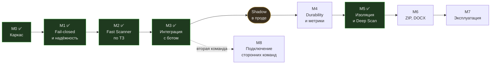

# ROADMAP

Цель: подключить к существующему боту API, которое возвращает обезвреженный файл и
вердикт за приемлемое время. Приоритет форматов — PDF, затем JPEG/PNG.

Целевая картина: [docs/architecture.md](docs/architecture.md).

**Минимально поставляемое в прод — M1 + M2 + M3.** Всё, что после, повышает
надёжность и покрытие, но не блокирует запуск в shadow-режиме.

---

## M0 — Каркас ✅

Сделано в текущем репозитории.

- [x] Структура репозитория, `CLAUDE.md`, docker-compose, Makefile
- [x] Gateway: приём multipart и по ссылке, sha256 стримом, кэш, очередь, ожидание `wait_ms`
- [x] Worker: конвейер стадий с ранним выходом, скоринг, доставка результата
- [x] Стадии `filetype`, `structure`, `clamav`, `yara`
- [x] CDR для PDF и изображений, три профиля, обязательная верификация выхода
- [x] Логирование через `logging`, JSON-формат, `contextvars`, запрет ПДн в логах
- [x] Коллбэк с HMAC-подписью и ретраями
- [x] Тесты, линт, генератор сэмплов

---

## M1 — Fail-closed и надёжность очереди ✅

Закрыт полностью. Помимо запланированного, по дороге найдены и исправлены четыре
дефекта, каждый из которых давал `clean` там, где проверки не было:
клиент мог выставить себе `fail-open` (M1.1), отказ CDR перезаписывал вердикт
режимом отказа (M1.6), `PasswordError` терял признак шифрования (M1.6),
недоступный clamd молча пропускал файлы (M1.7).

- [x] **M1.1** Убрать `on_timeout` из тела запроса, перевести режим отказа в
      серверную политику тенанта.
      *Готово: клиентское поле игнорируется, `fail-open` доступен только серверной настройке.*
- [x] **M1.2** Подхват задач, зависших в pending после падения воркера.
      *Готово: heartbeat живого владельца + разбор pending-списка. Упавший воркер
      больше не уносит задачу; лимит доставок не даёт перевыдавать её бесконечно.*
- [x] **M1.3** Различать инфраструктурную ошибку (ретрай) и контентную — краш парсера
      на конкретном файле детерминирован и ретраю не подлежит.
      *Готово: классификация исключений по природе + журнал попыток, переживающий
      жёсткий краш процесса. Файл, обрывающий разбор, закрывается после первой
      попытки; транзиторный сбой S3 или Redis возвращает задачу в очередь.*
- [x] **M1.4** Dead-letter stream + состояние `manual_review`.
      *Готово: поток `scan.dlq` с ограниченной длиной, три причины попадания,
      статус живёт неделю вместо пяти минут, служебная ручка `/v1/ops/dlq`
      с обязательной подписью.*
- [x] **M1.5** Идемпотентность: повторная доставка задачи не создаёт второй артефакт.
      *Готово: заявка на проверку по (sha256, профиль, версия политики) — тот же
      файл получает тот же `scan_id`; канал ожидания переведён на pub/sub, чтобы
      результата могло ждать несколько запросов; повторная доставка завершённой
      задачи не запускает конвейер заново. Заработал документированный, но не
      реализованный `Idempotency-Key`.*
- [x] **M1.6** Состояния `unscannable` (зашифрованный PDF, неподдерживаемый формат)
      отдельно от `clean` и `malicious`.
      *Готово: исправлено распознавание шифрования (`PasswordError` падал в
      `PDF_MALFORMED`, флаг терялся), непроверяемое больше не идёт в CDR,
      добавлен инвариант «сбой не смягчает вердикт». Владельческий пароль
      отделён от пользовательского: такой документ читается и проверяется.*
- [x] **M1.7** Тесты на отказ: краш воркера, таймаут стадии, недоступный S3, недоступный clamd.
      *Готово — и попутно закрыта дыра: при недоступном clamd файл получал `clean`.
      Введено понятие полноты покрытия: вердикт `clean` требует, чтобы обязательные
      стадии действительно отработали. Единственный путь к `clean` при неполном
      покрытии — явно выставленный оператором `fail-open`.*

---

## M2 — Fast Scanner до уровня ТЗ ✅

Сделано 8 из 8. ✅ Risk Engine переехал в общий пакет: вердикт считает и воркер, и
gateway при попадании в кэш — там же, где применяется политика тенанта.

- [x] **M2.1** `libmagic` вместо самописного определения типа; оставить свой polyglot-детект.
      *Готово: детектор двухслойный — таблица из 31 сигнатуры работает всегда,
      libmagic уточняет её вывод. 29 типов под тестами, добавлены признаки
      смещённой сигнатуры и расхождения детекторов.*
- [x] **M2.2** Расширить структурный анализ PDF: аннотации, шрифты, аномалии xref,
      число объектов, глубина вложенности, размеры потоков.
      *Готово: разбор вынесен в `stages/pdf_structure.py`, добавлено 22 новых
      признака, все 16 пунктов §8 покрыты, на каждый — синтетический сэмпл.*
- [x] **M2.3** Вынести веса и пороги Risk Engine в конфигурацию, добавить политику тенанта.
      *Готово: 24 литеральных веса убраны из стадий в таблицу `vscommon/weights.py`,
      файл `WEIGHTS_FILE` переопределяет встроенные значения, у тенанта свои
      `weight_overrides`. Пороги переехали в политику ещё в M1.1.*
- [x] **M2.4** YARA hot-reload без остановки воркера + версия правил в ключе кэша.
      *Готово: фоновая проверка правил и весов, компиляция вне блокировки,
      подмена ссылки под ней. Кривое правило не применяется и не останавливает
      проверку. Новый отпечаток сразу публикуется — иначе gateway читал бы кэш
      по прежним правилам. Заодно перезагружаются веса: без этого обещание M2.3
      «правка без пересборки» работало только с рестартом.*
- [x] **M2.5** Двухуровневый кэш: структурный по `rules_version`, AV по `av_db_version`
      с коротким TTL.
      *Готово: кэшируются признаки, а не вердикт — попутно исправлено, что тенанты
      с разными порогами делили одну запись с чужим вердиктом. При обновлении баз
      структурная часть переиспользуется, воркеру остаётся только clamd.*
- [x] **M2.6** Rate limiting и лимиты размера на gateway, per-tenant.
      *Готово: частота (скользящее окно) отсекается в middleware до чтения тела;
      параллелизм ограничен множеством с метками времени — именно он и защищает
      латентность соседей; предел размера у тенанта не поднимается выше общего.*
- [x] **M2.7** Замер латентности на корпусе документов.
      *Готово: `bench/latency.py`, цифры в architecture §9. Оценки оказались
      пессимистичны для PDF на порядок. Замер нашёл три дефекта: пересборка
      картинки шла через список пикселей (145× медленнее, ~5 ГБ на пределе),
      верификация CDR ложно срабатывала на сжатых данных, профиль `standard`
      раздувал фотографии втрое.*
- [x] **M2.8** Аудит потокобезопасности движков.
      *Готово: у clamd сокет лежал в поле экземпляра — общий клиент отдавал
      вердикт одного файла другому. Переведён на экземпляр-на-поток, YARA — на
      общий объект под блокировкой. Все разделяемые объекты в таблице
      architecture §7.7, на каждый — тест на параллельные вызовы.*

---

## M3 — Интеграция с ботом ✅

Сделано 11 из 11. ✅ Бот работает на боевом стенде: принимает вложения, отдаёт
обезвреженные копии, блокирует опасное. Есть теневой режим для обкатки и
список доверенных для снятия ложных блокировок.

- [x] **M3.1** Клиент сканера: таймаут, размыкатель, заранее заданное поведение
      при отказе. Живёт в `services/bot/botapp/scanner.py`.
      *Готово: при недоступном сканере бот отвечает «проверка недоступна» и файл
      не пропускает — fail-closed и на стороне клиента. Отдельным пакетом SDK
      пока не вынесен: второго потребителя нет.*
- [x] **M3.2** Приёмник вебхука на стороне бота: проверка HMAC, идемпотентность.
      *Готово: публичный адрес не нужен — сканер обращается по внутренней сети.
      Право ответить разыгрывается атомарно, поэтому повтор коллбэка и
      параллельный опрос-подстраховка не дают второго сообщения. Опрос остаётся
      как запасной путь: вебхук может не дойти.*
- [x] **M3.3** Shadow-режим: сканируем весь поток, ничего не блокируем, только логируем.
      *Готово: флаг `DEFAULT_SHADOW_MODE` в политике тенанта, отчёт
      `GET /v1/ops/shadow`. Вердикт остаётся честным — меняется только то,
      действует ли по нему клиент. Заблокированное в тени пересобирается, иначе
      режим не покрывал бы возможные ложные блокировки; ранний выход отключён,
      чтобы видеть мнение антивируса. Считаются отказы, а не только вердикт
      `malicious`.*
- [x] **M3.4** Allowlist по sha256 с аудитом — быстрый обход ложного срабатывания.
      *Готово: `POST /v1/ops/allowlist` с обязательными автором и причиной,
      ограниченным сроком и записью каждого применения в лог. Блокировка
      снимается без релиза, но пересборка файла сохраняется: список применяется
      ДО решения о CDR, иначе доверенный документ остался бы без копии.
      Кэш учтён — иначе запись не давала бы ничего до истечения TTL.*
- [x] **M3.5** Сквозной путь: пользователь → бот → сканер → обезвреженный файл → бот.
      *Готово: путь проверен на боевом стенде, реальные документы проходят.
      Систематического прогона по корпусу с замером time-to-verdict нет — он
      вынесен в M4.7, потому что упирается в метрики.*
- [x] **M3.6** Согласовать лимит Telegram Bot API (20 МБ на скачивание) с `max_file_size`.
      *Готово: бот проверяет размер до скачивания и отвечает понятным текстом.
      Локальный Bot API server — когда понадобятся файлы крупнее.*
- [x] **M3.7** Собрать образы под целевую архитектуру и выложить в registry.
      *Готово: buildx под `linux/amd64`, образы `dato1/vulnscantg-*` в Docker Hub,
      оверлей `docker-compose.prod.yml` для разворачивания без сборки.*
- [x] **M3.8** Регрессия на ложные срабатывания по корпусу реальных PDF.
      *Готово: `make corpus` и `make corpus-check`, разметка в репозитории,
      файлы скачиваются по требованию. Падение — по НОВЫМ срабатываниям на
      чистых файлах, а не по проценту: метка `none` означает «не внедряли», а не
      «безобидно». Разобранные случаи — в `corpus/expected.json` с объяснением.
      На корпусе доля срабатываний по чистым снижена с 40% до 3.8%, и все три
      оставшихся разобраны как верные.*
- [x] **M3.9** Понятные сообщения бота.
      *Готово: человек видит, что получает пересобранную копию, а не оригинал,
      и какие категории найдены — обычными словами, без кодов признаков. Для
      заблокированных файлов подробности не раскрываются.*
- [x] **M3.10** Документация для эксплуатации: `docs/policies.md`, `docs/deploy.md`,
      `deploy/README.md` и преднастроечная проверка `preflight.sh`.
- [x] **M3.11** Справочник кодов признаков (`docs/findings.md`).
      *Готово: 65 признаков с объяснением и указанием, что делать. Собирается
      из кода (`make findings-doc`), поэтому не может разойтись с реальными
      весами. Тест не даёт новому признаку остаться без описания и отсекает
      отписки вроде «то же».*

**После M3 — две недели shadow-режима на реальном потоке до включения блокировок.**

---

## M8 — Подключение сторонних команд ✅

Сделано 12 из 12. Мультитенантность обеспечена: тенант выводится из ключа,
загрузка требует подписи, результат достаётся только владельцу, коллбэк
подписывается ключом тенанта и уходит только на разрешённые адреса.

Не развёрнуто. Перед выкаткой обязателен `deploy/config/keys.json` — без него
gateway отвергает **все** запросы. Это осознанное поведение: умолчание в
аутентификации — дыра.

- [x] **M8.1** Подпись обязательна на `POST /v1/scan`.
      *Готово. Загрузка подписывает **канонический запрос без тела**
      (`METHOD\nPATH\nkey_id`), а не тело: подписать multipart можно только
      прочитав его, а читать тело до аутентификации нельзя — тогда нагрузка уже
      принята и проверка частоты теряет смысл. Целостность файла обеспечивает
      TLS (M8.10), подпись доказывает отправителя. Путь входит в подпись, иначе
      она годилась бы для любой другой ручки в пределах окна времени.*
- [x] **M8.2** Ключ на тенанта вместо общего секрета. Идентификатор тенанта
      берётся из ключа, а не из заголовка.
      *Готово: `vscommon/keys.py`. Реестр перечитывается на живом сервисе —
      скомпрометированный ключ нельзя оставлять до окна обслуживания.
      Нечитаемый файл ключей означает «никого не пускаем»: умолчание в
      аутентификации — это дыра. Одна битая запись не отрезает остальных.*
      *Критерий: заголовок `X-Vulnscan-Tenant` не влияет на применяемую политику;
      компрометация одного ключа не затрагивает остальных; ключ отзывается
      без рестарта.*
- [x] **M8.3** Проверка владения результатом.
      *Готово: `vscommon/ownership.py`, владелец фиксируется на приёме. Чужой
      тенант получает `404`, а не `403`: `403` подтвердил бы существование
      скана и превратил ручку в способ проверять чужие идентификаторы.
      Неизвестный владелец — отказ, а не разрешение.*
- [x] **M8.4** Коллбэк подписывается ключом тенанта, а не общим.
      *Готово вместе с M8.11: доставка вынесена в отдельный сервис `notifier`.
      Общий секрет означал, что любой клиент может подделать коллбэк любому
      другому — подпись доказывала лишь принадлежность к сервису.*
      *Ключи в воркер не попали: он разбирает враждебные файлы, и держать в нём
      секреты всех тенантов значит менять одну дыру в парсере на компрометацию
      всех клиентов сразу. В задаче едет только `key_id`, секрет знает notifier.*
- [x] **M8.9** Ограничить адреса коллбэков. `callback_url` приходит из запроса
      клиента и не проверяется: воркер отправляет запрос куда скажут. Вместе с
      отсутствием egress-политики (M5.2) это делает сканер посредником для
      обращений во внутреннюю сеть — метаданные облака, Redis, MinIO, сам
      gateway. **Работает на текущем стенде, не только при удалённом клиенте.**
      *Готово: `vscommon/callbacks.py`, проверка на приёме запроса. Пустой
      список означает «запрещено», а не «разрешено всё». Адреса метаданных
      облака запрещены даже если их вписали в список: легитимного повода слать
      туда результат не существует, а цена ошибки — ключи от инфраструктуры.*
- [x] **M8.10** TLS и точка входа для внешних клиентов.
      *Готово: Caddy в профиле `public`, gateway порт по-прежнему не публикует.
      Служебные и административные ручки наружу не выставляются: `/readyz`
      раскрывает состав движков и размер очереди разбора, `/metrics` — весь
      профиль нагрузки, а заведение тенантов через интернет не нужно вовсе.*
      *`REQUIRE_SIGNATURE=false` теперь пишет `ERROR` на старте: без подписи
      загружать файлы сможет кто угодно, а тенант возьмётся из умолчания.*
- [x] **M8.11** Долговечность доставки коллбэка.
      *Готово: 10 попыток с растущей паузой покрывают 27 минут. Отложенные
      повторы живут в упорядоченном множестве, а не в потоке: поток выдаёт
      сообщение сразу, а нужно «через четыре минуты». Задание удаляется из
      множества до попытки — иначе два экземпляра notifier доставили бы
      результат дважды.*
      *Недоставленное уходит в dead-letter с причиной `callback_failed`:
      молча потерянный результат для клиента неотличим от того, что файл не
      проверяли.*
      *Ретраи вынесены из воркера ещё и поэтому: полчаса повторов внутри
      обработки задачи означали бы, что воркер всё это время не берёт файлы.*
- [x] **M8.12** Согласовать расхождение часов.
      *Готово: `check_signature()` отдаёт причину отказа, и расхождение с
      размером окна видно в логе. Требование к NTP записано в §5 руководства.*
      *В ответ причина не уходит: клиенту незачем знать, ключа нет или подпись
      не сошлась. В лог обязана — иначе разошедшиеся часы выглядят как неверный
      ключ, и на это уходят часы разбирательств.*
- [x] **M8.5** Клиентская библиотека (SDK) отдельным пакетом: сейчас это
      `services/bot/botapp/scanner.py`, и второй команде пришлось бы копировать
      исходники.
      *Готово: `packages/vulnscan_client/`. Формат канонического запроса
      закреплён тестом буквально: расхождение с сервисом дало бы `401` на
      каждой загрузке, а выглядело бы как неверный ключ.*
      *Список безопасных вердиктов положительный, а не отрицательный: вердикт,
      добавленный в сервисе позже, считается небезопасным, пока интегратор не
      обновит библиотеку осознанно. `not blocked` и `safe` — разные вещи, и это
      главная ловушка интеграции.*
- [x] **M8.6** Руководство по подключению.
      *Готово: [docs/integration.md](docs/integration.md). Отдельный раздел про
      то, что `not blocked` не означает «безопасно», — это самая частая ошибка
      интеграции, и стоит она дороже всех остальных.*
- [x] **M8.7** Заведение тенанта без правки файла на сервере.
      *Готово: `/v1/admin/keys` и `/v1/admin/tenants/{t}/policy`, хранилище в
      Redis, подхват без перезапуска. Файл остался начальной загрузкой: потеря
      Redis не должна отрезать доступ всем, включая администратора.*
      *Секрет генерируется сервером и показывается один раз. Ручка, отдающая
      ключи списком, превратила бы одну утечку во все сразу.*
      *Административные ручки требуют отдельного признака у ключа: иначе клиент
      выписывал бы себе ключи и менял себе политику — тот же `fail-open` полем,
      только окольным путём.*
- [x] **M8.8** Раздельный учёт по тенантам.
      *Готово: `python -m writerapp.usage --days 30` по истории в PostgreSQL.
      Метрики для этого не годятся — у них ограниченная ретенция и они агрегаты,
      а счёт и разбор жалобы требуют записей.*
      *Список тенантов для меток метрик берётся из реестра ключей, а не из
      отдельной переменной: два списка неизбежно разъезжаются, и метрики тихо
      схлопывают настоящего тенанта в `other`.*

---

## M4 — Durability и наблюдаемость ✅

Сделано 14 из 14.

Стек наблюдаемости: **Tempo** для трейсов, **Prometheus** для метрик, **Loki** для
логов. Логи уже пишутся структурно (`vscommon.logging`, `LOG_FORMAT=json`) — их
остаётся только доставить. Трейсы и метрики нужно писать в коде: сейчас `/metrics`
отдаёт заглушку, а трассировки нет вовсе.

Общее ограничение для всех трёх: **у воркера нет сетевого выхода наружу**, и
наблюдаемость не повод его открывать. Всё, во что пишет воркер, живёт в `backend`,
а наружу выносит уже коллектор.

- [x] **M4.1** Result Writer: отдельный сервис-потребитель, владеет PostgreSQL.
      *Готово: `services/writer/`. Воркер публикует `ScanRecord` в поток
      `scan.results` и идёт дальше; базой владеет только writer, у воркера
      сетевого доступа к ней нет — это процесс, разбирающий враждебные файлы.*
      *Ack только после успешной записи: иначе сбой базы означал бы потерю
      истории без следа. Пачками, чтобы запись не стала узким местом.*
      *Отказ публикации не прерывает обработку: вердикт клиенту важнее истории.*
- [x] **M4.2** Схема PostgreSQL по §11 архитектуры + миграции.
      *Готово: `services/writer/migrations/001_init.sql` — `files`, `scans`,
      `findings`, `artifacts`. Индексы по `sha256`, `created_at`, `tenant`
      и `verdict`.*
      *Имя файла не хранится, и это закреплено тестом: поля просто нет в
      `ScanRecord`. Гарантия структурная, чтобы оно не появилось «для удобства
      отладки».*
      *Миграции идемпотентны (`IF NOT EXISTS`) — отдельная таблица версий при
      трёх файлах была бы лишней сущностью.*
- [x] **M4.3** Прометеевские метрики: гистограммы по стадиям и профилям CDR,
      счётчики вердиктов, глубина очереди, размер DLQ.
      *Готово: `vscommon/metrics.py`. Время до вердикта меряется в `ingest`, а не
      в middleware: middleware видит длительность запроса вместе с чтением тела
      и не отличает ответ из кэша от полного прохода.*
      *Дашборд — за пределами репозитория, метрики для него есть.*
- [x] **M4.6** Hit rate по каждому уровню кэша отдельно.
      *Готово: `vs_cache_lookups_total{level,outcome}`, уровни `structural` и `av`
      считаются раздельно.*
      *Критерий: на дашборде видно, что после freshclam падает только AV-уровень.
      Без этой метрики критерий M2.5 на проде нечем подтвердить.*
- [x] **M4.4** Alerting: рост очереди, рост latency, массовые ошибки сканеров,
      аномальная доля malicious.
      *Готово: `deploy/config/alerts.yml`, 10 правил, плюс конфигурация
      Prometheus и сам сервис в профиле `observability`.*
      *Главное правило — возраст баз: остальные ловят падения, которые заметны
      и без них, а это ловит сервис, который продолжает отвечать неправильно.*
      *Переполнение storage не покрыто: своей метрики на это нет, MinIO отдаёт
      её сам через `/minio/v2/metrics` — подключается отдельно.*
- [x] **M4.7** Замер time-to-verdict на корпусе реальных документов.
      *Готово: `bench/corpus_latency.py` — полный проход по внешнему корпусу,
      а не стадии по отдельности на своих же слишком аккуратных документах.*

      Замер на 175 файлах корпуса, профиль `standard`:

      | | измерено | цель |
      |---|---|---|
      | p50 | 11 мс | — |
      | p95 | 132 мс | ≤ 700 мс |
      | p99 | 693 мс | ≤ 2000 мс |
      | max | 2349 мс | — |
      | уложились в `wait_ms=400` | 98.9% | ≥ 80% |

      Вердикты: `clean` 54.3%, `suspicious` 27.4%, `malicious` 18.3% — корпус
      состоит из PDF с намеренно внедрёнными (безвредными) конструкциями.

      **Замер неполон и завышает оптимизм.** Он снят на машине разработчика, где
      нет ни `yara`, ни clamd, — то есть без антивирусной стадии, которая в
      проде и есть основная стоимость. Настоящие числа берутся с боевого стенда
      из `vs_verdict_duration_seconds`; этот скрипт нужен, чтобы ловить
      регрессии конвейера, а не подтверждать SLA.
- [x] **M4.8** Решить вопрос сохранности очереди. Redis запущен без записи на
      диск: его перезапуск теряет принятые, но не обработанные задачи. Группа
      потребителей теперь восстанавливается сама, задачи — нет, и это расходится
      с требованием «потеря задач 0».
      *Готово: включён `appendonly yes` с `appendfsync everysec` и томом.
      Выбран `everysec`, а не `always`: последний делает fsync на каждую запись
      и упирается в диск на горячем пути.*
      *Требование уточнено осознанно: остаточный риск — до секунды принятых
      задач при жёстком падении хоста. На этот случай работает идемпотентность
      по sha256: повторная присылка файла проверит его заново.*
- [x] **M4.14** Возраст баз и правил виден и деградирует сервис. Сейчас
      остановившееся обновление выглядит ровно как работающее: clamd доволен
      базой из образа, а вердикт `clean` выдаётся по сигнатурам недельной
      давности. С появлением зеркала (`cvdmirror`) риск вырос: clamd больше не
      ходит наружу сам и не жалуется в лог, если зеркало ничего не приносит.
      *Возраст в `/readyz` и метрикой; сутки без обновления — предупреждение,
      неделя — сервис не готов. Это ровно тот же приём, которым чинили молча
      недоступный clamd: не вес признака, а признание проверки несостоявшейся.*
      *Готово: `vscommon/freshness.py` разбирает дату базы из строки версии
      clamd, воркер публикует её, gateway отдаёт в `/readyz` и при возрасте
      больше недели объявляет себя неготовым. Метрика `vs_rules_age_seconds`,
      алерты на сутки и на неделю. 13 тестов.*
      *Неизвестный возраст считается непригодностью, а не свежестью: молчание
      означает, что воркер мог не запуститься вовсе.*

- [x] **M4.5** TTL и lifecycle-политики бакетов: quarantine 24 ч, clean по конфигу,
      отдельная политика для malicious-семплов.
      *Готово: `S3Store.apply_retention()`, воркер выставляет правила на старте.
      Срок живёт правилом бакета, а не уборщиком в коде: процесс, который
      «должен» подчищать, однажды не запустится, а правило переживёт рестарт.*
      *Политика по вредоносным семплам согласована так: дольше карантина их
      НЕ храним (`KEEP_MALICIOUS_SAMPLES=false`). Соблазн собрать коллекцию
      понятен, но вредоносный PDF — это всё ещё чей-то документ с ПДн, и
      удлинять срок нужно осознанно, а не по умолчанию.*
      *Хранилище без поддержки lifecycle не роняет старт, но пишет `ERROR`:
      молча накапливать чужие документы хуже, чем громко отказаться.*

### Имплементация наблюдаемости

Сделано 5 из 5. SDK заведены во всех компонентах: gateway, worker, deepscan, бот.
Не развёрнуто — коллектор поднимается профилем `observability`, выкатывать вместе
с M8.9.

Общий принцип, которого пришлось держаться: **наблюдаемость не имеет права влиять
на вердикт.** Отсутствующий SDK выключает телеметрию, но не проверку; недоступный
коллектор не задерживает стадию; негодный контекст трассировки начинает новый
трейс, а не роняет задачу.

- [x] **M4.9** OpenTelemetry: SDK и разметка спанами. Корневой спан на скан,
      дочерние — на стадии конвейера, пересборку и её проверку. Идентификаторы
      уже живут в `contextvars` (`log_context`), спаны кладутся туда же, а не
      протаскиваются аргументами.
      *Атрибуты спана — это те же логи: имя файла целиком, полный sha256, URL
      коллбэка с параметрами, значения EXIF в них не попадают. Ограничения
      раздела «что запрещено писать в логи» действуют дословно.*
      *Экспортёр обязателен в `_INFRA_MODULES` (`vscommon/errors.py`): иначе его
      транзиторный сбой будет принят за порчу файла и задача закроется без повтора.*
      *Экспорт не блокирует корутину — либо асинхронный экспортёр, либо
      `asyncio.to_thread`. Стадия не должна ждать коллектор.*
      *Критерий: один скан даёт одно связное дерево спанов; отключённый коллектор
      не меняет ни одного вердикта.*

- [x] **M4.10** Протаскивание контекста трассировки через очередь. Gateway и воркер
      разнесены по времени и по хостам, поэтому `traceparent` (W3C) едет **полем
      в `ScanJob`**, а не заголовком. Углублённая проверка со своим `scan_id`
      цепляется к трейсу родителя.
      *`traceparent` из запроса клиента не принимается на веру: чужой контекст
      позволил бы склеить свой скан с чужим трейсом. Либо валидируется, либо
      порождается заново.*
      *Критерий: трейс не рвётся на границе Redis Stream — приём файла, работа
      воркера и коллбэк лежат в одном дереве. Второй вердикт виден как
      продолжение первого.*

- [x] **M4.11** Экспорт OTLP в Tempo через коллектор. Коллектор стоит в `backend`
      и сам выносит наружу; воркер продолжает не иметь egress.
      *Критерий: `deploy/isolation-check.sh` по-прежнему проходит — из воркера
      в интернет не уходит ничего, кроме Redis, S3, коллбэка и коллектора.*

- [x] **M4.12** Настоящий `/metrics` вместо заглушки в
      `services/gateway/gateway_app/routes/health.py`. Отдельная задача — метрики воркера:
      он не HTTP-сервис, а цикл-потребитель, и своей ручки у него нет.
      Нужен либо минимальный HTTP-эндпоинт в воркере на `backend`, либо
      экспозиция через Redis; pushgateway не подходит — метрики не событийные.
      *Метки не содержат sha256, имени файла и `scan_id`: это и утечка ПДн,
      и неограниченная кардинальность. Тенант меткой быть может.*
      *Критерий: каждая реплика воркера скрейпится отдельно; рестарт реплики не
      обнуляет гистограммы на дашборде.*

- [x] **M4.13** Связка логов с трейсами для Loki. В структурную запись добавляются
      `trace_id` и `span_id` — через тот же `log_context`, которым уже
      протаскиваются `scan_id` и `sha256`.
      *Доставка логов (promtail или alloy) — инфраструктура, кода не требует.
      Кода требует именно корреляция.*
      *Правило «не больше одной записи INFO на скан в горячем пути» остаётся в
      силе: трейсы добавляются к логам, а не разрешают логировать больше.*
      *Критерий: из спана в Tempo можно перейти в логи этого же скана в Loki
      и обратно.*

---

## M5 — Изоляция и Deep Scanner ✅

Сделано 6 из 6. ✅ Изоляция воркера, углублённая проверка и реакция бота на
второй вердикт готовы. gVisor установлен на сервере и замерен. Осталось
развернуть — это общая выкатка вместе с M8.9.

- [x] **M5.1** Воркер внутри gVisor.
      *Готово: `runsc` установлен на сервере и доступен как рантайм,
      включается оверлеем `docker-compose.gvisor.yml`. Замер на самом сервере:
      разбор и пересборка PDF замедляются втрое (2.2 → 6.3 мс и 9.2 → 27.8 мс),
      перекодирование картинки не меняется вовсе. Это ожидаемый профиль:
      дорог перехват системных вызовов, а не вычисления. В абсолютных числах
      прибавка — десятки миллисекунд против сотен у антивируса, то есть
      приемлемо.*
      *Включается отдельным файлом `deploy/docker-compose.gvisor.yml`, а не
      переменной `WORKER_RUNTIME`: рантайм и адреса зависимостей обязаны
      меняться вместе, иначе воркеры не стартуют.*
      *Замер делался на одиночном контейнере и пропустил отказ: под compose
      воркеры с `runsc` не стартовали вовсе — не разрешались имена сервисов.
      Причина в `--reproduce-nat`, см. таблицу находок.*
- [x] **M5.2** Сеть воркера без выхода наружу.
      *Готово: две сети — `backend` (`internal: true`) для воркера и хранилищ,
      `egress` для тех, кому связь нужна по назначению: gateway принимает
      запросы, clamd тянет базы, бот ходит в Telegram. Проверка оформлена
      скриптом `deploy/isolation-check.sh`. Выяснилось попутно, что
      `internal: true` ломает публикацию порта — gateway пришлось оставить с
      внешней связностью, он парсеров не запускает.*
      *Не развёрнуто на сервере: там воркер пока ходит в интернет свободно.
      Выкатывать вместе с M8.9, иначе коллбэки к внешнему клиенту сломались бы.*
      *Критерий: исходящий запрос в интернет из воркера не проходит — негативный тест.*
- [x] **M5.3** Ограничение прав воркера.
      *Готово ещё в M0, здесь проверено и зафиксировано: non-root (uid 10001),
      корневая ФС только для чтения, все capabilities сброшены,
      `no-new-privileges`, временные файлы в tmpfs. Проверяется тем же
      `isolation-check.sh`, в том числе на сервере.*
- [x] **M5.4** Deep Scanner: очередь, углублённый разбор, асинхронный второй вердикт.
      *Готово: отдельный сервис `deepscan` — тот же образ в роли `WORKER_MODE=deep`.
      Разбирает без раннего выхода и пересобирает даже заблокированное, чтобы
      выяснить, поддаётся ли документ безопасной пересборке. Свой идентификатор
      скана со ссылкой на родительский: с прежним задача не запускалась бы
      вовсе, а результат быстрой проверки был бы затёрт.*
      *Детонация в песочнице не реализована — под неё оставлено место в
      конвейере. Отзыв первого вердикта на стороне бота вынесен в M5.6.*
- [x] **M5.6** Бот реагирует на второй вердикт.
      *Готово: углублённый результат ищется по родительскому скану — у него
      свой идентификатор, и иначе он выглядел бы ответом на неизвестный скан и
      молча терялся. Человека беспокоим, только если вердикт ухудшился;
      уточнение отправляется один раз, сколько бы коллбэков ни пришло.*
- [x] **M5.5** Выборка чистых файлов в углублённую проверку.
      *Готово: `DEEP_SAMPLE_RATE` — доля чистых, уходящих на разбор. Бросок
      криптостойкий: предсказуемая выборка позволяла бы подгадать, какой файл
      углублённо не проверят. Цифра пропусков появится, когда накопится
      статистика на реальном потоке.*

---

## M6 — Расширение форматов

- [ ] **M6.1** ZIP: защита от бомб, общий бюджет распаковки на всё дерево вложенности,
      path traversal, симлинки, исполняемые файлы внутри.
      *Критерий: 10 МБ → 10 ГБ блокируется; бюджет общий, а не на каждый архив.*
- [ ] **M6.2** Распространение признаков вложенного файла на контейнер.
      *Критерий: ZIP с вредоносным PDF внутри не получает `clean`.*
- [ ] **M6.3** DOCX: VBA, OLE, DDE, внешние шаблоны и связи, подозрительные relationships.
- [ ] **M6.4** CDR для DOCX.
      *Критерий: макрос есть на входе, отсутствует на выходе.*
- [ ] **M6.5** WEBP, TIFF, устаревшие DOC/XLS/PPT — по фактической потребности.

---

## M7 — Эксплуатация

- [ ] **M7.1** CI для YARA-правил: компиляция и прогон по корпусу до выкатки.
      *Критерий: правило, дающее FP на эталонном корпусе, не выкатывается.*
- [ ] **M7.2** Канареечная выкатка правил и мгновенный откат. Опирается на
      `reload_interval_s` из M2.4: он же задаёт окно, в котором воркеры могут
      работать на разных версиях правил.
- [ ] **M7.3** Очередь ревью ложных срабатываний, накопление размеченного корпуса.
- [ ] **M7.4** Мультитенантность: квоты, свои пороги, свой ретеншн, ротация ключей.
- [ ] **M7.7** Аудит на общие данные между тенантами. Кэш вердиктов этим уже болел
      (исправлено в M2.5), остальные общие ключи Redis не проверены.
      *Критерий: на каждый разделяемый ключ либо обоснование общности, либо тенант
      в составе ключа.*
- [ ] **M7.5** Шифрование quarantine at rest, аудит доступа.
- [ ] **M7.6** Runbook: что делать при росте очереди, при массовых FP, при недоступном clamd.

---

## Технический долг

Замечено по дороге, отдельного майлстоуна не требует.

- [x] **D1** Пакеты сервисов больше не конфликтуют.
      *Готово: `gateway_app` и `worker_app`; `botapp`, `writerapp` и
      `notifierapp` были названы правильно с самого начала. Все пять
      импортируются в одном процессе.*
      *Долг успел обрасти обходами: тесты грузили модули gateway по пути через
      `importlib`, потому что обычный импорт резолвился в воркер. Обходы
      удалены — и один из них стал строже: проверка канонического запроса
      теперь сверяется с настоящей функцией сервиса, а не с копией формата,
      которая разошлась бы молча.*
- [x] **D2** `POLICY_VERSION` считается отпечатком, а не правится руками.
      *Готово: `_policy_fingerprint()` по составу вердиктов, статусов,
      непроверяемого и признаков, зависящих от запроса.*
      *Семейства признаков ушли в отпечаток **таблицы весов**, а не сюда: они
      живут вместе с весами, и перегруппировка меняет балл при тех же
      значениях. Попытка собрать всё в одном отпечатке дала циклический
      импорт — разделение оказалось не косметическим.*
- [x] **D3** Предупреждения в тестах разобраны.
      *Готово: включён строгий режим (`filterwarnings = ["error", ...]`) —
      предупреждение ломает прогон. Иначе настоящие тонут в шуме, а среди них
      бывают `DeprecationWarning` от библиотек, разбирающих недоверенный
      контент.*
      *Три точечных исключения с обоснованием: `PageCopyWarning` от pikepdf на
      намеренно кривых сэмплах, устаревание starlette (просит `httpx2` —
      обновление тянет смену HTTP-клиента во всех сервисах) и `ResourceWarning`
      от fakeredis (см. D4).*

- [ ] **D4** Тестовые фикстуры не закрывают клиентов `fakeredis`, отчего
      `ResourceWarning` всплывает при сборке мусора от предыдущего теста.
      Сейчас класс заглушен целиком — то есть настоящая утечка сокетов в
      сервисе прошла бы незамеченной.
      *Появился при закрытии D3: глушить продуктовые `ResourceWarning` не
      хочется, но и городить закрытие в двадцати местах посреди работы над
      долгами тоже.*
      *Критерий: фикстуры закрывают соединения, `ignore::ResourceWarning`
      убран из конфигурации.*

## Что нашлось по дороге

Основная ценность прошедших майлстоунов оказалась не в запланированных пунктах,
а в дефектах, которые всплыли при их реализации. Все они — вариации одной ошибки:
**вердикт зависел от весов и порогов там, где должен зависеть от факта «проверка
состоялась»**.

| Где нашлось | Что было |
|---|---|
| M1.1 | клиент мог полем в запросе выставить себе `fail-open` |
| M1.6 | отказ CDR перезаписывал вердикт режимом отказа |
| M1.6 | `PasswordError` терялся в `PDF_MALFORMED`, признак шифрования не выставлялся |
| M1.7 | недоступный clamd молча пропускал файлы как `clean` |
| M2.2 | дубли признаков удваивали вес в скоринге |
| M2.2 | размер шрифта мерился по сжатой длине потока |
| M2.1 | объект libmagic разделялся между потоками пула |
| M2.5 | тенанты с разными порогами делили запись кэша с чужим вердиктом |
| M2.8 | общий клиент clamd отдавал вердикт одного файла другому |
| M2.7 | пересборка картинки через список пикселей: 145× медленнее, ~5 ГБ на пределе |
| M2.7 | верификация CDR искала `/JS` в сжатых данных — 45% ложных отказов на 10 МБ |
| деплой | воркер падал через 5 с: таймаут чтения обрывал `XREADGROUP ... BLOCK` |
| деплой | `S3Store.put` считал размер после заливки — boto3 уже закрыл поток |
| деплой | коррелированные признаки складывались: битый PDF набирал 100 из трёх взглядов на одну поломку |
| деплой | кривая конфигурация роняла gateway в цикл перезапуска вместо деградации |
| деплой | неверный токен бота давал traceback каждые 3 с вместо одной понятной строки |
| прод | polyglot искался по всему файлу: PDF из Word (со вложенным .docx) получал 70 баллов |
| прод | допуск в 64 байта после `%%EOF` пропускал приклеенный хвост |
| прод | расхождение длины потока весило 40 и делало подозрительным любой документ |
| прод | `MIME_MISMATCH` срабатывал на `application/octet-stream` — Telegram шлёт его постоянно |
| прод | метка типа от клиента попадала в кэш по содержимому и доставалась чужому вердикту |
| прод | потеря consumer group ломала воркеров намертво до ручного рестарта |
| корпус | `/OpenAction` считался опасным по факту наличия: 26 из 80 обычных PDF помечались подозрительными |
| корпус | `/JS` искался в байтах — три байта, в 12 МБ сжатых данных встречается случайно с вероятностью 51% |
| корпус | предел вложенности 32 задевал обычные документы: у реальных p99 = 49 |
| M3.4 | список доверенных не работал на кэш-хите: запись не действовала до истечения TTL |
| M3.4 | заявка из M1.5 жила 5 минут после скана: повторный запрос дедуплицировался на заблокированный результат |
| M8 | `POST /v1/scan` не требовал подписи вовсе — грузить мог кто угодно |
| M8 | тенант брался из заголовка: чужую политику и квоту можно было присвоить |
| M8 | результат и обезвреженный файл отдавались любому, кто знает `scan_id` |
| прод | проверка после CDR судила `/OpenAction` по наличию: ghostscript пишет «открыть на такой-то странице», и профиль `strict` не отдавал копию ни для одного файла (45 из 175 в корпусе) |
| прод | бот привязывал ответ к `scan_id`, а дедупликация выдаёт общий: второй такой же файл затирал первого ждущего, и на два сообщения уходил один ответ |
| прод | том postgres монтировался на `/var/lib/postgresql/data`: образы 18+ кладут данные в подкаталог с именем мажорной версии и отказываются стартовать при монтировании на `data` |
| прод | та же ошибка повторилась ещё дважды — на `prometheus.yml` и следом ждала на `alerts.yml`, `otel-collector.yaml`, `Caddyfile`. Лечение симптома не помогало: класс убран переводом на монтирование каталога в нейтральную точку |
| прод | `freshclam.conf` монтировался отдельным файлом, на сервере его не было — Docker молча создал КАТАЛОГ, и clamd упал с «not a directory». Ровно тот случай, от которого предостерегает комментарий в этом же compose-файле |
| документация | ограничение частоты считалось по заголовку `X-Vulnscan-Tenant`, который клиент выставляет сам: сменив его, он получал свежий счётчик в обход собственной квоты. M8 перевёл на ключи вердикт и политику, а квоту забыл — нашлось при сверке документации с кодом перед v1.0.0 |
| прод | проверка владения (M8.3) записывала владельца только на пути полной проверки: ответ из кэша получает новый `scan_id` и уходил без владельца, из-за чего клиент не мог забрать собственный результат. Проявлялось только на повторе файла — то есть когда всё «должно работать быстрее» |
| прод | M8 перевёл gateway на ключи, а бот остался на старом протоколе: слал `X-Vulnscan-Tenant` без подписи и получал `401` на каждый файл. Единственный клиент сервиса не был переведён вместе с ним |
| прод | `canonical_request` жил только в gateway — клиенту его было не импортировать, и копия формата на второй стороне разошлась бы молча. Перенесён в `vscommon.signing` |
| прод | запись-комментарий в `keys.json` давала `ERROR` при каждом старте: JSON комментариев не имеет, а `ERROR` на штатной записи обесценивает сам уровень |
| M8 | `hmac.compare_digest` падает на строках с не-ASCII символами: подпись с кириллицей в заголовке давала `500` вместо `401` — необработанное исключение прямо в пути аутентификации |
| прод | версия баз антивируса защёлкивалась на первом подключении: freshclam обновлял базы, clamd их подхватывал, а `av_db_version` в ключе кэша не менялся — новые сигнатуры не применялись к уже виденным файлам до истечения суточного TTL |
| прод | freshclam не мог получить TXT-запись через прокси, сваливался в скачивание полными файлами и ловил `429` с суточным баном от CDN. Лечится своим зеркалом (`cvdmirror`), после чего clamd вообще не нужен выход наружу |
| прод | под `runsc` воркеры не стартовали: встроенный DNS Docker недоступен из gVisor — резолвер слушает на 127.0.0.11 в сетевом пространстве хоста, а у песочницы свой стек и свой loopback. TCP по адресу шёл, имена не разрешались. `--reproduce-nat` не помогает: он переносит правила NAT, но не слушателя. Обход — закреплённые адреса и `extra_hosts` |

Отсюда практика на будущее: **каждый пункт закрывается тестом на свой критерий
приёмки, и отдельно — тестом на обратный инвариант** («исправный сканер не портит
чистый файл», «обычный PDF не поднимает признаков»). Половина списка выше найдена
именно обратными тестами.

Вторая половина — строки «деплой» и «прод» — без запуска не нашлась бы вовсе. Ни
один из этих дефектов не воспроизводился на тестах: локально стоял другой бэкенд
хранилища, не было настоящего Redis, а документы для проверки я генерировал сам.
Отдельно стоит корпус `badpdfgen`: три ложных срабатывания он вскрыл там, где
синтетика молчала.

## Порядок работы

Задачи внутри майлстоуна по возможности независимы и берутся параллельно.
Между майлстоунами порядок значим: M1 закрывает дыры в безопасности отказов,
без него нет смысла улучшать детект в M2.

Каждая задача считается закрытой, когда есть тест на её критерий приёмки —
не «работает на моей машине», а воспроизводимая проверка в `make test`.
