# Целевая архитектура vulnscantg

Документ описывает систему, к которой мы идём, а не только то, что уже написано.
Каждый компонент помечен статусом:

`✅` реализовано в репозитории · `🚧` частично · `⬜` план (см. [ROADMAP.md](../ROADMAP.md))

## 0. Что мы строим

Подключаемый по API сервис для чат-бота, принимающего документы от пользователей.
Два результата на каждый файл:

1. **Обезвреженный файл (CDR)** — пересобранный PDF, документ Word, изображение или
   архив из них без активного содержимого. Это основная гарантия: она не зависит от того, знает ли антивирус
   конкретную угрозу.
2. **Вердикт и признаки** — что нашли, с каким весом. Решение «пропустить или
   заблокировать» принимает клиент по своей политике.

Приоритет форматов: PDF, затем JPEG/PNG. Документы Word (DOCX, DOCM) и ZIP-архивы
добавлены в M6; таблицы, презентации и старые форматы Office — `unsupported`.

## 1. Компоненты

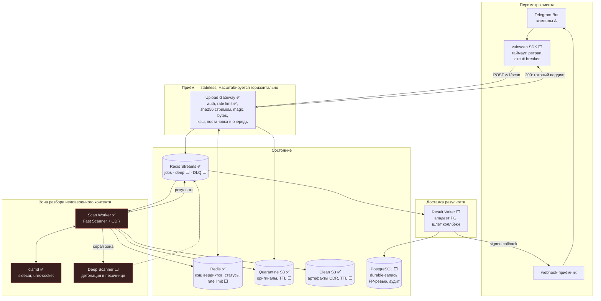
```mermaid
flowchart TB
    subgraph client["Периметр клиента"]
        BOT["Telegram Bot<br/>команды А"]
        SDK["vulnscan SDK ⬜<br/>таймаут, ретраи,<br/>circuit breaker"]
        HOOK["webhook-приёмник"]
    end

    subgraph edge["Приём — stateless, масштабируется горизонтально"]
        GW["Upload Gateway ✅<br/>auth, rate limit ✅,<br/>sha256 стримом, magic bytes,<br/>кэш, постановка в очередь"]
    end

    subgraph data["Состояние"]
        REDIS[("Redis ✅<br/>кэш вердиктов, статусы,<br/>rate limit ⬜")]
        Q[("Redis Streams ✅<br/>jobs · deep ⬜ · DLQ ⬜")]
        QUAR[("Quarantine S3 ✅<br/>оригиналы, TTL ⬜")]
        CLEAN[("Clean S3 ✅<br/>артефакты CDR, TTL ⬜")]
        PG[("PostgreSQL ⬜<br/>durable-запись,<br/>FP-ревью, аудит")]
    end

    subgraph zone["Зона разбора недоверенного контента"]
        W["Scan Worker ✅<br/>Fast Scanner + CDR"]
        CLAM["clamd ✅<br/>sidecar, unix-socket"]
        DEEP["Deep Scanner ⬜<br/>детонация в песочнице"]
    end

    subgraph out["Доставка результата"]
        RW["Result Writer ⬜<br/>владеет PG,<br/>шлёт коллбэки"]
    end

    BOT --> SDK
    SDK -->|"POST /v1/scan"| GW
    GW <--> REDIS
    GW --> QUAR
    GW --> Q
    Q --> W
    W <--> CLAM
    W --> QUAR
    W --> CLEAN
    W --> REDIS
    W -->|результат| Q
    Q --> RW
    RW --> PG
    RW -->|"signed callback"| HOOK
    W -.->|"серая зона"| DEEP
    DEEP -.-> Q
    GW -->|"200: готовый вердикт"| SDK
    HOOK --> BOT

    classDef untrusted fill:#3a1f1f,stroke:#a33,color:#eee
    class W,CLAM,DEEP untrusted
```

Красная зона — единственное место, где парсится недоверенный контент. У неё нет
доступа к PostgreSQL и к внутренней сети: egress-allowlist из трёх адресов — Redis,
S3, clamd. Результаты воркер не пишет в БД сам, а публикует в очередь — этим
снимается противоречие «воркер без доступа к БД, но пишет в БД».

## 2. Горячий путь

Ключевое решение: **гибридный контракт**. Gateway ждёт результат до `wait_ms`, и
типовой документ успевает в синхронный ответ. Всё, что не успело, доезжает вебхуком.
Коллбэк отправляется всегда, если задан — у клиента один код-путь.

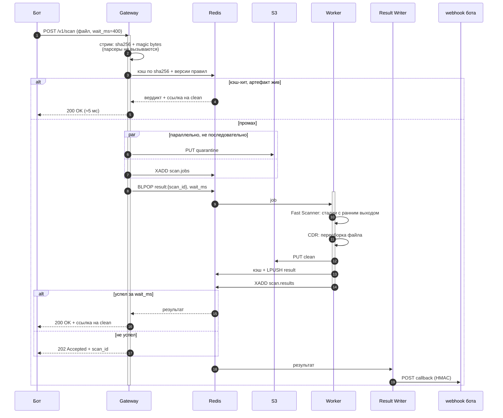
```mermaid
sequenceDiagram
    autonumber
    participant B as Бот
    participant G as Gateway
    participant R as Redis
    participant S as S3
    participant W as Worker
    participant RW as Result Writer
    participant H as webhook бота

    B->>G: POST /v1/scan (файл, wait_ms=400)
    activate G
    G->>G: стрим: sha256 + magic bytes<br/>(парсеры не вызываются)
    G->>R: кэш по sha256 + версии правил

    alt кэш-хит, артефакт жив
        R-->>G: вердикт + ссылка на clean
        G-->>B: 200 OK (≈5 мс)
    else промах
        par параллельно, не последовательно
            G->>S: PUT quarantine
        and
            G->>R: XADD scan.jobs
        end
        G->>R: BLPOP result:{scan_id}, wait_ms

        activate W
        R->>W: job
        W->>W: Fast Scanner: стадии с ранним выходом
        W->>W: CDR: пересборка файла
        W->>S: PUT clean
        W->>R: кэш + LPUSH result
        W->>R: XADD scan.results
        deactivate W

        alt успел за wait_ms
            R-->>G: результат
            G-->>B: 200 OK + ссылка на clean
        else не успел
            G-->>B: 202 Accepted + scan_id
        end

        R->>RW: результат
        RW->>H: POST callback (HMAC)
    end
    deactivate G
```

Почему запись в quarantine идёт параллельно с постановкой задачи, а не строго до неё:
последовательная схема добавляет полный round-trip к S3 в бюджет 500 мс на пустом
месте. Воркер всё равно ждёт своей очереди дольше, чем длится PUT.

## 3. Конвейер Fast Scanner

Стадии упорядочены по стоимости, ранний выход по достижении порога блокировки.

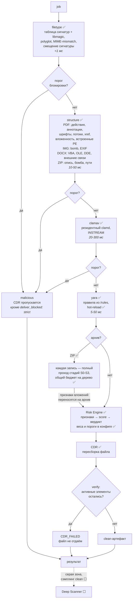
```mermaid
flowchart TD
    IN["job"] --> S0

    S0["filetype ✅<br/>таблица сигнатур + libmagic,<br/>polyglot, MIME-mismatch,<br/>смещение сигнатуры<br/><i>&lt;1 мс</i>"]
    S0 --> G0{"порог<br/>блокировки?"}
    G0 -- да --> BLOCK
    G0 -- нет --> S1

    S1["structure ✅<br/>PDF: действия, аннотации,<br/>шрифты, потоки, xref,<br/>вложенность, встроенные PE<br/>IMG: bomb, EXIF<br/>DOCX: VBA, OLE, DDE, внешние связи<br/>ZIP: опись, бомба, пути<br/><i>10-50 мс</i>"]
    S1 --> G1{"порог?"}
    G1 -- да --> BLOCK
    G1 -- нет --> S2

    S2["clamav ✅<br/>резидентный clamd,<br/>INSTREAM<br/><i>20-300 мс</i>"]
    S2 --> G2{"порог?"}
    G2 -- да --> BLOCK
    G2 -- нет --> S3

    S3["yara ✅<br/>правила из /rules,<br/>hot-reload ✅<br/><i>5-50 мс</i>"] --> ARCH

    ARCH{"архив?"}
    ARCH -- "ZIP ✅" --> REC["каждая запись — полный<br/>проход стадий S0-S3,<br/>общий бюджет на дерево ✅"]
    REC -- "признаки вложений<br/>переносятся на архив" --> RISK
    ARCH -- нет --> RISK

    RISK["Risk Engine ✅<br/>признаки → score → вердикт<br/>веса и пороги в конфиге ✅"]
    RISK --> CDR

    CDR["CDR ✅<br/>пересборка файла"]
    CDR --> VERIFY{"verify:<br/>активные элементы<br/>остались?"}
    VERIFY -- да --> FAIL["CDR_FAILED<br/>файл не отдаём"]
    VERIFY -- нет --> OK["clean-артефакт"]

    BLOCK["malicious<br/>CDR пропускается<br/><i>кроме deliver_blocked: strict</i>"]

    OK --> RES["результат"]
    FAIL --> RES
    BLOCK --> RES
    RES -.->|"серая зона,<br/>сэмплинг clean ⬜"| DEEP["Deep Scanner ⬜"]
```

Risk Engine — библиотека, а не сервис: это чистая функция от набора признаков,
отдельный сетевой хоп ей не нужен. Веса и пороги живут в конфигурации политики.

### Архивы и документы Word (M6)

**Вложение проверяется как отдельный файл.** Антивирус и YARA по сжатому
архиву видят только сжатые байты, поэтому каждая запись распаковывается в
tmpfs и проходит все стадии заново (`Pipeline._expand`). Признаки вложения
переносятся на архив (`ScanContext.adopt`) с номером записи вместо имени: имя —
это ПДн. Непроверенное вложение делает непроверенным весь архив.

**Бюджет общий на всё дерево.** Один объект `UnpackBudget` на загруженный
файл: объём (заявленный и настоящий), число записей, глубина, время. Опись
списывает заявленные размеры до распаковки — так бомба видна, не распаковав ни
байта. Лимит на каждый архив отдельно пропускает 42.zip по построению: каждый
его уровень выглядит безобидно.

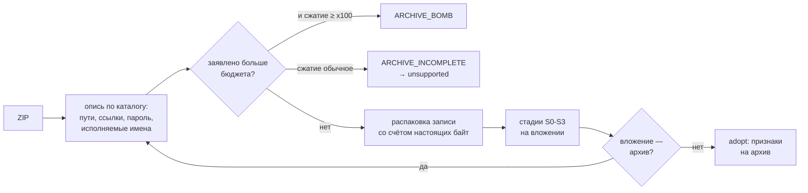
```mermaid
flowchart LR
    Z["ZIP"] --> I["опись по каталогу:<br/>пути, ссылки, пароль,<br/>исполняемые имена"]
    I --> B{"заявлено больше<br/>бюджета?"}
    B -- "и сжатие ≥ x100" --> BOMB["ARCHIVE_BOMB"]
    B -- "сжатие обычное" --> INC["ARCHIVE_INCOMPLETE<br/>→ unsupported"]
    B -- нет --> X["распаковка записи<br/>со счётом настоящих байт"]
    X --> S["стадии S0-S3<br/>на вложении"]
    S --> N{"вложение —<br/>архив?"}
    N -- да --> I
    N -- нет --> A["adopt: признаки<br/>на архив"]
```

**Документ Word — тоже ZIP**, и бомба в нём та же, но его части — не файлы для
проверки. Их разбирает `docx_structure`: макросы, ActiveX, OLE-объекты, поля
DDE (инструкция склеивается по границам поля, а не ищется в тексте), шаблон и
объекты по сети, `altChunk`. XML разбирается через expat с запретом DTD и
сущностей.

**YARA видит части документа распакованными.** По сырым байтам DOCX правило
видело бы сжатый поток, поэтому стадия отдаёт ему файл целиком и затем каждую
часть отдельно, с именем части во внешней переменной `part`
(`worker_app/yara_views.py`). Тот же обход используют канарейка и шлюз
`make rules-check`: правило проверяется в тех же условиях, в каких работает.

## 4. Детект и политика разведены

Сервис отвечает на вопрос «что нашли», клиент — на вопрос «что с этим делать».

| Слой | Что решает | Где живёт |
|---|---|---|
| Стадии | какие признаки есть в файле | `stages/*` — возвращают `Finding[]`, никогда не вердикт |
| Risk Engine | какой score и какой вердикт | `scoring.py` + таблица весов `WEIGHTS_FILE` |
| Политика тенанта | пороги, режим отказа, профиль CDR по умолчанию | серверная конфигурация, **не поле запроса** |
| Клиент | пропустить, заблокировать, показать предупреждение | код бота |

Режим отказа (`fail-closed`) — серверная настройка. Клиент не может параметром
запроса отключить себе безопасность.

### Веса признаков

Стадия сообщает, **что** нашла. Сколько это весит — решает таблица, а не код
стадии: подкрутка чувствительности не должна требовать пересборки образа.

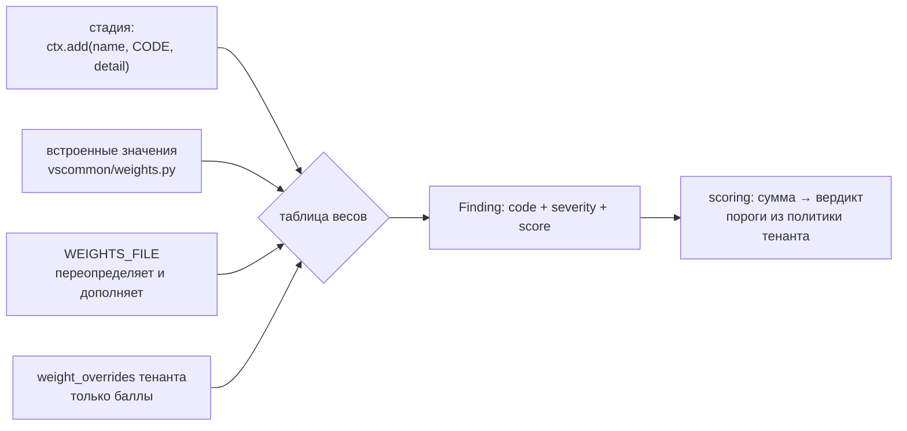
```mermaid
flowchart LR
    STAGE["стадия:<br/>ctx.add(name, CODE, detail)"] --> T{"таблица весов"}
    B["встроенные значения<br/>vscommon/weights.py"] --> T
    F["WEIGHTS_FILE<br/>переопределяет и дополняет"] --> T
    P["weight_overrides тенанта<br/>только баллы"] --> T
    T --> FIND["Finding: code + severity + score"]
    FIND --> SC["scoring: сумма → вердикт<br/>пороги из политики тенанта"]
```

Три уровня разрешаются в порядке: встроенное → файл → тенант. Встроенные
значения обязательны — сервис должен работать и без внешней конфигурации;
файл их переопределяет и дополняет.

Код, которого нет в таблице, получает **ненулевой** запасной вес и попадает в
`unknown_codes`. Забытый признак должен быть заметен в вердикте, а не исчезать
молча. У YARA код признака формируется из имени правила, поэтому вес берётся по
отдельному ключу `YARA:<тег>`.

### Определение типа файла

§2 ТЗ требует не доверять ни расширению, ни заявленному клиентом MIME. Детектор
двухслойный, и это не дублирование:

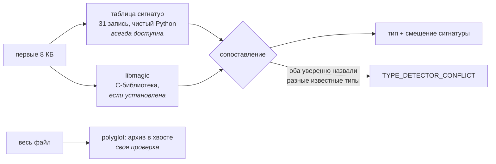
```mermaid
flowchart LR
    F["первые 8 КБ"] --> T["таблица сигнатур<br/>31 запись, чистый Python<br/><i>всегда доступна</i>"]
    F --> M["libmagic<br/>C-библиотека,<br/><i>если установлена</i>"]
    T --> D{"сопоставление"}
    M --> D
    D --> R["тип + смещение сигнатуры"]
    D -- "оба уверенно назвали<br/>разные известные типы" --> C["TYPE_DETECTOR_CONFLICT"]
    F2["весь файл"] --> P["polyglot: архив в хвосте<br/><i>своя проверка</i>"]
```

- **Таблица работает самостоятельно.** Отсутствие системной библиотеки не должно
  тихо отключать определение типа — деградация видна в `/readyz` полем `libmagic`,
  а не проявляется молчаливым `TYPE_UNKNOWN` на каждом файле.
- **Расхождение детекторов — сигнал.** Но только когда оба назвали типы из
  известного множества: для DOCX libmagic говорит `...wordprocessingml.document`
  против `application/zip` у таблицы — это уточнение, а не конфликт.
- **Polyglot остаётся своей проверкой.** libmagic сообщает основной тип файла и
  приклеенный к хвосту архив не видит.
- **Сигнатура не в нулевом смещении** (`TYPE_SIGNATURE_OFFSET`) — отдельный
  признак: такой PDF открывается просмотрщиком, но обходит наивную проверку
  начала файла.

Вызовы libmagic сериализованы блокировкой: стадии выполняются в пуле потоков, а
объект библиотеки держит cookie и потокобезопасным не является.

### Покрытие §8 ТЗ структурным анализом

Разбор идёт двумя проходами. Байтовый работает всегда — в том числе на
документе, который парсер открыть отказывается, а намеренно битые PDF ровно на
это и рассчитаны. Проход по графу объектов добавляет то, что в байтах не видно.

| Пункт §8 | Признаки |
|---|---|
| JavaScript | `PDF_JAVASCRIPT`, `PDF_JS` |
| `/OpenAction`, `/AA` | `PDF_OPENACTION`, `PDF_AUTO_ACTION` |
| `/Launch` | `PDF_LAUNCH` |
| embedded files | `PDF_EMBEDDED_FILE`, `PDF_EMBEDDED_NAMES` |
| external URLs | `PDF_EXTERNAL_URI` (в признак попадает только хост) |
| suspicious actions | `PDF_SUBMITFORM`, `PDF_IMPORTDATA`, `PDF_GOTOE`, `PDF_GOTOR`, `PDF_RENDITION`, `PDF_MOVIE`, `PDF_SOUND`, `PDF_SETOCGSTATE` |
| нестандартные streams | `PDF_UNUSUAL_FILTER`, `PDF_FILTER_CHAIN`, `PDF_JBIG2` |
| malformed objects | `PDF_MALFORMED`, `PDF_DAMAGED` |
| количество объектов | `PDF_TOO_MANY_OBJECTS` |
| аномальные размеры | `PDF_STREAM_BOMB`, `PDF_STREAM_LENGTH_MISMATCH`, `PDF_FONT_OVERSIZED` |
| подозрительные annotations | `PDF_ANNOT_ACTION`, `PDF_ANNOT_HIDDEN_ACTION`, `PDF_ANNOT_AUTO_ACTION` |
| encrypted documents | `PDF_ENCRYPTED`, `PDF_ENCRYPTED_OWNER` |
| embedded executables | `PDF_EMBEDDED_EXECUTABLE` |
| suspicious fonts | `PDF_FONT_EMBEDDED`, `PDF_FONT_OVERSIZED`, `PDF_TOO_MANY_FONTS` |
| parser anomalies | `PDF_XREF_RECONSTRUCTED`, `PDF_XREF_BROKEN`, `PDF_TRAILING_DATA`, `PDF_INCREMENTAL_UPDATES` |
| глубина вложенности | `PDF_DEEP_NESTING` |

Три вещи, которые удерживают анализ в бюджете и без ложных срабатываний:

- **Стоимость ограничена явно**: не больше 200 потоков на документ, не больше
  4 МБ распаковки на поток и 32 МБ на весь файл, не больше 50 000 шагов обхода
  графа. Без этих лимитов специально собранный документ съедает таймаут стадии.
- **Обход графа итеративный.** Рекурсия по намеренно вложенному документу — это
  `RecursionError`, то есть падение стадии вместо признака.
- **Один код — один признак.** Две проверки, независимо нашедшие одно свойство
  (бомба в отдельном потоке и она же в суммарной оценке), не удваивают вес.

Отдельно про шрифты: размер программы шрифта берётся из `/Length1`, а не из
`/Length` потока. `/Length` — длина ПОСЛЕ сжатия, и гигантский шрифт из
повторяющихся байт по ней выглядит крошечным.

## 5. Профили CDR

| Профиль | PDF | Изображения | Что теряется | Стоимость |
|---|---|---|---|---|
| `light` | снять JS, `/OpenAction`, `/AA` | strip EXIF/XMP | ничего существенного | +30-80 мс |
| `standard` | + вложения, `/Launch`, `/RichMedia`, XFA, внешние действия; полная пересборка | полное перекодирование | интерактив, метаданные | +100-400 мс |
| `strict` | растеризация страниц и сборка нового PDF | растеризация | текстовый слой | +0.5-3 с |

`strict` безопасен by construction: в выходной файл не переносится ни один объект
исходника, только пиксели. Для потока сканов паспортов и договоров это приемлемо.

## 6. Жизненный цикл

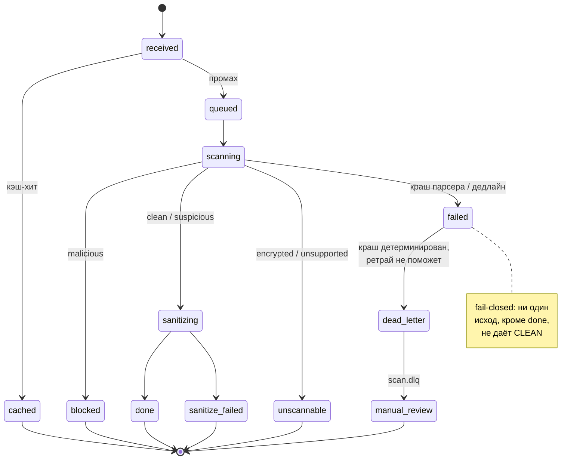
```mermaid
stateDiagram-v2
    [*] --> received
    received --> cached: кэш-хит
    received --> queued: промах

    queued --> scanning
    scanning --> blocked: malicious
    scanning --> sanitizing: clean / suspicious
    scanning --> unscannable: encrypted / unsupported
    scanning --> failed: краш парсера / дедлайн

    sanitizing --> done
    sanitizing --> sanitize_failed

    failed --> dead_letter: краш детерминирован,<br/>ретрай не поможет
    dead_letter --> manual_review: scan.dlq

    cached --> [*]
    done --> [*]
    blocked --> [*]
    unscannable --> [*]
    sanitize_failed --> [*]
    manual_review --> [*]

    note right of failed
        fail-closed: ни один
        исход, кроме done,
        не даёт CLEAN
    end note
```

`unscannable` — отдельное состояние для зашифрованного PDF, ZIP под паролем и
неподдерживаемого формата. Схлопывать его в `clean` нельзя: архив под паролем —
самый распространённый способ доставки вредоноса.

## 7. Надёжность

| Риск | Механизм | Статус |
|---|---|---|
| Воркер упал с задачей в работе | heartbeat владельца + разбор pending-списка другим воркером | ✅ M1.2 |
| Бесконечная перевыдача одной задачи | счётчик доставок, при превышении — закрытие по fail-mode | ✅ M1.2 |
| Задачу отобрали у живого воркера | heartbeat с TTL; `XCLAIM` с `min-idle` защищает от гонки reclaimer'ов | ✅ M1.2 |
| Файл детерминированно роняет парсер | журнал попыток переживает краш процесса; повтор не назначается | ✅ M1.3 |
| Транзиторный сбой S3 портит вердикт | инфра-ошибка не подтверждает задачу — она возвращается в очередь | ✅ M1.3 |
| Непроверенный файл теряется молча | dead-letter с причиной и ссылкой на карантин, статус `manual_review` | ✅ M1.4 |
| Дубли при ретрае | заявка по sha256 + пропуск повторной доставки завершённой задачи | ✅ M1.5 |
| Ошибка сканирования трактуется как «чисто» | fail-closed на уровне политики | ✅ M1.1 |
| Недоступная зависимость молча пропускает файл | `clean` требует полного покрытия обязательных стадий | ✅ M1.7 |
| Непроверяемый файл выдан за чистый | отдельные вердикты, пол по баллам, запрет смягчения при сбое | ✅ M1.6 |
| Кривое YARA-правило блокирует весь трафик | CI правил, канареечная выкатка, откат | ⬜ M7 |
| Ложные срабатывания на реальном потоке | shadow-режим, allowlist по хэшу, очередь ревью | ⬜ M3/M7 |

Ретраить краш парсера бессмысленно и опасно: тот же файл положит следующий воркер.
Один специально сформированный PDF × N ретраев × M воркеров кладёт очередь.

## 7.1 Подхват зависших задач

Признак смерти владельца — исчезнувший heartbeat, а не время простоя. Ждать таймаута
самой долгой легальной обработки (профиль `strict` — минуты) не приходится: сбой
виден за ~30 секунд.

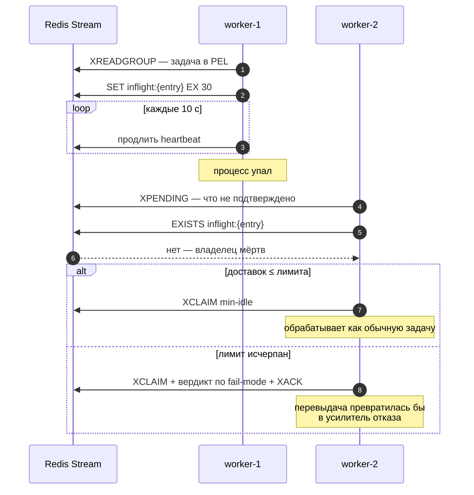
```mermaid
sequenceDiagram
    autonumber
    participant Q as Redis Stream
    participant W1 as worker-1
    participant W2 as worker-2

    W1->>Q: XREADGROUP — задача в PEL
    W1->>Q: SET inflight:{entry} EX 30
    loop каждые 10 с
        W1->>Q: продлить heartbeat
    end
    Note over W1: процесс упал

    W2->>Q: XPENDING — что не подтверждено
    W2->>Q: EXISTS inflight:{entry}
    Q-->>W2: нет — владелец мёртв

    alt доставок ≤ лимита
        W2->>Q: XCLAIM min-idle
        Note over W2: обрабатывает как обычную задачу
    else лимит исчерпан
        W2->>Q: XCLAIM + вердикт по fail-mode + XACK
        Note over W2: перевыдача превратилась бы<br/>в усилитель отказа
    end
```

`XCLAIM` с ненулевым `min-idle` сбрасывает счётчик простоя, поэтому второй reclaimer
то же сообщение уже не заберёт — гонка между воркерами разрешается самим Redis.

## 7.2 Повторять или закрывать

Питоновское исключение внутри стадии ловится и становится признаком — воркер от
этого не падает. Опасен другой случай: segfault в C-расширении (pikepdf, Pillow,
yara-python) или OOM-kill убивают процесс целиком, не оставляя записи в логах.

Отметка «начал разбирать этот файл на этой стадии» пишется **до** входа в C-код и
снимается после. Жёсткий краш не даёт её снять — и следующая попытка видит, где
именно оборвалась предыдущая.

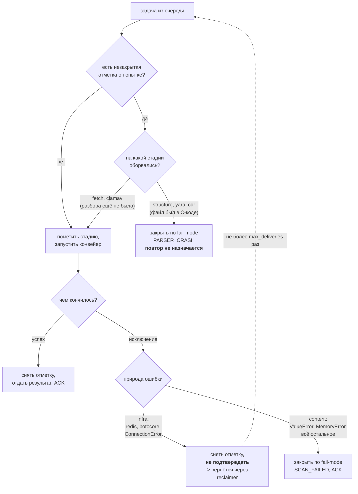
```mermaid
flowchart TD
    JOB["задача из очереди"] --> LOAD{"есть незакрытая<br/>отметка о попытке?"}

    LOAD -- нет --> RUN
    LOAD -- да --> WHERE{"на какой стадии<br/>оборвались?"}

    WHERE -- "fetch, clamav<br/>(разбора ещё не было)" --> RUN
    WHERE -- "structure, yara, cdr<br/>(файл был в C-коде)" --> POISON["закрыть по fail-mode<br/>PARSER_CRASH<br/><b>повтор не назначается</b>"]

    RUN["пометить стадию,<br/>запустить конвейер"] --> OUT{"чем кончилось?"}

    OUT -- успех --> DONE["снять отметку,<br/>отдать результат, ACK"]
    OUT -- "исключение" --> KIND{"природа ошибки"}

    KIND -- "infra:<br/>redis, botocore,<br/>ConnectionError" --> RETRY["снять отметку,<br/><b>не подтверждать</b><br/>-> вернётся через reclaimer"]
    KIND -- "content:<br/>ValueError, MemoryError,<br/>всё остальное" --> CLOSE["закрыть по fail-mode<br/>SCAN_FAILED, ACK"]

    RETRY -.->|"не более max_deliveries раз"| JOB
```

Дефолт классификации — «контентная ошибка». Это осознанно: перепутав инфраструктурный
сбой с контентным, мы получим один лишний отказ, который клиент повторит следующей
загрузкой. Перепутав наоборот — получим документ, кочующий по воркерам.

`clamav` не входит в число рискованных стадий: файл разбирает чужой процесс, упасть
вместе с воркером он не может.

Терпимость к обрывам настраивается (`MAX_PARSER_CRASHES`). Единица закрывает файл
после первого краша; поднимать её стоит там, где воркеров регулярно вытесняет
планировщик — OOM-kill по вине соседа по узлу выглядит так же, как краш парсера.

## 7.3 Dead-letter

Все три исхода «файл не проверен» ведут в один поток `scan.dlq`. Задача при этом
получает статус `manual_review`: для клиента это не `done` и никогда не `clean`.

| Причина | Когда | Откуда |
|---|---|---|
| `job_abandoned` | исчерпан лимит повторных доставок | M1.2 |
| `parser_crash` | разбор обрывает процесс воркера | M1.3 |
| `scan_failed` | ошибка обработки, вызванная файлом | M1.3 |

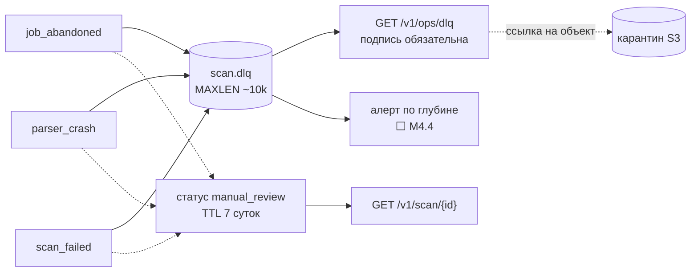
```mermaid
flowchart LR
    A["job_abandoned"] --> DLQ
    B["parser_crash"] --> DLQ
    C["scan_failed"] --> DLQ

    DLQ[("scan.dlq<br/>MAXLEN ~10k")]
    DLQ --> OPS["GET /v1/ops/dlq<br/>подпись обязательна"]
    DLQ --> ALERT["алерт по глубине<br/>⬜ M4.4"]

    ST["статус manual_review<br/>TTL 7 суток"] --> CLIENT["GET /v1/scan/{id}"]
    B -.-> ST
    A -.-> ST
    C -.-> ST

    QUAR[("карантин S3")]
    OPS -.->|"ссылка на объект"| QUAR
```

Три решения, которые стоит объяснить:

- **Длина потока ограничена** (`MAXLEN ~10000`). Всплеск отказов не должен съесть
  память Redis — а именно всплеска и стоит ожидать при кривом обновлении правил.
- **Статус живёт неделю**, а не пять минут как обычный результат. Голый `404` на
  задачу из dead-letter неотличим для клиента от «всё хорошо».
- **В записи нет содержимого файла** — только `sha256` и ссылка на объект в
  карантине. Разбирать инцидент по логам нельзя, там персональные данные.

Ручка `/v1/ops/dlq` требует подписи **всегда**, независимо от `REQUIRE_SIGNATURE`:
она отдаёт метаданные карантина, и dev-послабление на неё не распространяется.

## 7.4 Идемпотентность

Кэш вердиктов закрывает повтор уже проверенного файла. Открытым оставался другой
случай: тот же файл прислали, пока первая проверка ещё идёт — типичный двойной тап
по кнопке «отправить». Без заявки на проверку это два полных прохода CDR.

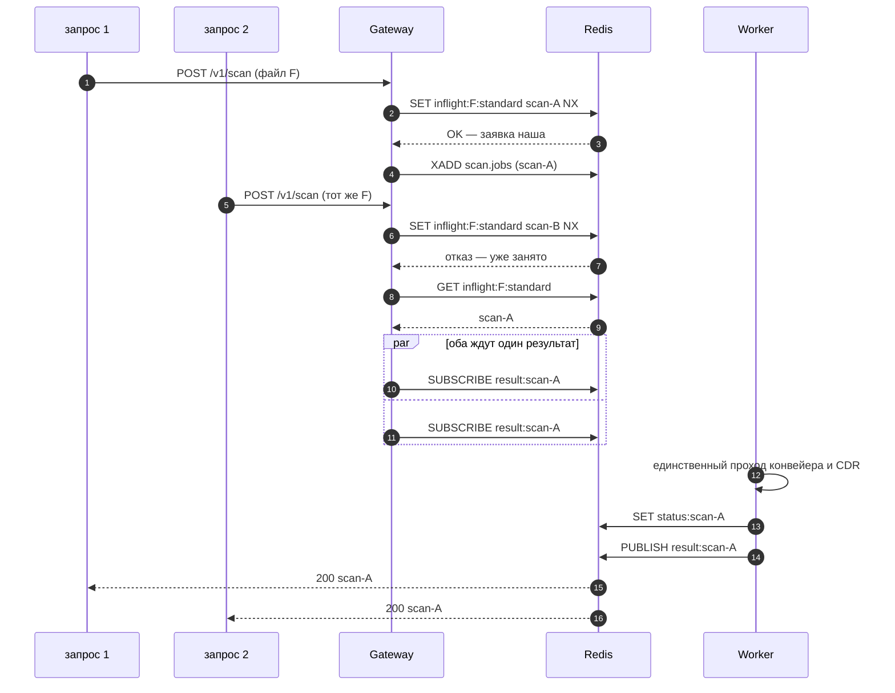
```mermaid
sequenceDiagram
    autonumber
    participant A as запрос 1
    participant B as запрос 2
    participant G as Gateway
    participant R as Redis
    participant W as Worker

    A->>G: POST /v1/scan (файл F)
    G->>R: SET inflight:F:standard scan-A NX
    R-->>G: OK — заявка наша
    G->>R: XADD scan.jobs (scan-A)

    B->>G: POST /v1/scan (тот же F)
    G->>R: SET inflight:F:standard scan-B NX
    R-->>G: отказ — уже занято
    G->>R: GET inflight:F:standard
    R-->>G: scan-A

    par оба ждут один результат
        G->>R: SUBSCRIBE result:scan-A
    and
        G->>R: SUBSCRIBE result:scan-A
    end

    W->>W: единственный проход конвейера и CDR
    W->>R: SET status:scan-A
    W->>R: PUBLISH result:scan-A
    R-->>A: 200 scan-A
    R-->>B: 200 scan-A
```

Три вещи, которые пришлось поменять:

- **Ключ заявки — `(sha256, профиль, версия политики)`**, а не только sha256.
  Профили `standard` и `strict` дают разные артефакты, объединять их нельзя.
- **Канал ожидания переведён с `BLPOP` на pub/sub.** Список отдал бы результат
  только первому ждущему, а дедупликация как раз и приводит нескольких на общий
  `scan_id`. Подписка оформляется до проверки статуса — иначе сигнал теряется.
- **Повторная доставка задачи с терминальным статусом** (`done`, `manual_review`)
  не запускает конвейер: результат просто добирается до получателей. Статус
  `failed` терминальным не считается — сбой CDR или дедлайн могут пройти со
  второй попытки.

Ключ артефакта детерминирован (`{scan_id[:2]}/{scan_id}`), поэтому даже полный
повтор прохода перезаписывает тот же объект, а не создаёт второй.

## 7.5 Непроверяемые файлы

«Не смогли проверить» и «проверили, чисто» — разные исходы. Смешивать их нельзя:
архив под паролем и запароленный PDF остаются самым распространённым способом
доставки вредоноса именно потому, что сканеры на них сдаются.

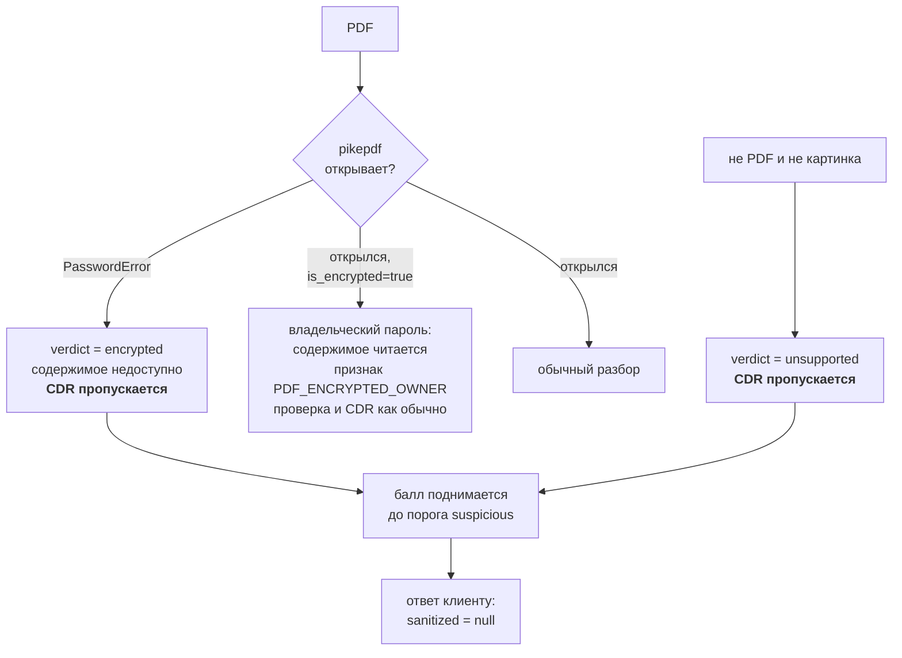
```mermaid
flowchart TD
    PDF["PDF"] --> OPEN{"pikepdf<br/>открывает?"}

    OPEN -- "PasswordError" --> ENC["verdict = encrypted<br/>содержимое недоступно<br/><b>CDR пропускается</b>"]
    OPEN -- "открылся,<br/>is_encrypted=true" --> OWNER["владельческий пароль:<br/>содержимое читается<br/>признак PDF_ENCRYPTED_OWNER<br/>проверка и CDR как обычно"]
    OPEN -- "открылся" --> NORM["обычный разбор"]

    OTHER["не PDF и не картинка"] --> UNS["verdict = unsupported<br/><b>CDR пропускается</b>"]

    ENC --> FLOOR["балл поднимается<br/>до порога suspicious"]
    UNS --> FLOOR
    FLOOR --> OUT["ответ клиенту:<br/>sanitized = null"]
```

Три правила, которые это удерживают:

- **Пол по баллам.** Непроверяемый файл получает балл не ниже порога
  `suspicious`, иначе клиент с пороговой политикой увидит «почти чисто» там, где
  проверки не было вовсе.
- **CDR не запускается.** Пересобирать нечего, а его падение раньше уводило
  задачу в ветку отказа, где вердикт перезаписывался режимом отказа — вплоть до
  `clean` при `fail-open`.
- **Сбой не смягчает вердикт** (`apply_failure`). Режим отказа применяется
  только там, где иначе вышло бы `clean` при незавершённой работе; всё уже
  найденное остаётся.

Владельческий пароль — отдельный случай: пароль пользователя пуст, документ
читается, и CDR отдаёт расшифрованную копию. Считать такой файл непроверяемым
было бы ложным срабатыванием на вполне обычных корпоративных PDF.

## 7.6 Полнота покрытия

Вердикт `clean` означает «проверили и ничего не нашли». Он не имеет права
означать «не смогли проверить». Различие держится не на баллах — балл за
упавшую стадию тонет под порогом, — а на явном учёте того, что отработало.

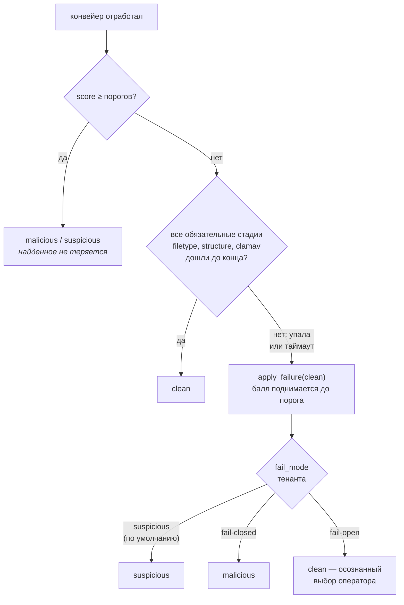
```mermaid
flowchart TD
    RUN["конвейер отработал"] --> SCORE{"score ≥ порогов?"}
    SCORE -- "да" --> FOUND["malicious / suspicious<br/><i>найденное не теряется</i>"]
    SCORE -- "нет" --> COV{"все обязательные стадии<br/>filetype, structure, clamav<br/>дошли до конца?"}

    COV -- да --> CLEAN["clean"]
    COV -- "нет: упала<br/>или таймаут" --> DEG["apply_failure(clean)<br/>балл поднимается до порога"]

    DEG --> M1{"fail_mode<br/>тенанта"}
    M1 -- "suspicious<br/>(по умолчанию)" --> S["suspicious"]
    M1 -- "fail-closed" --> B["malicious"]
    M1 -- "fail-open" --> C["clean — осознанный<br/>выбор оператора"]
```

`yara` в число обязательных не входит намеренно: это наши собственные правила
поверх сигнатурного детекта, и роль поиска известных угроз остаётся за `clamav`.
А вот убрать `clamav` из обязательных нельзя — именно так лежащий демон и
выдавал `clean` на любой файл до M1.7.

Отказ инфраструктуры никогда не стирает уже найденное: если структурный анализ
успел увидеть `/Launch`, вердикт останется `malicious`, даже если следом отвалился
антивирус.

## 7.7 Разделяемые движки и пул потоков

Блокирующие стадии выполняются через `asyncio.to_thread`, то есть один и тот же
объект движка вызывается из нескольких потоков одновременно. Аудит всех таких
объектов:

| Объект | Состояние | Решение |
|---|---|---|
| клиент `clamd` | сокет в поле экземпляра | **экземпляр на поток** ✅ M2.8 |
| `yara.Rules` | гарантий между версиями yara-python нет | общий + блокировка ✅ M2.8 |
| `magic.Magic` | cookie libmagic | общий + блокировка ✅ M2.1 |
| `WeightTable` | `unknown_codes` пополняется из потоков | общий; `set.add` атомарен, гонка безобидна |
| клиент boto3 | документирован как потокобезопасный | общий |
| `pikepdf`, `Pillow` | объекты создаются на вызов | не разделяются |
| `httpx.AsyncClient`, Redis | живут в event loop | в пул потоков не попадают |

### Почему для clamd блокировка не подошла

`ClamdNetworkSocket` хранит сокет полем экземпляра: `instream()` открывает
соединение, пишет в него и закрывает. При общем клиенте второй поток
перезаписывает `clamd_socket` первого — и файл уходит в чужое соединение.
Для сканера это худший из возможных отказов: **вердикт одного файла достаётся
другому**. Модель этой гонки даёт 8 перехватов из 8 попыток, потому что
`socket.send()` отпускает GIL ровно между присваиванием и использованием.

Блокировка отпала по цене: `clamav` — самая долгая стадия (20-300 мс), её
сериализация обнулила бы конкурентность воркера. Сам clamd рассчитан на
параллельные соединения, это его штатный режим.

### Почему для YARA подошла

Стадия занимает 5-50 мс — сериализация обходится дешевле. Экземпляр на поток
означал бы повторную компиляцию правил и дублирование памяти в каждом потоке,
а горячая перезагрузка правил (M2.4) превратилась бы из подмены одной ссылки
в согласование N копий.

Правило выбора: **блокировка, если стадия дешёвая и объект дорого создавать;
экземпляр на поток, если стадия дорогая и объект дёшев.**

## 7.8 Горячая перезагрузка правил и весов

Правила YARA и таблица весов — конфигурация, а не код. Воркер подхватывает их
правки фоновой задачей, не прерывая работу.

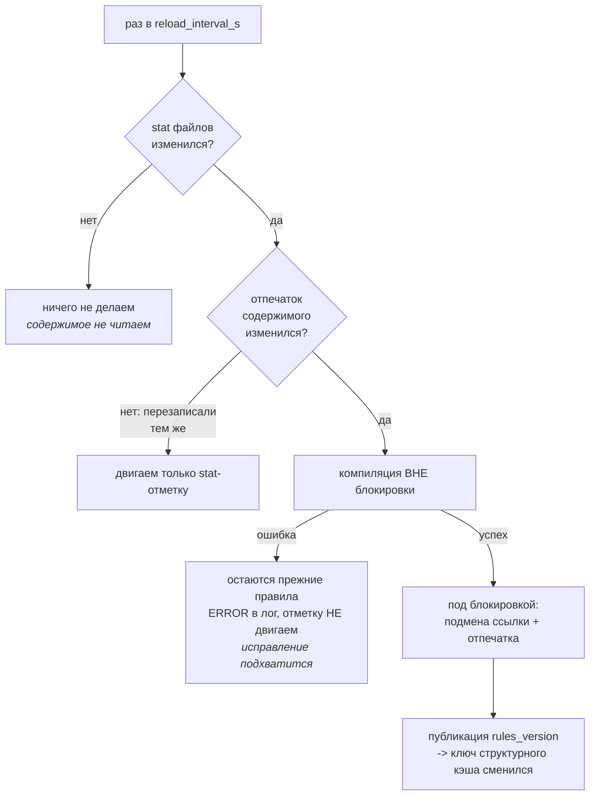
```mermaid
flowchart TD
    TICK["раз в reload_interval_s"] --> STAT{"stat файлов<br/>изменился?"}
    STAT -- нет --> SKIP["ничего не делаем<br/><i>содержимое не читаем</i>"]
    STAT -- да --> HASH{"отпечаток<br/>содержимого<br/>изменился?"}
    HASH -- "нет: перезаписали<br/>тем же" --> SKIP2["двигаем только stat-отметку"]
    HASH -- да --> COMPILE["компиляция ВНЕ блокировки"]

    COMPILE -- ошибка --> KEEP["остаются прежние правила<br/>ERROR в лог, отметку НЕ двигаем<br/><i>исправление подхватится</i>"]
    COMPILE -- успех --> SWAP["под блокировкой:<br/>подмена ссылки + отпечатка"]
    SWAP --> PUB["публикация rules_version<br/>-> ключ структурного кэша сменился"]
```

Четыре решения, которые за этим стоят:

- **Компиляция вне блокировки.** Она может занять секунды, и всё это время под
  локом стояли бы идущие проверки. Под блокировкой — только подмена ссылки.
- **Кривое правило не применяется.** Остаются прежние; stat-отметка не сдвигается,
  поэтому исправление подхватится следующей же проверкой. Выкатка сломанного
  правила не должна останавливать проверку файлов — а без этого она бы её
  останавливала полностью.
- **Отпечаток публикуется сразу.** Gateway строит по нему ключ структурного
  кэша; до обновления он читал бы записи, посчитанные по прежним правилам.
- **Двухступенчатая проверка.** Сначала дешёвый `stat`, содержимое читается
  только если что-то трогали.

Окно рассогласования: пока не все воркеры перезагрузились, они пишут кэш под
разными версиями. Промах в этом окне безопасен — он приводит к лишней проверке,
а не к устаревшему вердикту. Ширина окна равна `reload_interval_s`; сузить её
имеет смысл вместе с канареечной выкаткой (M7.2).

## 7.9 Ограничители: частота и параллелизм

Одного счётчика запросов мало. Тенант, укладывающийся в свою частоту, всё равно
может занять очередь воркеров большими файлами — и латентность вырастет у всех.
Поэтому ограничителя два, и защищает соседей именно второй.

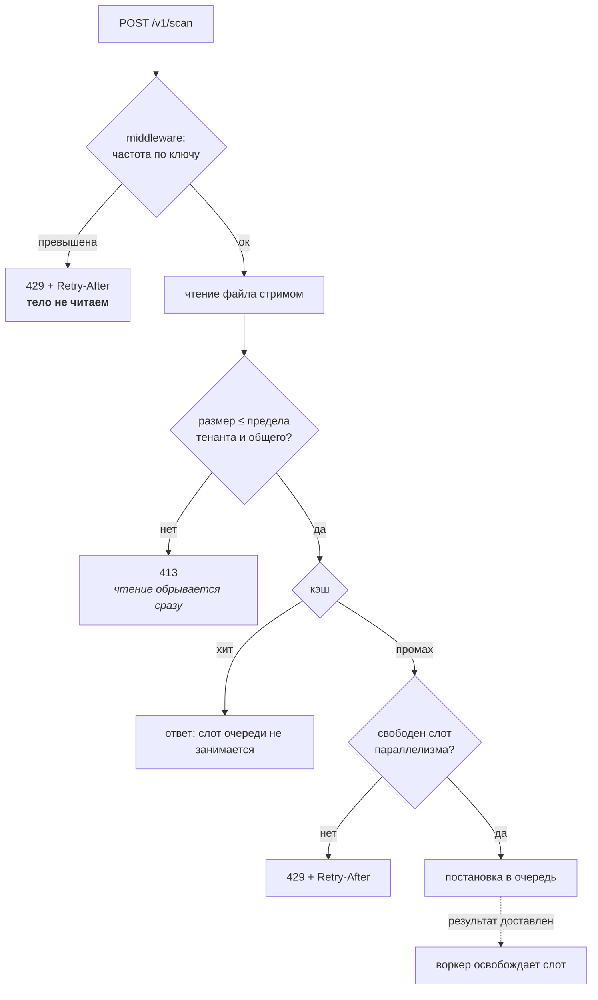
```mermaid
flowchart TD
    REQ["POST /v1/scan"] --> MW{"middleware:<br/>частота по ключу"}
    MW -- "превышена" --> R1["429 + Retry-After<br/><b>тело не читаем</b>"]
    MW -- ок --> BODY["чтение файла стримом"]
    BODY --> SZ{"размер ≤ предела<br/>тенанта и общего?"}
    SZ -- нет --> R2["413<br/><i>чтение обрывается сразу</i>"]
    SZ -- да --> CACHE{"кэш"}
    CACHE -- хит --> OK["ответ; слот очереди не занимается"]
    CACHE -- промах --> SLOT{"свободен слот<br/>параллелизма?"}
    SLOT -- нет --> R3["429 + Retry-After"]
    SLOT -- да --> Q["постановка в очередь"]
    Q -.->|"результат доставлен"| FREE["воркер освобождает слот"]
```

Решения, которые за этим стоят:

- **Частота проверяется в middleware, до чтения тела.** Тенант из тела multipart
  стал бы известен только после того, как файл уже прочитан и буферизован — то
  есть после того, как нагрузка уже принята. Ведро выбирается по
  идентификатору ключа: заголовок с именем тенанта клиент выставляет сам и,
  сменив его, получал свежий счётчик в обход собственной квоты. Подпись в
  middleware не проверяется — подделанный идентификатор попадёт в общее ведро
  и всё равно споткнётся об аутентификацию дальше.
- **Скользящее окно на двух счётчиках.** Фиксированное окно пропускало бы
  двойной всплеск на стыке, полный лог запросов хранит запись на каждый запрос.
  Взвешенная сумма текущего и предыдущего окна даёт достаточную точность за два
  счётчика.
- **Отклонённый запрос тоже расходует такт.** Иначе клиент, долбящийся в стену,
  обходил бы лимит повторами.
- **Параллелизм — множество с метками времени.** Запись, пережившая самый долгий
  разумный проход, отбрасывается сама: счётчик не протекает, если воркер умер,
  не сняв задачу. Порядок «добавить, узнать ранг, при переполнении убрать себя»
  корректен и без Lua — метки задают полный порядок, поэтому ровно `limit`
  участников имеют ранг меньше лимита даже при одновременных заявках.
- **Дубль слот не занимает.** По M1.5 он ждёт чужую проверку, а не создаёт свою.
- **Слот освобождается и при отказе.** Иначе тенант, чьи файлы стабильно роняют
  разбор, сам себе закрыл бы квоту.
- **Предел размера тенанта не поднимается выше общего.** Общий лимит защищает не
  тенанта от себя, а сервис от любого входа.

## 8. Кэш: двухуровневая схема ✅

Базы ClamAV обновляются несколько раз в сутки. Если версия баз входит в общий ключ
кэша, после каждого freshclam hit rate падает в ноль — и мы теряем главный источник
низкой задержки. Поэтому уровня два, и они инвалидируются независимо.

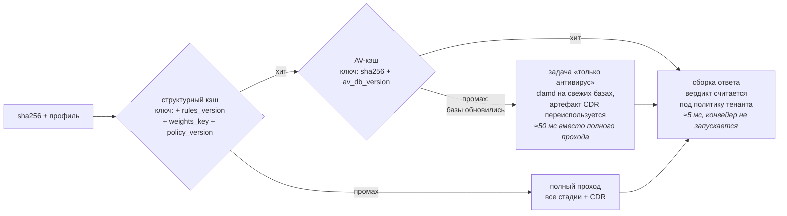
```mermaid
flowchart LR
    REQ["sha256 + профиль"] --> L1{"структурный кэш<br/>ключ: + rules_version<br/>+ weights_key + policy_version"}
    L1 -- промах --> FULL["полный проход<br/>все стадии + CDR"]
    L1 -- хит --> L2{"AV-кэш<br/>ключ: sha256 + av_db_version"}
    L2 -- хит --> ASM["сборка ответа<br/>вердикт считается<br/>под политику тенанта<br/><i>≈5 мс, конвейер не запускается</i>"]
    L2 -- "промах:<br/>базы обновились" --> AVONLY["задача «только антивирус»<br/>clamd на свежих базах,<br/>артефакт CDR переиспользуется<br/><i>≈50 мс вместо полного прохода</i>"]
    AVONLY --> ASM
    FULL --> ASM
```

### Что кэшируется

**Признаки, а не вердикт.** Пороги и веса у тенантов разные: общая запись с готовым
вердиктом отдавала бы одному тенанту ответ, посчитанный по политике другого. Вердикт
пересчитывается на чтении — этим же занимается `vscommon.scoring`, поэтому Risk
Engine и живёт в общем пакете, а не только в воркере.

### Из чего складываются ключи

| Составляющая | Уровень | Почему входит |
|---|---|---|
| `sha256` | оба | сам файл |
| профиль CDR | структурный | `standard` и `strict` дают разные артефакты |
| `rules_version` | структурный | отпечаток правил YARA и таблицы весов |
| `weights_key` | структурный | тенант со своими весами не делит запись: признаки хранятся с уже посчитанными баллами |
| `policy_version` | структурный | версия правил скоринга |
| `av_db_version` | AV | версия баз ClamAV |

AV-уровень самоинвалидируется версией баз, поэтому его TTL нужен только чтобы
ограничить память.

### Что происходит при частичном попадании

Структурная часть попала, AV-часть устарела. Gateway ставит задачу с уже готовым
структурным результатом внутри, а воркер прогоняет **только** `clamav`: стадии
разбора и CDR не повторяются, артефакт переиспользуется. Если артефакт истёк по
TTL, структурная часть бесполезна — и воркер, и gateway это проверяют и уходят на
полный проход.

## 9. Целевые показатели

Метрика, которая имеет смысл — **time-to-verdict**, от приёма файла до доставки
результата клиенту. Латентность POST-запроса при асинхронной модели измеряет время
постановки в очередь и ни о чём не говорит.

| Метрика | Цель |
|---|---|
| time-to-verdict p95, PDF ≤ 2 МБ, профиль `standard` | ≤ 700 мс |
| time-to-verdict p99 | ≤ 2 с |
| Доля файлов, уложившихся в синхронный ответ (`wait_ms=400`) | ≥ 80% |
| Повторный файл из кэша | ≤ 50 мс |
| Deep Scan | асинхронно, без SLA на латентность |
| Потеря задач | 0 (at-least-once + идемпотентность) |
| Ложные блокировки легитимных документов | ≤ 0.1%, измеряется в shadow-режиме |

### Фактические замеры

`bench/latency.py` на синтетическом корпусе, p50, миллисекунды. Прочерк —
движка нет в окружении замера. Сам скрипт замера — локальный инструмент и в
репозиторий не входит; цифры ниже — снимок, а не результат, который можно
воспроизвести из выпуска.

| Файл | Размер | filetype | structure | CDR `standard` | CDR `strict` |
|---|---|---|---|---|---|
| PDF, 1 страница | 0.2 МБ | 0.5 | 2.2 | 1.4 | — |
| PDF, 5 страниц | 0.9 МБ | 0.5 | 8.2 | 3.2 | — |
| PDF, 20 страниц | 3.8 МБ | 0.8 | 34 | 9.4 | — |
| PDF, 100 страниц | 8.6 МБ | 1.4 | 72 | 21 | — |
| JPEG, 3 Мпикс | 1.8 МБ | 0.6 | 0.6 | 53 | 52 |
| PNG, скан A4 | 6.2 МБ | 1.3 | 20 | 135 | 48 |

`structure` включает `filetype`. Не измерены `clamav` и `yara` (движков нет в
окружении замера) и `strict` для PDF (нужен ghostscript, он есть в образе).

Оценки, на которых строилась архитектура, оказались **пессимистичны для PDF на
порядок**: разбор пятистраничного договора занимает 8 мс вместо ожидавшихся
10-50, пересборка — 3 мс вместо 100-400. Дорогая часть конвейера — не наш
разбор, а антивирус и передача файла.

Поэтому `wait_ms=400` оставлен без изменений, но запас в нём теперь понятен:
почти весь бюджет расходуют `clamav` и сеть.

## 10. Изоляция

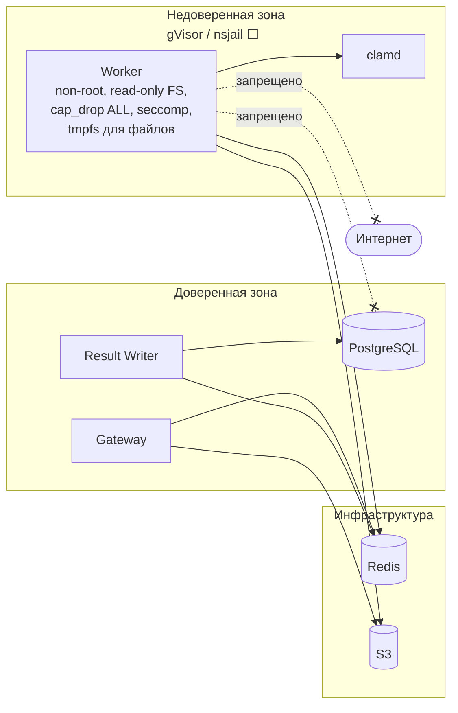
```mermaid
flowchart LR
    subgraph green["Доверенная зона"]
        GW["Gateway"]
        RW["Result Writer"]
        PG[("PostgreSQL")]
    end

    subgraph amber["Инфраструктура"]
        R[("Redis")]
        S3[("S3")]
    end

    subgraph red["Недоверенная зона<br/>gVisor / nsjail ⬜"]
        W["Worker<br/>non-root, read-only FS,<br/>cap_drop ALL, seccomp,<br/>tmpfs для файлов"]
        C["clamd"]
    end

    GW --> R & S3
    RW --> R & PG
    W --> R & S3
    W --> C
    W -. "запрещено" .-x PG
    W -. "запрещено" .-x NET(["Интернет"])
```

Сейчас изоляция — rlimits в `sandbox.py` плюс `read_only`, `cap_drop`,
`no-new-privileges` в compose. Этого достаточно для разработки и недостаточно для
прода: парсеры документов исторически полны CVE, и разбор должен идти внутри
gVisor или nsjail.

## 10.1 Изоляция на практике

Изолируется **воркер** — единственный компонент, который разбирает враждебные
файлы. Остальным связь нужна по назначению, и лишать их её бессмысленно.

| Сеть | Кто | Выход наружу |
|---|---|---|
| `backend` (`internal: true`) | воркер, deepscan, Redis, хранилище | нет |
| `egress` | gateway, clamd, бот | есть |

Gateway принимает запросы снаружи и парсеров не запускает; clamd тянет
сигнатурные базы; бот ходит в Telegram. Воркера в `egress` нет — в этом смысл.

Обнаружилось при проверке: `internal: true` ломает публикацию порта — Docker не
может пробросить хост в сеть без внешней связности.

Права воркера: non-root, корневая ФС только для чтения, все capabilities
сброшены, `no-new-privileges`, временные файлы в tmpfs. Проверяется скриптом
`deploy/isolation-check.sh` — он же годится для сервера.

Ядерная изоляция (gVisor) включается оверлеем
`deploy/docker-compose.gvisor.yml`, а не переменной: рантайм и адреса
зависимостей обязаны меняться вместе. Под gVisor не работает встроенный DNS
Docker, поэтому имена сервисов задаются статически через `/etc/hosts`.
Установка правит демон Docker и требует окна обслуживания
(`deploy/install-gvisor.sh`).

Цена, измеренная на боевом хосте:

| Операция | `runc` | `runsc` | |
|---|---|---|---|
| разбор PDF | 2.2 мс | 6.3 мс | ×2.9 |
| пересборка PDF | 9.2 мс | 27.8 мс | ×3.0 |
| перекодирование изображения | 39.6 мс | 39.0 мс | без изменений |

Профиль ожидаемый: дорог перехват системных вызовов, вычисления не страдают.
В абсолютных величинах прибавка — десятки миллисекунд против сотен у
антивируса, поэтому изоляция окупается.

## 10.2 Fast Scanner и Deep Scanner

Два режима одного образа: `WORKER_MODE=fast` и `WORKER_MODE=deep`. Код общий,
различаются очередь, бюджет и право на выводы.

### Fast Scanner — горячий путь

Работает на каждом файле, отвечает за то, что клиент увидит в ближайшую секунду.

Стадии идут **от дешёвых к дорогим**, и это не про экономию, а про то, что
дорогая проверка на заведомо плохом файле — потраченный бюджет:

| Стадия | Что делает | Бюджет |
|---|---|---|
| `filetype` | libmagic против заявленного расширения; ищет polyglot — файл, валидный сразу в двух форматах | доли мс |
| `structure` | итеративный обход графа объектов PDF: автозапуск, вложения, скрипты, аномалии потоков | до 72 мс на 100 страниц |
| `clamav` | clamd по сокету, потоком | зависит от баз |
| `yara` | правила, перезагружаемые на живом воркере | единицы мс |

У каждой стадии свой таймаут (`vscommon.limits`). Стадия без таймаута ревью не
проходит: недоверенный файл не должен уметь занять воркер навсегда.

**Ранний выход.** Как только набран порог блокировки, остальные стадии не
запускаются — решение уже принято, и уточнять его нечем.

**Стадия не выносит вердикт.** Она возвращает список признаков; балл берётся из
таблицы весов, вердикт считается централизованно в `scoring.py`. Внутри семейства
коррелированных признаков в счёт идёт только сильнейший — иначе одна поломка,
замеченная тремя проверками, даёт тройной вес.

Дальше файл **пересобирается заново** (CDR), результат проверяется на остаточные
активные элементы, и клиент получает вердикт плюс обезвреженную копию.

### Deep Scanner — вне горячего пути

Отдельная очередь (`scan.deep`), отдельный сервис, никакого влияния на время
ответа. Свой `scan_id` со ссылкой на родительский: с прежним задача не
запустилась бы вовсе — у неё терминальный статус, — а результат быстрой проверки
был бы затёрт.

Три отличия по существу:

- **Идёт до конца.** Раннего выхода нет: он затем и нужен, чтобы увидеть картину
  целиком, а не остановиться на первом пороге.
- **Пересобирает даже заблокированное.** Так выясняется, поддаётся ли документ
  безопасной пересборке вообще — вопрос, на который быстрый путь не отвечает.
- **Бюджет не ограничен стоимостью ответа.** Здесь можно позволить то, чего
  нельзя в горячем пути.

**Кого отправляют** (`deep.py`):

| Вердикт быстрой проверки | Идёт вглубь? | Зачем |
|---|---|---|
| `malicious` | нет | решение принято, тратить дорогую проверку незачем |
| `suspicious` | да | серая зона — то, ради чего всё и затевалось |
| `unsupported`, отказ стадии | да | понять, не проблема ли это на нашей стороне |
| `clean` | выборкой | измерить пропуски |

Выборка чистых — не про защиту конкретного файла. Без неё мы знаем только то,
что нашли, и ничего — о том, что упустили. Бросок криптостойкий: предсказуемая
выборка позволяла бы подгадать, какой файл углублённо не проверят.

**Второй вердикт не подменяет первый.** Клиент уже получил ответ и действовал по
нему; углублённый приходит отдельным коллбэком, и человека беспокоят, только
если вердикт **ухудшился**. Уточнение отправляется один раз, сколько бы коллбэков
ни пришло.

Детонация в песочнице не реализована — под неё оставлено место в конвейере.

## 11. Данные

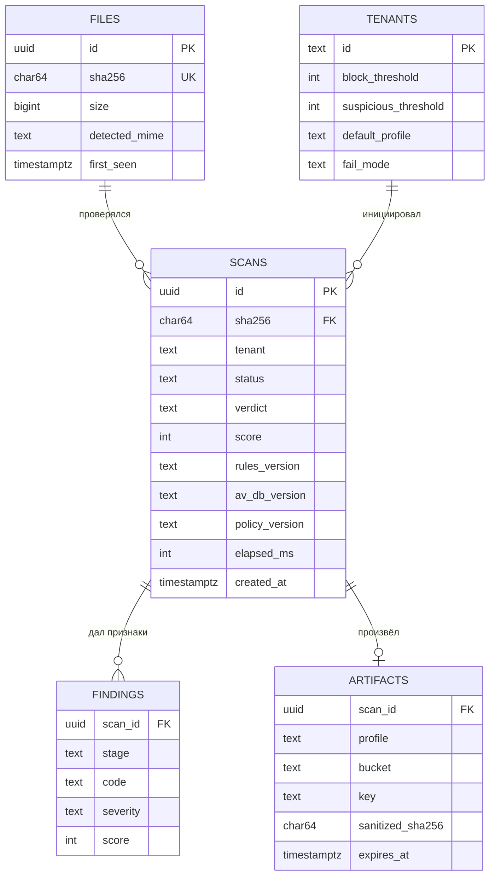
```mermaid
erDiagram
    FILES ||--o{ SCANS : "проверялся"
    SCANS ||--o{ FINDINGS : "дал признаки"
    SCANS ||--o| ARTIFACTS : "произвёл"
    TENANTS ||--o{ SCANS : "инициировал"

    FILES {
        uuid id PK
        char64 sha256 UK
        bigint size
        text detected_mime
        timestamptz first_seen
    }
    SCANS {
        uuid id PK
        char64 sha256 FK
        text tenant
        text status
        text verdict
        int score
        text rules_version
        text av_db_version
        text policy_version
        int elapsed_ms
        timestamptz created_at
    }
    FINDINGS {
        uuid scan_id FK
        text stage
        text code
        text severity
        int score
    }
    ARTIFACTS {
        uuid scan_id FK
        text profile
        text bucket
        text key
        char64 sanitized_sha256
        timestamptz expires_at
    }
    TENANTS {
        text id PK
        int block_threshold
        int suspicious_threshold
        text default_profile
        text fail_mode
    }
```

Имя исходного файла в БД не хранится: в потоке сканов паспортов оно почти всегда
содержит персональные данные. Для трассировки достаточно `scan_id` и `sha256`.

### Кто держит секреты

Ключи тенантов есть у двух сервисов: gateway проверяет ими входящие подписи,
notifier подписывает ими исходящие коллбэки. У воркера их нет и быть не должно.

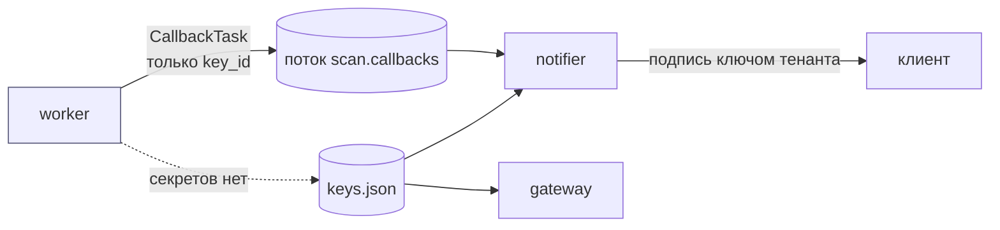
```mermaid
flowchart LR
    W[worker] -->|CallbackTask<br/>только key_id| CQ[(поток scan.callbacks)]
    CQ --> N[notifier]
    K[(keys.json)] --> N
    K --> GW[gateway]
    N -->|подпись ключом тенанта| C[клиент]
    W -.->|секретов нет| K
    style W fill:#eef,stroke:#557
```

Это тот же принцип, что и с базой: воркер разбирает враждебные файлы, и всё,
что можно из него убрать, из него убирается. Держать там ключи всех тенантов
значило бы менять одну дыру в парсере на компрометацию всех клиентов сразу.

В задаче доставки едет `key_id`, а не секрет: задание лежит в Redis, а Redis
теперь пишет на диск.

Второе следствие выноса — время. Повторы доставки растянуты на 27 минут, чтобы
пережить разрыв между площадками. Держать их внутри обработки задачи нельзя:
воркер всё это время не берёт новые файлы.

### Кто пишет в базу

Доступ к PostgreSQL есть **только** у Result Writer. Воркер туда не ходит: это
процесс, который разбирает враждебные файлы, и сетевой путь из него в хранилище
истории — лишняя дверь.

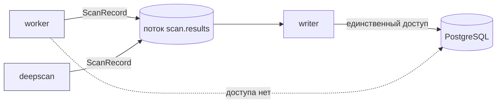
```mermaid
flowchart LR
    W[worker] -->|ScanRecord| RS[(поток scan.results)]
    DS[deepscan] -->|ScanRecord| RS
    RS --> WR[writer]
    WR -->|единственный доступ| PG[(PostgreSQL)]
    W -.->|доступа нет| PG
    style W fill:#eef,stroke:#557
    style DS fill:#eef,stroke:#557
```

Подтверждение записи (`ack`) идёт только после успешной вставки: иначе сбой базы
означал бы потерю истории без следа. Повторная доставка при этом безопасна —
запись идемпотентна по идентификатору скана.

Отказ публикации в поток не прерывает обработку. История ценна, но вердикт
клиенту важнее: недоступность потока не должна оставлять пользователя без ответа.

## 11.1 Наблюдаемость

Три потока телеметрии, три назначения: трассировки в Tempo, метрики в Prometheus,
логи в Loki. Логи структурны с самого начала (`vscommon.logging`), трассировки и
метрики заведены в M4.9–M4.13.

Ключевое ограничение — **у воркера нет сетевого выхода наружу, и телеметрия не
повод его открывать.** Поэтому наружу пишет только коллектор, а воркер до него
дотягивается по внутренней сети.

```mermaid
flowchart LR
    subgraph backend["backend (internal: true)"]
        GW[gateway] -->|OTLP| COL[otel-collector]
        W[worker] -->|OTLP| COL
        DS[deepscan] -->|OTLP| COL
        PROM[(Prometheus)] -.->|скрейп| GW
        PROM -.->|скрейп| W
        PROM -.->|скрейп| DS
    end
    subgraph egress["egress"]
        COL -->|OTLP| TEMPO[(Tempo)]
    end
    BOT[bot] -->|OTLP| COL
    style W fill:#eef,stroke:#557
    style DS fill:#eef,stroke:#557
```

Воркер не является HTTP-сервисом — это цикл-потребитель, — поэтому эндпоинт метрик
он поднимает отдельно и слушает во внутренней сети. Pushgateway здесь не подходит:
метрики не событийные, и скрейпить нужно каждую реплику по отдельности.

### Трассировка через границы процессов

Файл проходит четыре процесса, и между ними нет ни одного обычного вызова: HTTP на
входе, дальше три очереди Redis. Каждая такая граница — место, где контекст либо
передаётся явно, либо трейс рвётся.

Заголовком контекст переходит только первую границу. Дальше gateway, воркер и
notifier разнесены во времени и по хостам, поэтому `traceparent` в форме W3C едет
**полем**: в `ScanJob`, `CallbackTask`, `DeliveryTask` и `ScanRecord`.

```mermaid
sequenceDiagram
    participant B as bot
    participant G as gateway
    participant Q as Redis Stream
    participant W as worker
    participant R as writer

    B->>G: POST /v1/scan + traceparent
    G->>G: POST /v1/scan (серверный спан)
    G->>G: ingest.read → storage.put → scan.accept
    G->>Q: ScanJob + traceparent
    Q->>W: задача
    W->>W: scan.process → stage × N → cdr
    W->>R: ScanRecord + traceparent
    R->>R: history.write
    W-->>G: результат в одном дереве спанов
```

**Чужой контекст принимается ровно в четырёх местах** — по одному на границу:
`tracing_middleware` в gateway, чтение очереди задач в воркере, очереди коллбэков и
выгрузки в notifier, поток истории в writer. Всё остальное внутри процесса — обычные
вложенные спаны.

Ограничение не стилистическое. `continue_trace` ставит родителя явно, из заголовка
или из поля задачи; вызванный в середине обработки, он даёт не потомка, а брата.
Именно так спан приёма когда-то и висел — отдельно от запроса, внутри которого
выполнялся, — и чтение тела с заливкой в S3 не попадали в трейс вовсе: спан
открывался уже после них.

Негодное значение начинает новый корень, а не роняет задачу — телеметрия не повод
терять файл. Углублённая проверка со своим `scan_id` цепляется к трейсу родителя.

### Что в телеметрию не попадает

Атрибуты спана — это те же данные, вынесенные наружу, и живут они там дольше и
видны шире, чем лог. Раздел «что запрещено писать в логи» действует на них дословно:
ни имени файла, ни полного sha256, ни URL коллбэка с параметрами, ни значений EXIF.
Фильтр стоит внутри `span()`, а не на стороне вызова: полагаться на внимательность
в двадцати местах нельзя.

Отдельная забота — кардинальность метрик. Метка, значение которой приходит снаружи,
это способ положить Prometheus чужим запросом, поэтому:

- в метки не идут `sha256`, `scan_id` и имя файла;
- тенант приводится к списку известных, незнакомый схлопывается в `other`;
- маршрут в HTTP-метриках — шаблон (`/v1/scan/{scan_id}`), а не фактический путь.

### Отказ телеметрии

Наблюдаемость не имеет права влиять на вердикт. Отсутствующий SDK выключает
трассировку и метрики, но не проверку файлов. Экспорт идёт батчами в своём потоке,
поэтому недоступный коллектор не задерживает стадию. Модули телеметрии внесены в
`_INFRA_MODULES`: их транзиторный сбой классифицируется как инфраструктурный, иначе
он был бы принят за порчу файла и задача закрылась бы без повтора.

---

## 12. Что осознанно вне скоупа первых итераций

- Office и архивы — после того, как PDF-поток отработает в проде (M6).
- Детонация в песочнице — контракт и очередь закладываем сразу, реализация в M5.
- Мульти-AV — интерфейс стадий это позволяет, второй движок подключаем при
  измеренной необходимости, а не заранее.
- ML-классификация — только после накопления размеченного корпуса из FP-ревью.
