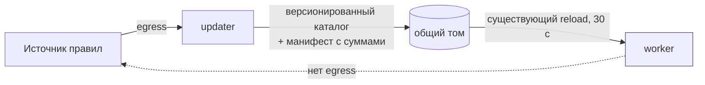
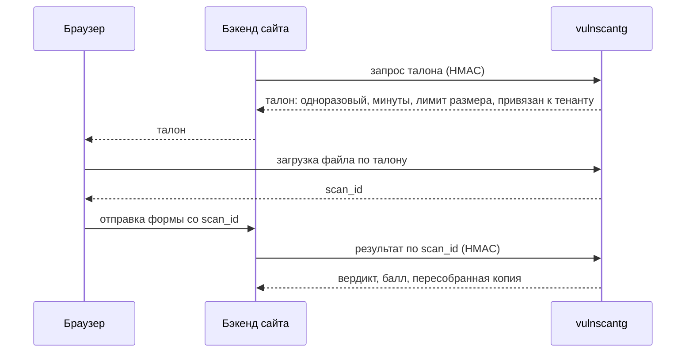

# Мысли, не разложенные по майлстоунам

Черновик. Ничего отсюда не запланировано и не делается — это записано, чтобы не
пересобирать рассуждение заново через месяц. Когда мысль дозревает до работы, она
уезжает в [ROADMAP.md](../ROADMAP.md) и отсюда удаляется.

Ссылки на код указывают на файл целиком: номера строк здесь протухли бы быстрее
самих мыслей.

---

## 1. Регулярное обновление баз, правил и признаков

Замысел: раз в сутки обновлять базы ClamAV, правила YARA и таблицу признаков.

### Сначала — найденный дефект, он это блокирует

`AvCache` в [packages/vscommon/cache.py](../packages/vscommon/cache.py) объявляет, что
«самоинвалидируется версией баз, TTL только ограничивает память». Но версия в
[services/worker/worker_app/stages/clamav.py](../services/worker/worker_app/stages/clamav.py)
защёлкивается один раз и больше не перечитывается:

```python
if self._version != "unavailable":
    return          # больше никогда не обновится
```

freshclam базы обновляет, clamd их подхватывает, а воркер до конца жизни процесса
рапортует старую строку. Значит `av_db_version` в ключе кэша не меняется, и файл,
просканированный до обновления сигнатур, продолжает отдаваться из кэша по старому
результату.

Спасает только TTL, и он равен `24 * 3600` — то есть ровно предполагаемому периоду
обновления. Новая сигнатура появилась, а файл, который она бы поймала, ещё сутки
считается проверенным.

Это тот же почерк, что и все находки в таблице ROADMAP: вердикт зависит от факта,
который перестал быть правдой.

**Исправлено.** `ClamavStage.refresh_version()` вызывается из
`Pipeline.reload_config()` — в уже существующем цикле, раз в 30 с. Смена версии
меняет ключ AV-кэша. Недоступность clamd и пустой ответ за обновление не
считаются: иначе сетевой сбой обесценивал бы кэш целиком ровно тогда, когда
антивирус и так не отвечает.

### Три потока, и обновлять их одинаково нельзя

| Что | Кто автор | Риск от плохого обновления |
|---|---|---|
| Базы ClamAV | вендор | низкий, они курируются |
| Правила YARA | мы или внешние фиды | высокий — одно правило метит все документы |
| Новые признаки и веса | мы | высший — меняет балл всем тенантам разом |

Базы можно обновлять автоматически и не думать. Правила и веса — нет. У нас уже был
ровно этот сценарий: проверка `/OpenAction` по факту наличия дала 26 ложных из 80
обычных PDF. Ежедневный автопромоут правил — тот же случай, только по расписанию и
без человека рядом.

Отсюда главный вывод темы: **разделить доставку и включение в счёт.** Забирать
ежедневно и автоматически; включать в балл отдельным шагом, а первые сутки новое
правило живёт в shadow — признак записывается, вес нулевой, вердикт не меняется.
`shadow.py` для этого уже есть.

### Форма, которая почти ничего не ломает

Ограничение, которое нельзя ослаблять: **у воркера нет и не должно появиться выхода
наружу.** Значит обновлятель — отдельный контейнер на `egress`, пишущий в общий том.
Воркер продолжает делать то, что уже умеет: раз в 30 с перечитывать каталог правил и
таблицу весов.



В воркере при этом не меняется ничего: перезагрузка вне блокировки, откат к прежней
версии при ошибке компиляции и смена отпечатка в ключе кэша там уже реализованы
([pipeline.py](../services/worker/worker_app/pipeline.py)).

Правила и веса обязаны ехать **одним атомарным набором**: новый код признака без
строки в таблице весов получает запасные 25 и попадает в `unknown_codes`. Отпечаток
у них уже общий — надо просто не разносить их по разным выкаткам.

### Две вещи, которые считаю обязательными

**Тихо сломавшийся апдейтер — худший исход.** Остановившийся freshclam выглядит
ровно как работающий. Это уже проходили: недоступный clamd молча выдавал `clean` на
всё подряд, и лечилось не весом, а признанием стадии обязательной. Здесь та же
логика — возраст баз и правил должен быть в `/readyz` и должен **деградировать
сервис**, а не просто печататься. Сутки без обновления — предупреждение, неделя —
сервис не готов.

**Ежедневный поход в интернет за правилами — это цепочка поставок.** Правила
скармливаются той же C-библиотеке, что разбирает недоверенные файлы. Подменённый
фид — способ попасть в воркер мимо всей остальной защиты. Источник закреплён,
манифест с контрольными суммами проверяется до записи в том, непроверенное воркеру
не отдаётся.

### Обо что упирается

Автоматически промоутить правило из shadow можно только по доле ложных срабатываний.
Метрик нет — `/metrics` сейчас заглушка, это M4. Честный порядок: сначала
перечитывание версии базы, потом доставка и shadow, промоут руками; автопромоут —
после M4.

Отдельно стоит заранее согласиться с ценой: смена отпечатка правил обесценивает
**весь** структурный кэш разом. Раз в сутки нормально, но первые минуты после
промоута дадут всплеск задержки — всё пересчитывается заново.

### Что решить, когда дойдут руки

- Откуда берём правила YARA: пишем свои, тянем внешний фид, или и то и другое.
  От этого зависит, нужен ли обновлятелю разбор чужого формата и проверка подписи.
- Промоут руками или по расписанию на старте. От этого зависит, нужен ли M4 сразу.

---

## 2. Интеграция с формами обратной связи на сайтах

Замысел: у сайтов есть формы обратной связи с вложениями — предлагать им проверку
через наш API.

### Что уже готово

M8 делался ровно под «пришла чужая команда, хочет подключиться». Подпись тела,
вердикт отдельно от политики, результат и обезвреженная копия не достаются просто по
знанию `scan_id`. Форма на сайте — тот же интегратор, что и бот.

### Что ломается: браузер не может держать ключ

Вся авторизация — HMAC по телу запроса. Положить секрет в JavaScript нельзя, а форма
на сайте это именно браузер. Развилка не техническая, а продуктовая.

**Через бэкенд сайта.** Браузер шлёт файл на сервер сайта, тот подписывает и передаёт
нам. Работает сегодня, без строчки нового кода. Но враждебный файл при этом лежит на
сервере сайта — а приходим мы с обещанием, что им не придётся его трогать.

**По одноразовому талону.** Бэкенд просит у нас талон на одну загрузку, отдаёт его в
браузер, браузер грузит файл прямо нам. Сервер сайта байтов не видит.



Второй вариант дороже, но он и есть то, что стоит продавать: «ваш сервер к этому
файлу не прикасается». Склоняюсь к нему.

### Чего нет и что придётся закрыть

**Ключи по тенантам.** Сейчас секрет **один общий**
([auth.py](../services/gateway/gateway_app/auth.py)), а `tenant` — обычное поле внутри
подписанного тела ([models.py](../packages/vscommon/models.py)). Пока интегратор
один, это незаметно. Как только их двое — второй может назваться первым: взять его
политику, квоту, список доверенных. А в политике лежит режим отказа, то есть это
путь к `fail-open` через самоназвание.

Этот класс мы уже вычищали: клиент не должен полем в запросе ослаблять себе проверку.
Здесь то же самое этажом выше — поле выбирает не порог, а весь набор порогов. Для
второго интегратора нужны отдельные ключи и тенант, выведенный **из ключа**, а не из
тела.

**CORS.** Его нет вообще. При прямой загрузке из браузера нужен, и обязательно со
списком разрешённых источников на тенанта, а не `*`.

**M8.9, проверка адресов коллбэка.** Для нашего бота это долг. Для сайтов, каждый из
которых называет свой адрес, откладывать нельзя: чужой URL, на который мы ходим сами
изнутри, — готовый SSRF.

### Что форма получает взамен

Здесь не стоит продешевить. Для формы обратной связи ценность не в вердикте, а в
**подменённом вложении**: поддержка открывает пересобранную копию, а не то, что
прислал посетитель. Вердикт нужен, чтобы отказать в явно плохом; всё остальное время
работает CDR. Это же снимает вопрос «а вдруг пропустим» — не пропустили, а обезвредили.

Три состояния для формы: отказать, принять с пометкой, принять и подложить копию.
Решает сайт — мы отдаём вердикт и балл.

### Мелочи, которые всплывут

Форма терпимее чата к задержке: посетитель уже смотрит на спиннер, 700 мс незаметны.
А `202` + вебхук для формы неудобен — форму либо отправили, либо нет. Скорее всего
нужен больший `wait_ms` и синхронный ответ, а вебхук как запасной путь.

Загрузчик здесь анонимный, в отличие от бота: у посетителя нет аккаунта. Ограничение
по адресу и капча — забота сайта, но нашу квоту на тенанта это делает не удобством,
а защитой.

### Что решить, когда дойдут руки

- Прямая загрузка или через бэкенд сайта. Разница между «уже работает» и неделей работы.
- Сколько интеграторов ожидается. Если больше одного — ключи по тенантам идут вперёд
  всего остального, включая обновления правил.
