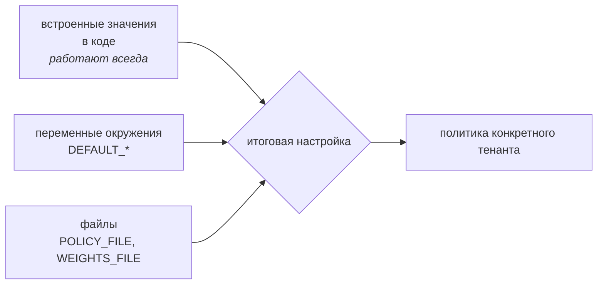
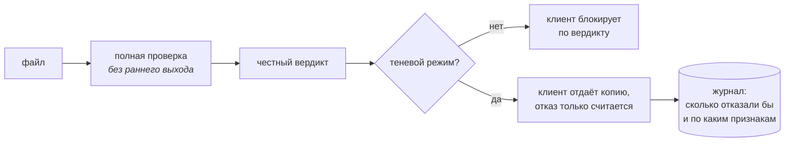

# Политики, веса и профили

Всё, что меняет поведение проверки, настраивается на стороне сервиса. Клиент не
может ослабить проверку для себя — это сознательное ограничение, см. последний
раздел.

## Три уровня настройки



Каждый следующий уровень переопределяет предыдущий. Встроенные значения
обязательны: сервис должен работать, даже если файлов конфигурации нет. Если
файл задан, но не читается, сервис не падает — он берёт встроенные значения,
пишет `ERROR` и показывает `config: degraded` в `/readyz`.

Файлы заполняются диалогом `make config` (`deploy/configure.py`): он спрашивает
параметры по одному, принимает только допустимые значения и перед записью
проверяет результат теми же загрузчиками, что и сервис. `make config-check`
делает только проверку. Правка руками остаётся допустимой — формат от этого не
меняется.

---

## Режим отказа: `DEFAULT_FAIL_MODE`

Отвечает ровно на один вопрос: **что считать вердиктом, когда проверка не
состоялась**. Не когда что-то нашли, а когда проверить не смогли — упал clamd,
не уложилась стадия в таймаут, оборвался разбор.

| Значение | Что происходит при несостоявшейся проверке |
|---|---|
| `fail-closed` | файл считается вредоносным и не пропускается |
| `suspicious` | файл помечается подозрительным (по умолчанию) |
| `fail-open` | файл считается чистым |

Ключевая тонкость: **режим отказа никогда не смягчает уже найденное**. Если
структурный анализ увидел `/Launch`, вердикт останется `malicious` при любом
режиме — даже при `fail-open`.

Как это выглядит на практике:

| Ситуация | `fail-closed` | `suspicious` | `fail-open` |
|---|---|---|---|
| Всё отработало, ничего не найдено | `clean` | `clean` | `clean` |
| Найден `/Launch` | `malicious` | `malicious` | `malicious` |
| Набрано 45 баллов | `suspicious` | `suspicious` | `suspicious` |
| **clamd недоступен, файл выглядит чистым** | `malicious` | `suspicious` | **`clean`** |
| clamd недоступен, но найден `/Launch` | `malicious` | `malicious` | `malicious` |
| Упала стадия `yara` (необязательная) | `clean` | `clean` | `clean` |

Разница только в одной строке — и в ней вся суть.

### Что выбрать

**`suspicious`** — разумное значение по умолчанию. Файл не объявляется чистым,
но и не блокируется: клиент решает сам, опираясь на `score` и признаки.

**`fail-closed`** — когда цена пропущенного вредоноса выше цены отказа в
обслуживании. Юридические документы, финансовые вложения, всё, что идёт дальше
в автоматическую обработку. Готовьтесь к отказам во время обновления
антивирусных баз или деплоя.

**`fail-open`** — файлы пропускаются, даже если проверки не было. Это осознанный
отказ от гарантии, а не «мягкая настройка»: при недоступном clamd сервис
превращается в дорогой способ пересобирать файлы, ничего не проверяя, и никакого
сигнала об этом клиент не получит. Осмысленно ровно в одном случае: пока вы
обкатываете сервис в теневом режиме и блокировки ещё не влияют на пользователей.
Для боевого потока — нет.

Стадии, без которых проверка считается несостоявшейся: `filetype`, `structure`,
`clamav`. Стадия `yara` в их число не входит — это наши правила поверх
сигнатурного детекта, а роль поиска известных угроз остаётся за антивирусом.

---

## Профиль CDR: `DEFAULT_CDR_PROFILE`

Отвечает на другой вопрос: **насколько глубоко пересобирать файл**. На вердикт
не влияет вообще — только на то, что получит пользователь.

Общее для всех профилей: файл всегда собирается **заново**, а не правится на
месте. Ни один байт исходника не переносится в выход как есть.

| Профиль | PDF | Изображения | Метаданные |
|---|---|---|---|
| `light` | убираются JS, автозапуск, действия | пересборка из растра | **остаются** |
| `standard` | то же + вложения, XFA, внешние действия, полная пересборка структуры | пересборка из растра | удаляются |
| `strict` | страницы растеризуются, из исходника не переносится ни один объект | пересборка + сведение к JPEG | удаляются |

Измерено на одностраничном PDF и скане A4:

| Профиль | PDF 1.4 КБ | время | PNG 10 КБ | время |
|---|---|---|---|---|
| `light` | 1.3 КБ | 1 мс | 10 КБ, PNG | 48 мс |
| `standard` | 1.2 КБ | 1 мс | 10 КБ, PNG | 41 мс |
| `strict` | 2.5 КБ | 160 мс | 13 КБ, JPEG | 13 мс |

Два наблюдения, которые обычно удивляют:

- **`strict` может дать файл больше исходного.** Растеризация превращает текст
  в изображение, а плоскую графику JPEG жмёт хуже, чем PNG. Экономии от `strict`
  ждать не надо.
- **Для изображений разница между `light` и `standard` невелика.** Картинка и
  так пересобирается из сырых пикселей, дальше урезать нечего. Существенная
  разница между профилями — у PDF.

### Что выбрать

**`standard`** — значение по умолчанию и правильный выбор в большинстве случаев.
Текст, изображения и структура документа сохраняются, интерактив и метаданные
удаляются.

**`strict`** — когда содержимое важнее оформления и есть запас по времени. На
выходе гарантированно нет ни одного объекта из исходного файла, только пиксели
страниц. Платите текстовым слоем: копировать текст из такого PDF нельзя, поиск
по нему не работает. Для потока сканов паспортов и договоров это часто
приемлемо — они и так растровые.

**`light`** — **не используйте для документов с персональными данными.** Он
оставляет метаданные: имя автора, название организации, программу и версию,
которой сделан файл. Для потока сканов это утечка. Профиль имеет смысл, только
когда важно сохранить интерактивные формы, а происхождение файла доверенное.

---

## Теневой режим: `DEFAULT_SHADOW_MODE`

Отвечает на третий вопрос: **действовать ли по вердикту вообще**. Нужен ровно
один раз — когда сервис ставят на реальный поток и надо узнать, во что обойдётся
включение блокировок, прежде чем они коснутся людей.

Вердикт при этом **не подкрашивается**: он честный, именно его мы и считаем.
Меняется только то, действует ли по нему клиент.



Три отличия от обычной работы:

- **Заблокированное тоже пересобирается.** Обычно вредоносный файл в CDR не
  идёт — пересобирать его незачем. В тени идёт: иначе режим не покрывал бы как
  раз те случаи, ради которых нужен, — возможные ложные блокировки. Новой
  поверхности атаки это не добавляет: файл уже прошёл через те же парсеры на
  стадии разбора, а выход проверяется.
- **Ранний выход отключён.** Обычно конвейер останавливается, как только набран
  порог блокировки. В тени важно знать, согласился ли антивирус со структурным
  анализом, — это первое, что смотрят при разборе ложного срабатывания.
- **Ведётся учёт.** Каждая проверка попадает в счётчики: сколько всего, скольким
  отказали бы, по каким признакам.

### Отчёт

```bash
curl -s http://ХОСТ:8080/v1/ops/shadow   # подпись обязательна
```

```json
{
  "total": 1240,
  "would_block": 17,
  "would_block_ratio": 0.0137,
  "by_verdict": {"clean": 1180, "suspicious": 43, "malicious": 17},
  "top_codes": [{"code": "PDF_LAUNCH", "count": 9}],
  "recent_blocks": ["2e2bc5059f45:malicious"]
}
```

`would_block` считает **отказы**, а не только вердикт `malicious`: файл, который
не удалось пересобрать, до человека тоже не дойдёт, и не учитывать это значило бы
занижать цену включения блокировок.

Содержимого файлов в журнале нет — только усечённые хэши, по которым можно найти
исходник в карантине.

### Как этим пользоваться

1. Включить `DEFAULT_SHADOW_MODE=true` и дать сервису поработать на реальном
   потоке — две недели или пока не наберётся несколько сотен файлов.
2. Посмотреть `would_block_ratio`. Если он заметно выше ожидаемой доли
   вредоносных файлов, значит блокировки задели бы легитимные документы.
3. Разобрать `top_codes`: какой признак стоит за большинством отказов. Чаще
   всего лечится не поднятием порога, а снижением веса конкретного признака —
   порог глушит всё сразу, включая настоящие находки.
4. Найти примеры по `recent_blocks` в карантине и посмотреть глазами.
5. Выключить режим.

Предел режима: файл, тип которого определить не удалось, пересобрать нельзя, и
пользователь не получит его даже в тени. Такие случаи в отчёте видны как
`unsupported` среди отказов.

При старте с включённой тенью в лог идёт `WARNING` — иначе режим легко забыть
включённым после обкатки.

---

## Пороги: когда балл становится вердиктом

Каждый признак приносит баллы. Сумма сравнивается с двумя порогами:

```
score  0 ─────────── suspicious_threshold (30) ─────── block_threshold (80) ─── 100
       │   clean     │        suspicious              │      malicious
```

Отдельно: один признак весом 100 (совпадение сигнатуры антивируса,
исполняемый файл вместо документа) блокирует сам по себе, не складываясь.

Пороги настраиваются на тенанта:

```json
{ "block_threshold": 60, "suspicious_threshold": 20 }
```

Снижение порогов делает сервис строже — и одновременно повышает долю ложных
срабатываний. Прежде чем менять, посмотрите на реальный поток в теневом режиме.

---

## Веса признаков

Файл `WEIGHTS_FILE` переопределяет встроенную таблицу. Правка веса не требует
пересборки образа и подхватывается живым воркером — раз в `RELOAD_INTERVAL_S`.

```json
{
  "PDF_EXTERNAL_URI": {"score": 25, "severity": "medium"},
  "PDF_OBJSTM":       {"score": 0,  "severity": "info"}
}
```

Коды, которых нет в файле, берутся из встроенной таблицы. Ключи, начинающиеся
с подчёркивания, игнорируются — так в JSON пишутся комментарии.

### Семейства: почему сумма не всегда сумма

Некоторые признаки описывают одно и то же свойство файла с разных сторон.
`PDF_DAMAGED`, `PDF_XREF_BROKEN` и `PDF_STREAM_LENGTH_MISMATCH` — это три
проверки, увидевшие одну поломку. Складывать их как независимые наблюдения
нельзя: битый, но безобидный документ набирал бы сотню баллов.

Поэтому признаки объединены в семейства, и **внутри семейства в балл идёт
только сильнейший**:

| Семейство | Признаки |
|---|---|
| `pdf_broken` | повреждения структуры и xref |
| `pdf_js` | JavaScript, найденный разными способами |
| `pdf_autorun` | `/OpenAction` и `/AA` |
| `pdf_embedded` | вложенный файл в маркере и в дереве имён |
| `pdf_annot` | аннотация с действием и её скрытый вариант |
| `type_lie` | несовпадение расширения и заявленного типа |
| `type_unsupported` | тип не распознан либо не поддерживается |

Список — в `CODE_FAMILIES` (`packages/vscommon/weights.py`).

### Вес неизвестного кода

Код, которого нет в таблице, получает **ненулевой** запасной вес и попадает в
`unknown_codes`. Это сделано намеренно: забытый в таблице признак должен быть
заметен в вердикте, а не исчезать молча.

### Чего вес не решает

Веса `STAGE_FAILED`, `STAGE_TIMEOUT` и `CDR_FAILED` в таблице есть, но подкручивать
их бессмысленно. Вердикт при несостоявшейся проверке определяют полнота покрытия
и режим отказа, а не баллы — балл за упавшую стадию всё равно тонет под порогом.

---

## Политика тенанта

Файл `POLICY_FILE`, ключ — идентификатор тенанта:

```json
{
  "telegram-bot": {
    "fail_mode": "suspicious",
    "block_threshold": 80,
    "suspicious_threshold": 30,
    "default_profile": "standard",
    "max_wait_ms": 2000,
    "rate_limit_per_min": 1200,
    "max_concurrent_scans": 64
  },
  "team-legal": {
    "fail_mode": "fail-closed",
    "block_threshold": 60,
    "suspicious_threshold": 20,
    "default_profile": "strict",
    "max_upload_bytes": 20971520,
    "rate_limit_per_min": 120,
    "max_concurrent_scans": 8,
    "weight_overrides": {
      "PDF_EMBEDDED_FILE": 80,
      "PDF_EXTERNAL_URI": 30
    }
  }
}
```

Незаданные поля берутся из `DEFAULT_*`. Тенант, которого нет в файле, получает
значения по умолчанию целиком.

| Поле | Смысл |
|---|---|
| `fail_mode` | вердикт при несостоявшейся проверке |
| `block_threshold`, `suspicious_threshold` | границы вердиктов |
| `default_profile` | профиль CDR, если клиент не указал свой |
| `max_wait_ms` | потолок синхронного ожидания |
| `max_upload_bytes` | свой предел размера, но не выше общего |
| `rate_limit_per_min` | запросов в минуту, `0` — без ограничения |
| `max_concurrent_scans` | сколько проверок одновременно; именно это защищает латентность соседей |
| `public_rate_limit_per_min` | частота выдачи талонов по публичному ключу сайта |
| `public_daily_tickets` | сколько талонов в сутки может выдать публичный ключ, `0` — без счёта |
| `weight_overrides` | свои веса поверх общей таблицы, только баллы |

### Почему у публичного ключа свои лимиты

Публичный ключ сайта (M12.3) лежит открыто в HTML и виден каждому посетителю.
Из этого следуют два отдельных ограничения, и одним обойтись нельзя.

**Частота считается по идентификатору ключа, а не по тенанту.** Общее ведро
означало бы, что наплыв через форму на сайте вытесняет собственные вызовы его
бэкенда: наша защита от перегрузки ломала бы клиента ровно в тот момент, когда
ему тяжелее всего.

**Суточная квота — про стоимость, а не про нагрузку.** Шестьдесят запросов в
минуту это восемьдесят шесть тысяч файлов в сутки; поток внутри лимита частоты
выглядит совершенно штатным. Без потолка публичный ключ превращается либо в
бесплатный антивирус за чужой счёт, либо в способ разорить владельца.

Счёт идёт по календарным суткам UTC, и отказанная попытка тоже расходует счёт:
откат означал бы гонку, в которой два параллельных запроса пробивают лимит.
При недоступном Redis квота **не** отказывает в проверке — вспомогательный
механизм не должен становиться единственной точкой отказа.

Тенант определяется **ключом**, которым подписан запрос, и ничем иным.
Заголовок с именем тенанта и поле `tenant` в теле игнорируются: выбирая тенанта,
клиент выбирал бы себе пороги и режим отказа — тот же `fail-open` в запросе,
только окольным путём.

---

## Список доверенных файлов

Разбор ложных срабатываний — регулярная работа, и ждать релиза, пока у клиента
не проходит документ, нельзя. Для этого есть список: `POST /v1/ops/allowlist`
снимает блокировку с конкретного файла по его sha256.

Это механизм ослабления проверки, поэтому обставлен ограничениями:

| Ограничение | Зачем |
|---|---|
| автор и причина обязательны | через полгода должно быть понятно, кто и зачем внёс |
| срок жизни ограничен | вечная запись превращается в дыру, о которой все забыли |
| срок назначает сервер | иначе его выставлял бы тот, кто вносит запись |
| каждое применение в логе | запись, срабатывающая часто, означает системную ошибку детекта либо злоупотребление |
| признаки остаются видны | оператор должен знать, что перекрыто вручную |

Снятие блокировки **не отменяет пересборку**: файл всё равно уходит в CDR, и
пользователь получает обезвреженную копию. Поэтому список применяется до решения
о пересборке — заблокированный файл в CDR не идёт, и иначе доверенный документ
остался бы вовсе без копии.

Запись действует сразу: и на новых файлах, и на тех, что уже лежат в кэше.
Отзыв тоже мгновенный — это не односторонняя дверь.

Что означает конкретный код и что с ним делать — в
[справочнике признаков](findings.md).

Список — не замена настройке весов. Если один и тот же признак приходится
перекрывать раз за разом, чинить надо вес, а не заводить записи.

Записи разных тенантов по одному файлу независимы. Своя перекрывает общую, а
удалить чужую нельзя: пропавшее разрешение возвращает блокировку документа,
который вручную разобрали, — и выглядит это как новое ложное срабатывание, а
не как потерянная настройка.

Подробности вызова — в [api.md](api.md).

## Выкатка правил: канарейка и откат

Правила YARA — единственная часть детекта, которую меняют часто и на живом
сервисе. Оба механизма ниже существуют ради одного свойства: **правило не
должно уметь навредить**.

### Кандидат вхолостую

`YARA_CANDIDATE_DIR` — каталог с набором-кандидатом. Задан — набор
прогоняется рядом с действующим на каждом файле и **ни на что не влияет**: ни
на вердикт, ни на `engines`, ни на кэш, ни на отпечаток правил.

Набор, способный изменить вердикт, — это не канарейка, а выкатка на долю
трафика. Тогда сырое правило блокировало бы настоящие документы, то есть
механизм, заведённый ради безопасной проверки, сам стал бы источником аварии.

Что смотреть: `GET /v1/ops/rules/canary`.

| Поле | О чём говорит |
|---|---|
| `candidate_only` | кандидат пометил бы, действующий набор нет — **будущие ложные срабатывания**, по ним и решают |
| `active_only` | детект, который выкатка потеряет |
| `samples` | усечённые хэши для разбора; исходник ищется в карантине |

Смена кандидата — повод обнулить наблюдение (`DELETE /v1/ops/rules/canary`):
иначе отчёт складывает расхождения двух разных наборов.

Цена включения — второй проход YARA на файл, 5-50 мс. Каталог задают на время
выкатки, а не держат постоянно.

Путь указывается внутри контейнера. Воркер собран `read_only`, наружу у него
смонтирован только `./config`, поэтому правила-кандидаты кладут в
`deploy/config/yara-candidate/` и задают
`YARA_CANDIDATE_DIR=/app/config/yara-candidate`. Каталог задан, а правил в нём
нет — воркер пишет `WARNING`: настроенная и неработающая канарейка снаружи
неотличима от работающей и не нашедшей расхождений.

### Откат без выката

`POST /v1/ops/rules/disabled` выключает **одно правило** по имени. Совпадения
перестают учитываться, файлы правил не трогаются — их приводят в порядок
отдельно и без спешки.

```http
POST /v1/ops/rules/disabled
{"rule": "pdf_js_with_autoexec", "reason": "массовые ложные на договорах", "author": "timur"}
```

Автор и причина обязательны — это механизм ослабления проверки. Действует на
ближайшей перезагрузке конфигурации воркера (`RELOAD_INTERVAL_S`, по умолчанию
30 с); это и есть окно отката, и это тот параметр, который стоит уменьшать.

Срока жизни у записи нет, в отличие от списка доверенных файлов, и это
намеренно. Запись в списке разрешает один файл, а мир вокруг меняется.
Выключенное правило — наоборот: его выключили, потому что оно ошибается, и
автоматически включить обратно значит вернуть ровно ту аварию. Забытое
выключение ловится не таймером, а тем, что оно на виду: метрика
`vs_rules_disabled` и панель «Правил выключено вручную» на дашборде дежурного.

Обе ручки административные. Тенанту выключать правила нельзя: он выключил бы
их себе, а платит за это поток соседей. Если правило ошибается на потоке
одного клиента, лечится это весами (`weight_overrides`) или записью в списке
доверенных — тем, что действует на него одного.

Выключение входит в отпечаток правил, то есть обесценивает структурный кэш.
Иначе файл, проверенный час назад, продолжал бы отдаваться с признаком от
правила, которого больше нет в работе.

## Что у тенантов общее, а что своё

Клиенты работают на одном Redis, и вопрос «чьи данные лежат под этим ключом»
имеет ровно три законных ответа. Инвентарь ниже — обязательство: новый ключ
обязан попасть в одну из трёх колонок, и это проверяется тестом
`tests/test_tenant_isolation.py`, который смотрит на ключи, **фактически
созданные** компонентами, а не на литералы в исходниках.

**Тенант в составе ключа.** Данные принадлежат одному клиенту.

| Ключ | Что там |
|---|---|
| `allowlist:<тенант>:<sha256>` | разрешения, снимающие блокировку |
| `allowlist:index:<тенант>` | индекс для пересмотра по сроку |
| `shadow:<тенант>:*` | учёт теневого режима |
| `rl:<тенант>:<минута>` | частота запросов |
| `inflight:tenant:<тенант>` | одновременные проверки |
| `quota:<дата>:public:<ключ>` | суточная квота ключа сайта |

**Адресация неугадываемым идентификатором.** Тенанта в ключе нет намеренно;
право на чтение проверяется отдельным механизмом.

| Ключ | Чем защищён |
|---|---|
| `status:<scan_id>` | `owner:<scan_id>` — владелец скана |
| `owner:<scan_id>` | сам этот механизм |
| `attempt:<scan_id>` | журнал попыток, наружу не отдаётся |
| `inflight:scan:<sha256>:…` | идемпотентность по содержимому файла |
| `ticket:<токен>`, `status-ticket:<токен>` | токен случайный, тенант внутри значения |

**Осознанно общее.** Обоснование, а не описание.

| Ключ | Почему общий |
|---|---|
| `scan:struct:…`, `scan:av:…` | это **факты о байтах файла**, а не вердикт. Вердикт пересчитывается на чтении под политику тенанта — общая запись не отдаёт чужой |
| `engine:*` | версии движков — свойство установки, а не клиента |
| `provision:*` | административный реестр ключей и политик |
| `scan.jobs`, `results`, `callbacks*` | внутренние потоки; наружу не отдаются |
| `scan.dlq` | поток разбора общий, отбор по тенанту делает ручка |

Кэш — единственный неочевидный пункт, и он же однажды был дефектом: там
лежал **вердикт**, и клиент с другими порогами получал чужой ответ (M2.5).
Лечение было не в разделении ключей, а в том, чтобы кэшировать факты.

## Рецепты

**Много ложных срабатываний на легитимных документах.** Не поднимайте пороги
вслепую — посмотрите, какие коды приходят чаще всего, и снижайте вес именно им.
Поднятый порог глушит всё сразу, включая настоящие находки.

**Нужно строже для одного клиента.** Заведите ему тенанта с `fail-closed`,
пониженными порогами и `weight_overrides` на интересующие признаки. Остальных
это не затронет.

**Обкатка на реальном потоке.** `fail_mode: suspicious`, обычные пороги, и
блокировки не включать на стороне бота, пока не соберёте статистику. Именно
для этого и нужен теневой режим.

**Скорость важнее полноты пересборки.** `default_profile: light` — но помните
про метаданные: для документов с персональными данными это неприемлемо.

---

## Что настроить нельзя и почему

Клиент **не может** прислать в запросе режим отказа, пороги или отключение
стадий. Всё это серверная конфигурация.

Причина простая: иначе отправитель файла сам решал бы, насколько тщательно
этот файл проверять. Поле вроде `on_timeout: fail-open` в теле запроса
превращает сканер в формальность — достаточно его прислать.

Клиент выбирает только то, что не влияет на строгость проверки: профиль CDR
(и то в пределах, разрешённых политикой), время синхронного ожидания и адрес
для коллбэка.

Смежные документы: [architecture.md](architecture.md) — как устроен конвейер,
[api.md](api.md) — контракт, [deploy.md](deploy.md) — развёртывание.
