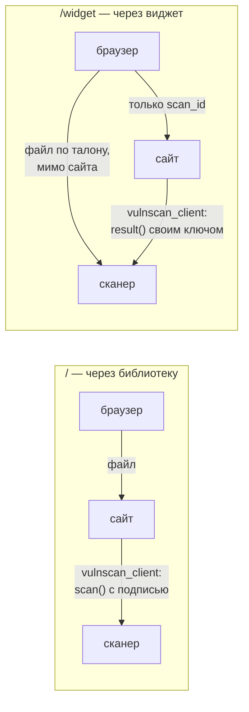

# Форма обратной связи — пример подключения

Работающая иллюстрация к [docs/integration.md](../../docs/integration.md):
сайт с формой, куда посетитель прикладывает файл, а сайт проверяет его
сканером. Сайт ставится на **отдельный сервер** в docker compose, сканер
живёт в **Kubernetes**, и сайт ходит к нему так же, как ходила бы любая чужая
команда: по HTTPS через Gateway API, с ключом и подписью.

Сайт показывает оба способа подключения, и решение по вердикту у них одно
(`_decide` в `feedback_site.py`): как файл попал в сканер, на то, что с ним
делать, не влияет.

## Два способа



**Через библиотеку** (`/`). Браузер шлёт файл сайту, сайт подписывает запрос
своим ключом и передаёт сканеру через `vulnscan_client`. Ключ живёт на
сервере сайта: положить его в JavaScript нельзя, а без подписи сканер запрос
не примет. Плата — враждебный файл на секунду оказывается в памяти сайта.

**Через виджет** (`/widget`). В форму вставлен наш виджет: блок с публичным
ключом и один скрипт. Файл уходит из браузера **прямо в сканер** по
одноразовому талону, сайт его не видит. С формой к сайту приходит только
`vulnscan_scan_id` — и вердикт по нему сайт **спрашивает у сканера сам**,
своим серверным ключом. Всё, что пришло в полях формы, написал браузер
посетителя, включая «состояние» виджета: оно годится только на текст
сообщения, когда вложения нет.

## Все исходы

Одинаковы для обоих способов.

| Что ответил сканер | Что делает сайт |
|---|---|
| `clean` и есть копия | принимает **пересобранную копию**, даёт ссылку на неё |
| `suspicious` и есть копия | принимает копию с оговоркой: подозрительное пересборка убрала |
| `malicious` | отклоняет, показывает коды признаков; ссылки на копию нет |
| `encrypted`, `unsupported` | не принимает как чистое — просит другой файл |
| копии нет: незнакомый вердикт, сбой пересборки | не принимает — оригинал сайт не берёт, а копии нет |
| проверка не закончилась | дожидается опросом; не дождался — «ещё проверяется, отправьте позже» |
| сканер недоступен | «не смогли проверить, попробуйте позже» — **не** «принято» |
| виджет: чужой или подобранный `scan_id` | «вложение не найдено» — сканер отвечает чужому тенанту «нет такого» |
| файл больше предела | отказ ещё до разбора формы, по `Content-Length` |

Три строки из этой таблицы — места, где интеграции ошибаются чаще всего.

**`not blocked` — не «безопасно».** Файл, который не удалось проверить, не
заблокирован, но и чистым не является. Проверка `if not blocked` молча
приняла бы зашифрованный архив.

**«Не закончили» — не «подозрительный».** Когда проверка не укладывается в
отведённое время, сервис отвечает `202`. Наивный код показывает посетителю
«файл вызвал вопросы» — это такая же ошибка, как считать непроверенное
чистым.

**Принимается копия, а не файл** — даже чистый. Копия собрана заново, без
активных элементов, и это работает против того, чего мы ещё не умеем
детектить. Тип и имя копии сайт берёт у сканера (`download_clean_copy`):
GIF пересобирается в PNG, и копия с расширением исходника не открылась бы.

## Настройка сканера (Kubernetes)

### 1. Ключи — `deploy/config/keys.json`

Два ключа одного тенанта: серверный — для подписи, публичный — для виджета.

```json
{
  "demo-site-1": {
    "tenant": "demo-site",
    "secret": "СГЕНЕРИРУЙТЕ: python3 -c \"import secrets; print(secrets.token_urlsafe(32))\"",
    "callback_hosts": []
  },
  "demo-site-public": {
    "tenant": "demo-site",
    "secret": "ЭТОТ-СЕКРЕТ-ПУБЛИЧЕН-ПОДПИСЫВАТЬ-ИМ-НЕЛЬЗЯ-НЕ-КОРОЧЕ-32",
    "public": true,
    "origins": ["https://feedback.example.ru"]
  }
}
```

**`origins` — точный адрес сайта, как его видит браузер:** схема, имя и порт,
если он не стандартный. `https://feedback.example.ru` и
`http://feedback.example.ru:8000` — разные адреса. Из этого списка сканер
строит и CORS, и `frame-ancestors` рамки виджета; промах выглядит как пустое
место вместо виджета и ошибка в консоли браузера.

**`callback_hosts` пуст:** сайт ждёт результат опросом, вебхук у себя не
поднимает, и разрешать коллбэки «на всякий случай» — лишняя поверхность.

Тенант `demo-site` уже есть в `KNOWN_TENANTS` (`deploy/k8s/base/10-config.yaml`),
так что в метриках он виден под своим именем. Политику тенанта можно не
заводить — действуют умолчания; своя нужна, если хотите другие пределы.

### 2. Разложить по кластеру

```bash
make config-check
sh deploy/k8s/secrets.sh
```

### 3. Доступность снаружи

**Для способа через библиотеку** сервер сайта должен достучаться до сканера по
имени из `HTTPRoute`. Если TLS на Gateway выпущен своим центром, положите его
сертификат на сервер и задайте путь к нему в `SCANNER_CA_FILE_ON_HOST`. Внутрь контейнера файл всегда
попадает по одному и тому же пути, задавать его не нужно. Файл должен
читаться пользователем контейнера (uid 10001): сертификат центра не секрет,
`chmod 644` ему подходит. Если с файлом что-то не так, процесс при старте
называет причину одной строкой — нет файла, каталог вместо файла, нет прав —
и не запускается.

Отключать проверку сертификата нельзя: подпись защищает от чужого клиента,
но не от посредника, который прочтёт документ.

**Для виджета** этого мало: скрипт и рамку загружает **браузер посетителя**.
Значит, адрес сканера должен открываться у посетителей, и сертификат на нём
должен быть таким, которому доверяют их браузеры. Свой центр сертификации
здесь не поможет — его сертификат не установлен у посетителей, и виджет у
них просто не загрузится. Для лабораторного `*.abdullin.lab` виджет будет
работать только в браузерах, куда вы сами поставили этот центр; способ через
библиотеку — везде.

### Виджет отвечает «ключ сайта недействителен»

Речь о **публичном ключе** — том, что в `SCANNER_SITE_KEY` и в
`data-vulnscan-key` на странице. Сервис намеренно не говорит, какая из трёх
причин: ключа нет в `keys.json` кластера, ключ не `public`, или `Origin`
запроса не подошёл. Различить их можно по тому, где сломалось:

* **рамка виджета не появилась вовсе** — ключ или `origins`: адрес сайта в
  `origins` должен совпадать с адресом в строке браузера посимвольно, со
  схемой и портом;
* **рамка есть, а падает отправка файла** — сервис не узнал в запросе свою же
  рамку. За Gateway API это почти всегда схема: TLS снят на входе, gateway
  видит `http`, браузер шлёт `https`. Нужна `FORWARDED_ALLOW_IPS` в
  `vulnscan-env` (`deploy/k8s/base/10-config.yaml`).

В логе gateway это одна и та же строка «ключ сайта отклонён».

## Настройка сайта (отдельный сервер)

```bash
cp examples/feedback-site/.env.example examples/feedback-site/.env   # заполнить
cd examples/feedback-site
docker compose up -d
```

Образ собирается там, где есть репозиторий:

```bash
make push-demo-site NAMESPACE=dato1 TAG=<тег>
```

Сайт слушает `8000` по HTTP. Наружу его стоит выставлять через обратный прокси
с TLS: `origins` в ключе виджета должен совпасть с тем адресом, который в
итоге видит браузер.

Метрики — на отдельном порту `9108` и по умолчанию только на `127.0.0.1`:
сайт смотрит в интернет, и `/metrics` рядом с формой был бы открыт каждому.

Что сайт намеренно **не** делает, потому что это пример:

* **копии хранит в памяти** — последние 64, не дольше часа. В настоящей
  интеграции копия уезжает в ваше хранилище, например доставкой сканера прямо
  в S3 (M14), и скачивать её сайту не нужно вовсе;
* **имя и сообщение никуда не сохраняет** — форма показывает приём, а не
  обработку обращений.
