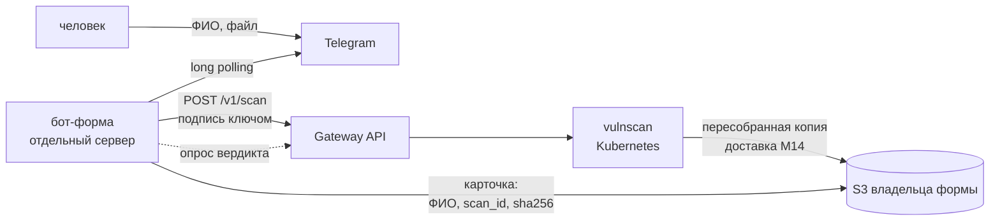

# Бот-форма обратной связи

Telegram-бот, который принимает обращение: сначала ФИО, потом файл. Файл
проверяет vulnscan; отправителю он не возвращается. Владелец формы получает
в своём S3 **пересобранную копию** и карточку обращения рядом.

Бот ставится на отдельный сервер, сканер живёт в Kubernetes. К сканеру бот
ходит как сторонняя команда — через библиотеку `vulnscan_client`, с ключом и
подписью, по HTTPS через Gateway API.



## Что принимается

| Вердикт | Что делает бот |
|---|---|
| `clean`, `suspicious` и есть пересобранная копия | принимает, пишет карточку, называет номер обращения |
| `malicious`, и сканер его пересобрал (`deliver_blocked: "strict"`) | принимает; копия — в `_rebuilt/`, в карточке `rebuilt_from_blocked: true` |
| `malicious` без копии (`deliver_blocked: "never"`) | не принимает, просит другой файл |
| `unsupported`, `encrypted` | не принимает и объясняет почему |
| сканер недоступен, не успел, незнакомый вердикт | не принимает, просит повторить позже |

Принимать ли опасные файлы, решает **политика тенанта на сканере**, а не бот:
у бота нет своего переключателя. Сканер пересобирает заблокированное только
при `deliver_blocked: "strict"`, и копия в ответе означает, что выдача
разрешена. Два места для одного решения однажды разошлись бы — и карточка
обещала бы файл, которого в хранилище нет. Исключение — теневой режим
тенанта: там копия есть при любой политике, а выгружается только при
`strict`, поэтому в тени опасное не принимается.

`suspicious` принимается намеренно: владелец формы получает не оригинал, а
пересобранную копию, из которой подозрительное уже убрано. Отказать — значит
не принять договор из-за макроса, которого в копии нет.

Всё, чего бот не понял, — **не принято**. Новый вердикт в сервисе не должен
молча открывать форму.

## Чего на сервере бота нет

* **Входящих портов.** Обновления Telegram забираются long polling, вердикт —
  опросом сканера. Коллбэк не нужен, и ключу бота коллбэки запрещены
  (`callback_hosts: []`).
* **Хранения ФИО.** Начатая форма живёт в памяти процесса час, потом
  забывается. Перезапуск бота обрывает начатые формы — человек начинает с
  `/start`.
* **Файлов на диске.** Файл держится в памяти до ответа сканера. Копию в S3
  кладёт сам сканер, а не бот.
* **ФИО и имён файлов в логах.** В лог идут `scan_id`, расширение, размер и
  вердикт. Остальное — только в карточке, то есть в вашем хранилище.

## Настройка сканера (Kubernetes)

### 1. Ключ доступа — `deploy/config/keys.json`

```json
{
  "feedback-bot-1": {
    "tenant": "feedback-bot",
    "secret": "СГЕНЕРИРУЙТЕ: python3 -c \"import secrets; print(secrets.token_urlsafe(32))\"",
    "callback_hosts": [],
    "disabled": false
  }
}
```

Тот же секрет — в `SCANNER_SECRET` на сервере бота.

### 2. Политика тенанта — `deploy/config/policies.json`

```json
{
  "feedback-bot": {
    "fail_mode": "fail-closed",
    "default_profile": "standard",
    "max_wait_ms": 5000,
    "rate_limit_per_min": 60,
    "max_concurrent_scans": 4,
    "max_upload_bytes": 20971520,
    "shadow_mode": false,
    "deliver_blocked": "strict",
    "delivery": {
      "backend": "s3",
      "endpoint": "https://storage.yandexcloud.net",
      "bucket": "ваш-бакет",
      "prefix": "feedback/",
      "region": "ru-central1",
      "credentials_id": "feedback-drop",
      "key_template": "files/{sha}{ext}"
    }
  }
}
```

**Ключ верхнего уровня — имя тенанта** (`feedback-bot`), а не ключа
(`feedback-bot-1`). Промах даёт тенанта без доставки, и об этом никто не
скажет: воркер просто не поставит выгрузку.

**`{sha}` в шаблоне имени — не для красоты**, см. «Известное ограничение».

**`deliver_blocked: "strict"`** — пересобирать и выгружать и опасные файлы.
Уберите строку, если опасное принимать не нужно: бот начнёт отказывать сам.

## Что лежит в бакете

```
feedback/files/<sha>.pdf                    копия проверенного файла
feedback/files/<sha>.pdf.vulnscan.json      манифест: вердикт, scan_id
feedback/_rebuilt/files/<sha>.pdf           копия, пересобранная из ОПАСНОГО файла
feedback/_rebuilt/files/<sha>.pdf.vulnscan.json
cards/2026/09/25/<scan_id>--<номер>.json    карточка обращения
```

Сервису, который читает бакет, нужно смотреть **оба** каталога — `files/` и
`_rebuilt/files/`. Раздельные они намеренно: скрипт, обрабатывающий каталог
целиком и не читающий манифесты, не должен принять пересобранное из опасного
за обычное. Если разница вам не важна, читайте оба и не смотрите на неё; если
важна — она уже в пути и в манифесте (`rebuilt_from_blocked`).

Опасный файл пересобирается профилем `strict` — **безопасно по построению**,
а не «удалили то, что знали». Цена — удобство работы с копией:

| Исходник | Что получают люди |
|---|---|
| PDF | страницы-картинки: читать можно, **выделить и искать текст — нет** |
| документ Word | документ, собранный заново: текст, таблицы, картинки, полужирный и курсив; стили, колонтитулы, сноски и нумерация списков теряются |
| JPEG, PNG | JPEG из пикселей |
| ZIP | архив, в котором каждое вложение пересобрано так же |

Если внешнему сервису нужен текст из PDF, его придётся распознавать (OCR) на
его стороне: у растеризованной копии текстового слоя нет.

Непроверяемое (`unsupported`, `encrypted`) не принимается и при `strict`:
пересобирать нечего.

Учётные данные доставки — в `deploy/secrets/delivery.json` под именем
`feedback-drop`, как описано в [../k8s/README.md](../../deploy/k8s/README.md#доставка-копий-в-чужой-s3-yandex-object-storage).

### 3. Разложить по кластеру

```bash
make config-check
sh deploy/k8s/config.sh
sh deploy/k8s/secrets.sh
```

Reloader перезапустит gateway и notifier сам.

### 4. Доступность снаружи

Сервер бота должен достучаться до сканера по имени из `HTTPRoute`
(`hostnames` в `deploy/k8s/base/80-httproute.yaml`): DNS или `/etc/hosts`
на сервере бота должен указывать на адрес Gateway. Если TLS на Gateway
выпущен своим центром, положите его сертификат на сервер и задайте
путь к нему в `SCANNER_CA_FILE_ON_HOST`. Внутрь контейнера файл всегда
попадает по одному и тому же пути, задавать его не нужно. Файл должен
читаться пользователем контейнера (uid 10001): сертификат центра не секрет,
`chmod 644` ему подходит. Если с файлом что-то не так, процесс при старте
называет причину одной строкой — нет файла, каталог вместо файла, нет прав —
и не запускается.

Отключать проверку сертификата нельзя: подпись в каждом запросе защищает от
чужого клиента, но не от посредника, который прочтёт загружаемый документ.

## Настройка бота (отдельный сервер)

Нужен выход на три адреса: Telegram (напрямую или через `TELEGRAM_PROXY`),
сканер и S3. Прокси используется **только** для Telegram: к сканеру и в S3
бот идёт напрямую, даже если в окружении сервера задан `HTTPS_PROXY`.

У ключа S3 для карточек достаточно права на запись: роль
`storage.uploader`, отдельный сервисный аккаунт, не тот, которым пишет
сканер. Компрометация сервера бота тогда даёт мусор в префиксе карточек, а не
чтение присланных документов.

```bash
cp .env.example .env    # заполнить
docker compose up -d
docker compose logs -f
```

Первая строка лога — версия сборки, вторая — «бот формы запущен». Если
вместо неё «не заданы обязательные переменные», в записи названы какие.

## Карточка

`cards/2026/09/24/<scan_id>--<номер>.json`:

```json
{
  "card_version": 1,
  "submission_id": "3f9a1c0b7d2e",
  "received_at": "2026-09-24T18:02:11+00:00",
  "full_name": "Иванова Мария Петровна",
  "telegram": {"user_id": 1001, "username": "masha", "chat_id": 1001},
  "file": {"name": "Жалоба.pdf", "size": 184233, "sha256": "…"},
  "scan": {"scan_id": "…", "verdict": "clean", "score": 0}
}
```

Одна карточка на обращение, а не на файл: один и тот же бланк могут прислать
двое, и вторая карточка не затирает первую.

## Известное ограничение: повторный файл

Файл, который сканер уже видел, отвечается из кэша — с **новым** `scan_id` и
**без выгрузки** в хранилище (открытый пункт M14.11). Для формы это обычный
случай: один бланк от двух людей, повторная отправка.

Что из этого следует:

* **Искать копию по `scan_id` из карточки нельзя** — под новым `scan_id`
  выгрузки не было. Искать надо по `file.sha256`: с шаблоном
  `files/{sha}{ext}` копия лежит под первыми 12 символами хэша, и повторная
  отправка того же файла этим тенантом находит её там же.
* **Если файл первым прислал другой тенант**, копии в вашем бакете не будет
  вовсе. Карточка есть, файла нет.

* **Опасный файл, присланный повторно, не принимается.** На пути из кэша
  копия заблокированного файла в ответ не отдаётся (`vscommon/cache.py`,
  `Pipeline._process_av_only`), и бот честно отказывает. Первая отправка
  принимается, вторая — нет.

Второй и третий случаи закрывает только M14.11 — выгрузка при ответе из кэша. До
этого форму стоит считать пригодной для демонстрации, но не для потока, где
пропажа обращения недопустима.
